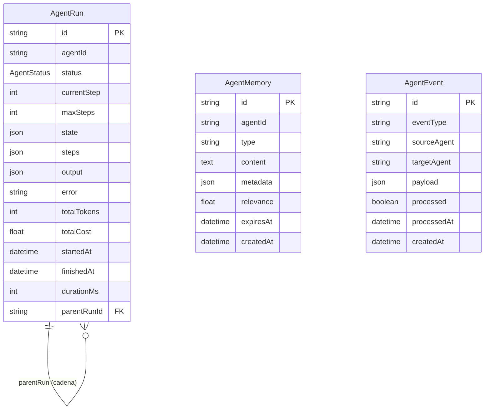
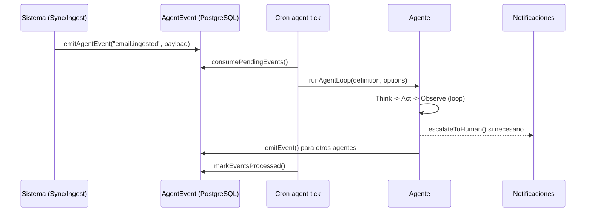

# Ecosistema Agentico — Arquitectura

> Implementado: 2026-03-12

## Resumen Ejecutivo

El ecosistema agentico de Dreamland evoluciona las automatizaciones de "dispara y olvida" (crons, scripts) a **agentes autonomos** que observan, razonan, actuan y aprenden. Cada agente es un loop discretizado compatible con serverless (Vercel, max 300s).

---

## Decisiones Arquitectonicas

| Decision | Alternativa descartada | Razon |
|----------|----------------------|-------|
| Agent loop discretizado | Proceso continuo | Vercel max 300s. Cada tick lee estado, razona, actua, guarda |
| PostgreSQL como event bus | Redis / BullMQ / Kafka | Volumen bajo (~decenas eventos/hora). Sin infra adicional |
| Supervisor determinista | LLM coordinator | Mas barato, predecible y debuggable |
| Memoria episodica en DB | Vector store completo | Fase inicial. Pinecone queda para fase 2+ |

---

## Componentes del Framework

```
src/lib/agents/
  types.ts              AgentDefinition, StepRecord, EscalationPolicy
  agent-registry.ts     Registro in-memory de agentes (Map)
  agent-runner.ts       CRUD de AgentRun en DB + guards (cooldown, concurrencia)
  agent-loop.ts         Core ReAct loop: Think -> Act -> Observe con generateText()
  agent-memory.ts       CRUD memorias episodicas + decay temporal
  agent-events.ts       Event bus PostgreSQL (emit, consume, mark processed)
  agent-tools.ts        Tools comunes: recordMemory, queryMemories, emitEvent, escalateToHuman
  orchestrator.ts       Budget diario, resumen agregado, cola de eventos
  register-all.ts       Import side-effect para registrar todos los agentes
  index.ts              Barrel exports
```

---

## Modelo de Datos



### Enum AgentStatus

`QUEUED` -> `THINKING` -> `ACTING` -> `OBSERVING` -> `COMPLETED | ESCALATED | FAILED | CANCELLED`

---

## Core Agent Loop

Cada ejecucion de un agente sigue el patron ReAct:

```
1. createAgentRun() -> status: QUEUED
2. for step in 0..maxStepsPerRun:
   a. Check timeout y budget de tokens
   b. status: ACTING
   c. generateText() con tools del agente + tools comunes
      - AI SDK v6: stopWhen: stepCountIs(3)
   d. status: OBSERVING
   e. analyzeResult() -> detecta completion/escalation signals
   f. Checkpoint: updateAgentRun() con state, steps, tokens
   g. Si isComplete o shouldEscalate -> break
3. finalizeAgentRun() -> COMPLETED | ESCALATED | FAILED
   - Si FAILED: notificacion PROCESS_FAILED
   - Si ESCALATED: notificacion AGENT_ESCALATION
```

### Presupuesto y Limites

| Parametro | Default | Descripcion |
|-----------|---------|-------------|
| `maxStepsPerRun` | 10 | Pasos maximo del loop externo |
| `maxTokensPerStep` | 600 | Output tokens por llamada LLM |
| `maxTokensPerRun` | 8,000 | Budget total de tokens |
| `maxDurationMs` | 240,000 | Timeout de ejecucion (4 min) |
| `cooldownMs` | 60,000 | Cooldown entre ejecuciones |
| Budget diario | 100,000 | Tokens/dia global (~$3/mes con gpt-4o-mini) |

---

## Agentes Implementados

### ATC Agent (`atc-agent`)

**Mision**: Procesar emails entrantes de clientes autonomamente.

| Aspecto | Detalle |
|---------|---------|
| Trigger | Evento `email.ingested` |
| Max steps | 8 |
| Cooldown | 10s |
| Tools | `getEmailDetails`, `classifyEmail`, `lookupClientHistory`, `draftReply`, `lookupReservation`, `searchKnowledgeBase` |

**Flujo**: Clasificar email -> Investigar contexto (KB, reservas, historial) -> Generar draft o escalar.

**Ficheros**:
- `src/modules/atc/agents/atc-agent.ts`
- `src/modules/atc/agents/tools/classify-email.ts`
- `src/modules/atc/agents/tools/lookup-client-history.ts`
- `src/modules/atc/agents/tools/draft-reply.ts`

---

### Sherlock Agent (`sherlock-agent`)

**Mision**: Detectar anomalias de coste alimentario.

| Aspecto | Detalle |
|---------|---------|
| Trigger | Evento `sync.food-cost.completed` |
| Max steps | 8 |
| Cooldown | 5 min |
| Tools | `getFoodCostKpis`, `getCostByLocation`, `getWasteAnalysis`, `getStockAlerts`, `comparePeriods` |

**Umbrales**: Varianza >15% investigar, >25% escalar. Food cost >35% escalar.

**Fichero**: `src/modules/sherlock/agents/sherlock-agent.ts`

---

### Analytics Agent (`analytics-agent`)

**Mision**: Morning briefing y deteccion de tendencias de ventas.

| Aspecto | Detalle |
|---------|---------|
| Trigger | Evento `sync.agora.completed` |
| Max steps | 6 |
| Cooldown | 1 hora |
| Tools | `getSalesKpis`, `getSalesTrend`, `getLocationRanking`, `getWeekdayPattern` |

**Fichero**: `src/modules/analytics/agents/analytics-agent.ts`

---

### Calidad Agent (`calidad-agent`)

**Mision**: Auditorias automaticas de calidad de datos GStock.

| Aspecto | Detalle |
|---------|---------|
| Trigger | Evento `sync.gstock.completed` |
| Max steps | 6 |
| Cooldown | 1 hora |
| Tools | `runFullAudit`, `getDataConsistency`, `compareWithHistory` |

**Fichero**: `src/modules/calidad/agents/calidad-agent.ts`

---

## Infraestructura

### Rutas API

| Ruta | Metodo | Funcion |
|------|--------|---------|
| `/api/agents/[agentId]/run` | POST | Trigger manual (auth: CRON_SECRET) |
| `/api/agents/[agentId]/status` | GET | Estado del ultimo run |
| `/api/cron/agent-tick` | GET | Cron cada 5 min: procesa eventos pendientes |
| `/api/cron/watchdog` | GET | Limpia runs atascados >30 min |

### Vercel Cron

```json
{ "path": "/api/cron/agent-tick", "schedule": "*/5 * * * *" }
```

### Flujo de Eventos



### Tools Comunes (todos los agentes)

| Tool | Descripcion |
|------|-------------|
| `recordMemory` | Guardar insight/decision/patron/correccion en memoria persistente |
| `queryMemories` | Consultar memorias previas del agente |
| `emitEvent` | Emitir evento para otros agentes o el sistema |
| `escalateToHuman` | Crear notificacion para administradores |

---

## Dashboard Admin

**Ruta**: `/admin/agents`

Muestra:
- **KPIs globales**: agentes activos, tokens consumidos hoy (con progress bar de budget), eventos pendientes, insights recientes
- **Cards por agente**: runs/completados/fallidos/escalados hoy, tokens, coste, triggers, ultimo run
- **Insights recientes**: timeline de insights de todos los agentes
- **Cola de eventos**: eventos recientes con estado (procesado/pendiente)

**Ficheros**:
- `src/app/[locale]/(modules)/admin/agents/page.tsx`
- `src/modules/admin/ui/agents/agent-dashboard.tsx`
- `src/modules/admin/actions/agents.ts`

---

## Watchdog

El cron watchdog existente (`/api/cron/watchdog`, cada 15 min) fue extendido para incluir AgentRuns:

- Detecta runs en estado activo (QUEUED/THINKING/ACTING/OBSERVING) > 30 min
- Los marca como FAILED con mensaje descriptivo
- Logs detallados de cada run limpiado

---

## Observabilidad

| Capa | Mecanismo |
|------|-----------|
| Por paso | `AgentRun.steps[]` — thought, toolCalls, observation, tokens, durationMs |
| Por run | `AgentRun` — status, totalTokens, totalCost, durationMs, error |
| Memoria | `AgentMemory` — insights persistentes con decay temporal |
| Eventos | `AgentEvent` — trazabilidad inter-agente |
| Alertas | Notificaciones in-app para FAILED y ESCALATED |
| Budget | Orquestador con budget diario de 100K tokens |
| Dashboard | `/admin/agents` con estado en tiempo real |

---

## Estimacion de Costes

| Concepto | Estimacion |
|----------|-----------|
| Modelo base | GPT-4o-mini via OpenRouter (~$0.15/1M input tokens) |
| Runs/dia estimados | 5 agentes x 1-3 runs/dia |
| Tokens/paso | ~500 tokens |
| Pasos/dia total | ~50 |
| **Coste mensual** | **~$3/mes** |

---

## Migracion Prisma

```
prisma/migrations/20260312120000_add_agent_ecosystem/migration.sql
```

Crea: enum `AgentStatus`, tablas `agent_runs`, `agent_memories`, `agent_events`, extiende `NotificationType` con `AGENT_ESCALATION` y `AGENT_INSIGHT`.
