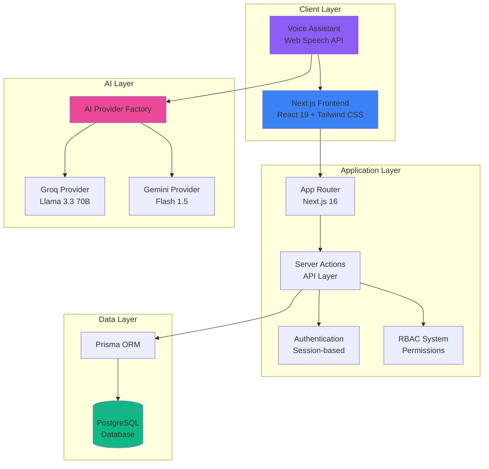
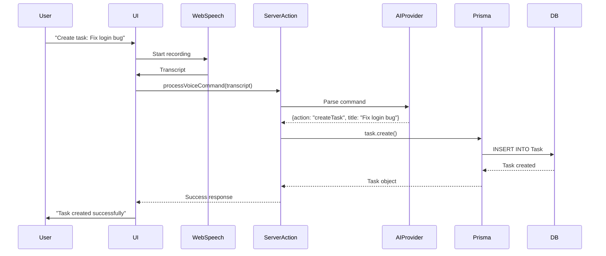
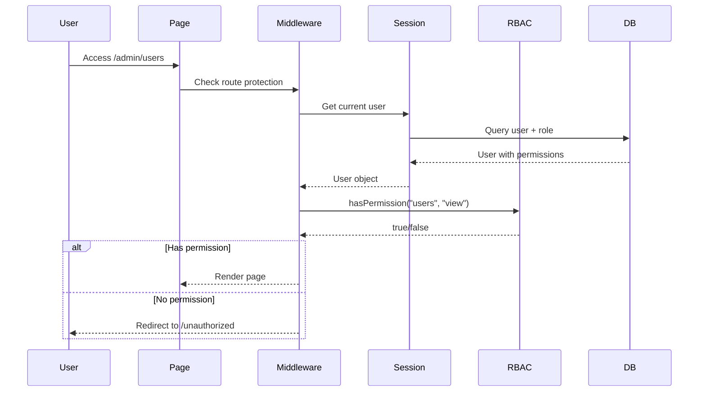
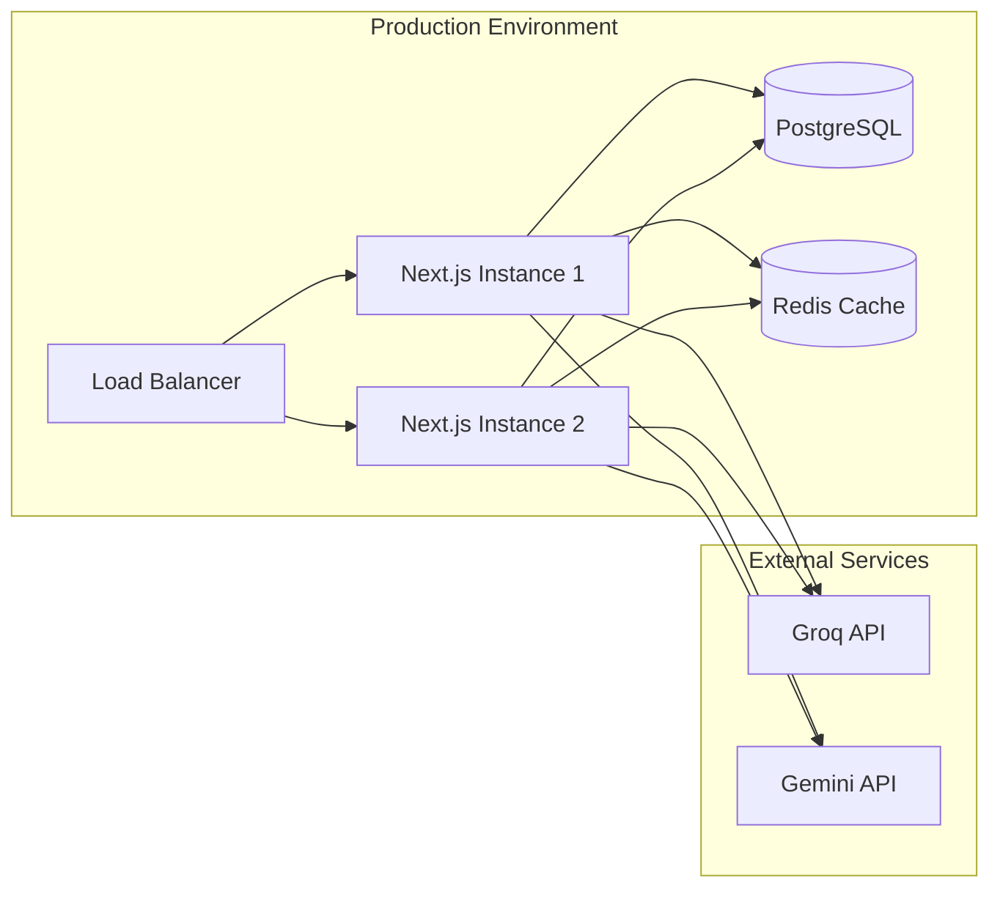

# System Overview - Dreamland Manager

## Introduction

Dreamland Manager is a strategic intelligence platform that transforms raw project data into actionable insights. Built with modern web technologies, it combines project management, team wellness monitoring, and AI-powered voice commands into a unified experience.

## High-Level Architecture



## Architecture Layers

### 1. **Client Layer**
The presentation layer built with modern React:

- **Framework**: Next.js 16 with App Router
- **UI Library**: React 19 with TypeScript
- **Styling**: Tailwind CSS v4 for utility-first styling
- **Components**: shadcn/ui + Radix UI primitives
- **Icons**: Lucide React
- **Themes**: next-themes for dark mode support

**Key Features**:
- Server-side rendering (SSR) for optimal performance
- Client-side interactivity with React Server Components
- Responsive design with mobile-first approach

### 2. **Application Layer**
The business logic and routing layer:

#### App Router (Next.js 16)
- File-based routing with `/app/[locale]` structure
- Support for internationalization at the routing level
- Nested layouts for consistent UI structure
- Loading and error states handling

#### Server Actions
All backend logic is exposed through Server Actions in `/src/lib/actions`:
- **Type-safe**: Full TypeScript support
- **Automatic serialization**: No need for API routes
- **Direct database access**: Via Prisma ORM
- **Built-in validation**: Input validation with custom schemas

**Key Action Modules**:
- `projects.ts`: Project CRUD operations
- `tasks.ts`: Task management, dependencies, subtasks
- `users.ts`: User management
- `roles.ts`: RBAC role management
- `sentiment.ts`: Team mood tracking
- `voice.ts`: Voice command processing

#### Authentication & Sessions
- **Custom session-based auth**: No external dependencies
- **Password hashing**: bcryptjs for secure storage
- **JWT tokens**: jose library for secure session tokens
- **Middleware protection**: Route-level access control

#### RBAC (Role-Based Access Control)
Granular permission system with:
- **Resources**: Projects, Users, Departments, Tasks, etc.
- **Actions**: View, Create, Edit, Delete
- **Role matrix**: Flexible permission assignment
- **Permission checks**: Server-side validation on every action

### 3. **AI Layer**
Voice command processing with provider abstraction:

#### Provider Pattern
```typescript
interface AIProvider {
  processVoiceCommand(transcript: string, locale: string): Promise<Response>
  getUsageInfo(): Promise<UsageInfo>
}
```

**Benefits**:
- Swap AI providers without code changes
- Fallback mechanisms
- Centralized rate limit tracking

#### Groq Provider (Recommended)
- **Model**: `llama-3.3-70b-versatile`
- **Speed**: Ultra-fast responses (~1-2 seconds)
- **Rate Limiting**: Real-time tracking via response headers
- **Cost**: Free tier with generous limits

#### Google Gemini Provider (Fallback)
- **Model**: `gemini-1.5-flash`
- **Speed**: Moderate (~2-4 seconds)
- **Rate Limiting**: Local estimation (RPM/RPD)
- **Cost**: Free tier available

### 4. **Data Layer**
Persistent storage with Prisma ORM:

#### Prisma ORM
- **Type-safe queries**: Auto-generated TypeScript types
- **Schema-first**: Declarative data modeling
- **Migrations**: Version-controlled schema changes
- **Introspection**: Database-first development support

#### PostgreSQL Database
- **Production**: PostgreSQL for scalability and reliability
- **Development**: Can use SQLite for local prototyping
- **Adapter**: `@prisma/adapter-pg` for PostgreSQL connection pooling

**Key Models**:
- **Project Management**: Project, TaskList, Task, TaskStatus, Tag
- **Collaboration**: TaskComment, TaskAttachment, TaskDependency
- **Team Wellness**: TeamMood, ProjectRisk
- **RBAC**: User, Role, Permission
- **AI Tracking**: AiUsageLog

## Data Flow Examples

### Example 1: Creating a Task via Voice Command



### Example 2: RBAC Permission Check



## Technology Decisions

### Why Next.js App Router?
- **Server Components**: Reduce client bundle size
- **Streaming SSR**: Faster perceived load times
- **Built-in optimizations**: Image optimization, font loading
- **File-based routing**: Intuitive project structure
- **API co-location**: Server Actions eliminate need for separate API layer

### Why Prisma ORM?
- **Type safety**: Catch errors at compile time
- **Developer experience**: Auto-completion and IntelliSense
- **Migrations**: Database versioning built-in
- **Multi-database**: Easy to switch between PostgreSQL, MySQL, SQLite

### Why Session-based Auth (vs JWT)?
- **Simplicity**: No need for token refresh logic
- **Security**: Tokens stored server-side only
- **Revocation**: Instant logout by deleting session
- **Size**: No large tokens sent on every request

### Why Provider Pattern for AI?
- **Flexibility**: Swap providers based on cost, speed, or availability
- **Testing**: Easy to mock providers in tests
- **Resilience**: Automatic fallback if primary provider fails
- **Optimization**: Choose best provider per use case

## Scalability Considerations

### Current Architecture
- **Single-server deployment**: Suitable for small-medium teams (<100 users)
- **PostgreSQL**: Handles thousands of tasks/projects easily
- **Session storage**: In-database (can be moved to Redis for scale)

### Future Scaling Path
1. **Horizontal scaling**: Add Next.js instances behind load balancer
2. **Database optimization**: Read replicas, connection pooling
3. **Caching layer**: Redis for sessions and frequently accessed data
4. **CDN**: Static assets served via edge network
5. **AI optimization**: Queue system for voice commands during peak load

## Security Architecture

### Authentication Flow
1. User submits credentials
2. Server validates against hashed password (bcryptjs)
3. JWT session token created (jose)
4. Token stored in HTTP-only cookie
5. Middleware validates token on protected routes

### Authorization Flow
1. User attempts action (e.g., delete project)
2. Server Action extracts session from request
3. RBAC checks user's role permissions
4. Action proceeds only if permission granted
5. Audit log created (optional)

### Data Protection
- **Password hashing**: bcryptjs with salt rounds
- **SQL injection**: Prevented by Prisma's parameterized queries
- **XSS protection**: React's automatic escaping
- **CSRF protection**: Built into Next.js Server Actions

## Deployment Architecture



**Recommended Platforms**:
- **Vercel**: Easiest deployment for Next.js (auto-scaling)
- **Railway**: Database + app hosting in one platform
- **AWS/GCP**: Full control for enterprise deployments

## Development Workflow

### Local Development
```bash
# 1. Install dependencies
npm install

# 2. Setup database
npm run db:reset  # Creates schema + seeds data

# 3. Start dev server
npm run dev
```

### Production Build
```bash
# 1. Generate Prisma client
npx prisma generate

# 2. Run database migrations
npx prisma migrate deploy

# 3. Build Next.js app
npm run build

# 4. Start production server
npm start
```

## Key Design Principles

1. **Type Safety First**: Leverage TypeScript everywhere
2. **Server-Side Heavy**: Minimize client JavaScript bundle
3. **Progressive Enhancement**: Works without JS for core features
4. **Accessibility**: ARIA labels, keyboard navigation
5. **Internationalization**: Built-in from day one
6. **Performance**: Lighthouse scores >90 for all metrics
7. **Security**: Defense in depth with multiple layers
8. **Developer Experience**: Fast feedback loops, helpful errors

## Further Reading

- [Data Model Documentation](../database/data-model.md)
- [Voice Assistant Architecture](../features/voice-assistant/architecture.md)
- [RBAC System Overview](../features/rbac/overview.md)
- [API Reference](../api-reference/server-actions.md)
