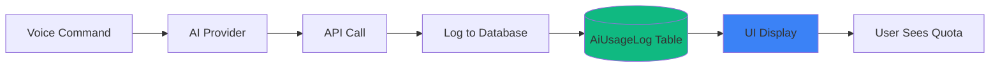

# AI Usage Tracking - Dreamland Manager

## Overview

The Voice Assistant includes a built-in **usage tracking system** to monitor AI API consumption, prevent quota exhaustion, and provide visibility into costs.

---

## Architecture



---

## Database Model

### AiUsageLog

Every AI request is logged to track usage:

```prisma
model AiUsageLog {
  id                String   @id @default(cuid())
  modelName         String   // "llama-3.3-70b-versatile" or "gemini-1.5-flash"
  actionType        String   // "VoiceCommand"
  
  // Token Usage
  promptTokens      Int      @default(0)
  completionTokens  Int      @default(0)
  totalTokens       Int      @default(0)
  
  // Metadata
  projectId         String?
  userId            String?
  
  // Provider Snapshot (Groq only)
  remainingRequests Int?
  remainingTokens   Int?
  
  createdAt         DateTime @default(now())
}
```

---

## Logging Implementation

### Groq Provider

Captures real-time quota from response headers:

```typescript
async processVoiceCommand(transcript: string, locale: string) {
  const response = await fetch('https://api.groq.com/openai/v1/chat/completions', {
    // ... config
  });
  
  // Extract rate limit info from headers
  const remainingRequests = parseInt(
    response.headers.get('x-ratelimit-remaining-requests') || '0'
  );
  const remainingTokens = parseInt(
    response.headers.get('x-ratelimit-remaining-tokens') || '0'
  );
  
  // Log usage
  await prisma.aiUsageLog.create({
    data: {
      modelName: 'llama-3.3-70b-versatile',
      actionType: 'VoiceCommand',
      promptTokens: usage.prompt_tokens,
      completionTokens: usage.completion_tokens,
      totalTokens: usage.total_tokens,
      remainingRequests,  // Groq-specific
      remainingTokens,    // Groq-specific
      userId: currentUser.id,
      projectId: currentProject?.id
    }
  });
}
```

### Gemini Provider

Estimates usage from local logs (no headers available):

```typescript
async getUsageInfo(): Promise<UsageInfo> {
  const now = Date.now();
  
  // RPM (Requests Per Minute)
  const logsLastMinute = await prisma.aiUsageLog.count({
    where: {
      modelName: 'gemini-1.5-flash',
      createdAt: { gte: new Date(now - 60000) }
    }
  });
  
  // RPD (Requests Per Day)
  const logsLastDay = await prisma.aiUsageLog.count({
    where: {
      modelName: 'gemini-1.5-flash',
      createdAt: { gte: new Date(now - 86400000) }
    }
  });
  
  return {
    estimatedRPM: logsLastMinute,
    estimatedRPD: logsLastDay
  };
}
```

---

## UI Display

### Project Header Component

**File**: `src/components/layout/project-header.tsx`

Displays real-time quota in the app header:

```tsx
'use client';

import { useEffect, useState } from 'react';

export function AIUsageIndicator() {
  const [usage, setUsage] = useState<UsageInfo | null>(null);
  
  useEffect(() => {
    async function fetchUsage() {
      const res = await fetch('/api/ai-usage');
      const data = await res.json();
      setUsage(data);
    }
    
    fetchUsage();
    const interval = setInterval(fetchUsage, 30000); // Update every 30s
    return () => clearInterval(interval);
  }, []);
  
  if (!usage) return null;
  
  if (usage.provider === 'groq') {
    return (
      <div className="flex items-center gap-2">
        <div className="h-2 w-2 rounded-full bg-green-500" />
        <span className="text-sm">
          Groq: {usage.remainingRequests?.toLocaleString()} / 14,400 requests
        </span>
      </div>
    );
  }
  
  return (
    <div className="flex items-center gap-2">
      <div className="h-2 w-2 rounded-full bg-blue-500" />
      <span className="text-sm">
        Gemini: {usage.estimatedRPM} RPM / {usage.estimatedRPD} RPD
      </span>
    </div>
  );
}
```

---

## Analytics Queries

### Daily Usage Report

```typescript
async function getDailyUsage(date: Date) {
  const startOfDay = new Date(date);
  startOfDay.setHours(0, 0, 0, 0);
  
  const endOfDay = new Date(date);
  endOfDay.setHours(23, 59, 59, 999);
  
  const logs = await prisma.aiUsageLog.findMany({
    where: {
      createdAt: {
        gte: startOfDay,
        lte: endOfDay
      }
    },
    select: {
      modelName: true,
      totalTokens: true,
      createdAt: true
    }
  });
  
  const grouped = logs.reduce((acc, log) => {
    acc[log.modelName] = (acc[log.modelName] || 0) + 1;
    return acc;
  }, {} as Record<string, number>);
  
  return grouped;
}
```

### User-Specific Usage

```typescript
async function getUserUsage(userId: string, days: number = 7) {
  const since = new Date(Date.now() - days * 86400000);
  
  const logs = await prisma.aiUsageLog.findMany({
    where: {
      userId,
      createdAt: { gte: since }
    },
    select: {
      actionType: true,
      totalTokens: true,
      createdAt: true
    }
  });
  
  return {
    totalRequests: logs.length,
    totalTokens: logs.reduce((sum, log) => sum + log.totalTokens, 0),
    avgTokensPerRequest: logs.length > 0 
      ? logs.reduce((sum, log) => sum + log.totalTokens, 0) / logs.length 
      : 0
  };
}
```

### Cost Estimation (Projected)

```typescript
async function estimateMonthlyCost() {
  const logs = await prisma.aiUsageLog.findMany({
    where: {
      createdAt: { gte: new Date(Date.now() - 2592000000) } // 30 days
    },
    select: {
      modelName: true,
      totalTokens: true
    }
  });
  
  const costPerModel = {
    'llama-3.3-70b-versatile': 0.000001, // Placeholder (Groq free tier)
    'gemini-1.5-flash': 0.000075          // $0.075 per 1K tokens
  };
  
  const totalCost = logs.reduce((sum, log) => {
    const rate = costPerModel[log.modelName as keyof typeof costPerModel] || 0;
    return sum + (log.totalTokens / 1000) * rate;
  }, 0);
  
  return totalCost;
}
```

---

## Alerts & Notifications

### Quota Warning (90% threshold)

```typescript
async function checkQuotaAndWarn() {
  const latestLog = await prisma.aiUsageLog.findFirst({
    where: { modelName: 'llama-3.3-70b-versatile' },
    orderBy: { createdAt: 'desc' }
  });
  
  if (latestLog?.remainingRequests && latestLog.remainingRequests < 1440) {
    // Less than 10% remaining (14,400 * 0.1)
    console.warn('⚠️ Groq quota low:', latestLog.remainingRequests, 'requests left');
    
    // Send notification to admins
    await sendQuotaWarning(latestLog.remainingRequests);
  }
}
```

---

## Best Practices

### 1. Regular Cleanup

Delete old logs to prevent database bloat:

```typescript
// scripts/cleanup-ai-logs.ts
async function cleanupOldLogs() {
  const thirtyDaysAgo = new Date(Date.now() - 2592000000);
  
  const deleted = await prisma.aiUsageLog.deleteMany({
    where: {
      createdAt: { lt: thirtyDaysAgo }
    }
  });
  
  console.log(`Deleted ${deleted.count} logs older than 30 days`);
}
```

Run as a cron job:
```bash
# Every week
0 0 * * 0 npx tsx scripts/cleanup-ai-logs.ts
```

### 2. Index for Performance

Add database index for fast queries:

```sql
CREATE INDEX idx_aiusagelog_createdAt ON AiUsageLog(createdAt);
CREATE INDEX idx_aiusagelog_userId ON AiUsageLog(userId);
CREATE INDEX idx_aiusagelog_modelName ON AiUsageLog(modelName);
```

### 3. Aggregate Data

Pre-compute daily summaries for faster dashboards:

```prisma
model AiUsageSummary {
  id          String   @id @default(cuid())
  date        DateTime @unique
  modelName   String
  totalReqs   Int
  totalTokens Int
}
```

---

## Dashboard Widgets

### Usage Chart (Recharts)

```tsx
import { AreaChart, Area, XAxis, YAxis, Tooltip } from 'recharts';

export function UsageChart({ data }: { data: UsageData[] }) {
  return (
    <AreaChart width={600} height={300} data={data}>
      <XAxis dataKey="date" />
      <YAxis />
      <Tooltip />
      <Area 
        type="monotone" 
        dataKey="requests" 
        stroke="#3b82f6" 
        fill="#3b82f6" 
        fillOpacity={0.3}
      />
    </AreaChart>
  );
}
```

---

## Troubleshooting

### Logs not showing in UI

**Check**:
1. Database connection: `npx prisma studio`
2. Server action permissions
3. Browser console for errors

### Estimated RPM/RPD inaccurate (Gemini)

**Cause**: Based on local logs only (not account-wide).

**Solution**: Manually track via Google Cloud Console for production.

---

## Further Reading

- [Voice Assistant Architecture](./architecture.md)
- [Groq Integration](./groq-integration.md)
- [Gemini Integration](./gemini-integration.md)
- [Data Model](../../database/data-model.md)
