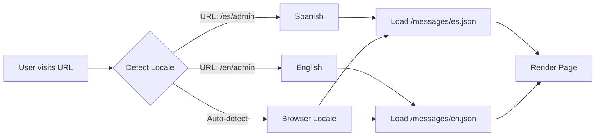

# Internationalization (i18n) - Dreamland Manager

## Overview

Dreamland Manager is built with internationalization from day one using [`next-intl`](https://next-intl-docs.vercel.app/). The application currently supports:

- 🇬🇧 **English** (`en`)
- 🇪🇸 **Spanish** (`es`)
- 🇩🇪 **German** (`de`)
- 🇫🇷 **French** (`fr`)
- 🇮🇹 **Italian** (`it`)
- 🇷🇺 **Russian** (`ru`)

El sistema detecta automáticamente el idioma del navegador o permite la selección manual a través de la URL.

---

## Architecture

### How it Works



### Configuration Files

#### 1. `src/i18n/request.ts`
Configures locale detection and message loading:

```typescript
import { getRequestConfig } from 'next-intl/server';

export default getRequestConfig(async ({ locale }) => ({
  messages: (await import(`../../messages/${locale}.json`)).default
}));
```

#### 2. `src/i18n/routing.ts`
Defines available locales and default locale:

```typescript
import { defineRouting } from 'next-intl/routing';

export const routing = defineRouting({
  locales: ['en', 'es', 'de', 'fr', 'it', 'ru'],
  defaultLocale: 'en'
});
```

#### 3. `src/middleware.ts`
Handles locale routing:

```typescript
import createMiddleware from 'next-intl/middleware';
import { routing } from './i18n/routing';

export default createMiddleware(routing);

export const config = {
  matcher: ['/', '/(en|es|de|fr|it|ru)/:path*']
};
```

---

## Translation Files

Translation files are located in `/messages/` directory:

```
/messages
  ├── en.json    # English translations
  ├── es.json    # Spanish translations
  ├── de.json    # German (example for future)
  ├── fr.json    # French (example for future)
  └── ...
```

### File Structure

Translation files use nested JSON objects organized by feature:

```json
{
  "common": {
    "welcome": "Welcome",
    "save": "Save",
    "cancel": "Cancel"
  },
  "projects": {
    "title": "Projects",
    "createNew": "Create New Project",
    "types": {
      "problem": "Problem",
      "idea": "Idea",
      "initiative": "Initiative"
    }
  },
  "tasks": {
    "title": "Tasks",
    "assignTo": "Assign to",
    "dueDate": "Due Date"
  }
}
```

### Current Translation Keys

#### Common (Shared across app)
- Navigation items
- Button labels (Save, Cancel, Edit, Delete)
- Form validation messages
- Date/time formatting

#### Projects
- Project types (Problem, Idea, Initiative)
- Priority levels (High, Medium, Low)
- Status values (Active, Pending, Done)
- Form labels and placeholders

#### Tasks
- Task list management
- Status labels
- Assignment and scheduling
- Progress tracking

#### Admin
- User management
- Role management
- Permission matrix
- Dashboard metrics

#### Voice Assistant
- Command acknowledgments
- Error messages
- Usage quota warnings

#### Sentiment
- Mood descriptions
- Department labels
- Score interpretations

---

## Usage in Components

### Server Components

Use `useTranslations` hook with namespace:

```typescript
import { useTranslations } from 'next-intl';

export default function ProjectsPage() {
  const t = useTranslations('projects');
  
  return (
    <div>
      <h1>{t('title')}</h1>
      <button>{t('createNew')}</button>
      <p>{t('types.problem')}</p>
    </div>
  );
}
```

### Client Components

Same API works in client components:

```typescript
'use client';

import { useTranslations } from 'next-intl';

export default function TaskForm() {
  const t = useTranslations('tasks');
  
  return (
    <form>
      <label>{t('assignTo')}</label>
      <input placeholder={t('dueDate')} />
    </form>
  );
}
```

### Nested Keys

Access nested translations with dot notation:

```typescript
const t = useTranslations('projects');

// Access: projects.types.problem
<span>{t('types.problem')}</span>
```

### Interpolation

Use dynamic values in translations:

**Translation File** (`en.json`):
```json
{
  "tasks": {
    "assigned": "Task assigned to {user}",
    "due": "Due in {days} days"
  }
}
```

**Component**:
```typescript
const t = useTranslations('tasks');

<p>{t('assigned', { user: 'John Doe' })}</p>
<p>{t('due', { days: 3 })}</p>
```

---

## Adding a New Language

### Step 1: Create Translation File

Create a new file in `/messages/` directory:

```bash
# Example: Adding German
touch messages/de.json
```

### Step 2: Copy Existing Translations

Copy `en.json` as a template:

```bash
cp messages/en.json messages/de.json
```

### Step 3: Translate All Keys

Translate each value in `de.json`:

```json
{
  "common": {
    "welcome": "Willkommen",
    "save": "Speichern",
    "cancel": "Abbrechen"
  },
  "projects": {
    "title": "Projekte",
    "createNew": "Neues Projekt erstellen"
  }
}
```

### Step 4: Update Routing Configuration

Edit `src/i18n/routing.ts`:

```typescript
export const routing = defineRouting({
  locales: ['en', 'es', 'de'],  // Add 'de'
  defaultLocale: 'en'
});
```

### Step 5: Update Middleware

Edit `src/middleware.ts`:

```typescript
export const config = {
  matcher: ['/', '/(en|es|de)/:path*']  // Add 'de'
};
```

### Step 6: Test New Locale

Visit the new locale URL:
```
http://localhost:3000/de/admin
```

---

## Best Practices

### 1. **Organize by Feature**
Group related translations under feature namespaces:

```json
{
  "dashboard": { ... },
  "projects": { ... },
  "tasks": { ... },
  "admin": { ... }
}
```

### 2. **Use Semantic Keys**
Prefer semantic keys over literal translations:

❌ Bad:
```json
{ "saveButton": "Save" }
```

✅ Good:
```json
{ "common": { "save": "Save" } }
```

### 3. **Avoid Hardcoded Text**
Never hardcode user-facing text in components:

❌ Bad:
```typescript
<button>Save</button>
```

✅ Good:
```typescript
<button>{t('common.save')}</button>
```

### 4. **Keep Keys Shallow**
Limit nesting to 2-3 levels for readability:

❌ Too Deep:
```json
{
  "projects": {
    "form": {
      "fields": {
        "title": {
          "label": "Project Title"
        }
      }
    }
  }
}
```

✅ Better:
```json
{
  "projects": {
    "titleLabel": "Project Title"
  }
}
```

### 5. **Use Consistent Pluralization**
For plural forms, use ICU message format:

```json
{
  "tasks": {
    "count": "{count, plural, =0 {No tasks} =1 {1 task} other {# tasks}}"
  }
}
```

Usage:
```typescript
<p>{t('tasks.count', { count: taskCount })}</p>
```

---

## Date and Number Formatting

### Dates

`next-intl` provides locale-aware date formatting:

```typescript
import { useFormatter } from 'next-intl';

export default function TaskItem({ dueDate }: { dueDate: Date }) {
  const format = useFormatter();
  
  return (
    <span>
      {format.dateTime(dueDate, {
        year: 'numeric',
        month: 'long',
        day: 'numeric'
      })}
    </span>
  );
}
```

**Output**:
- English: "January 15, 2026"
- Spanish: "15 de enero de 2026"

### Numbers

Format numbers with locale-specific separators:

```typescript
import { useFormatter } from 'next-intl';

export default function ProjectStats({ budget }: { budget: number }) {
  const format = useFormatter();
  
  return (
    <span>{format.number(budget, { style: 'currency', currency: 'USD' })}</span>
  );
}
```

**Output**:
- English: "$1,234.56"
- Spanish: "1.234,56 $"

---

## Voice Assistant Localization

The Voice Assistant dynamically uses the user's locale for responses:

### Translation Keys
```json
{
  "voice": {
    "taskCreated": "Task created successfully",
    "listCreated": "List created successfully",
    "error": "Sorry, I couldn't process that command"
  }
}
```

### Implementation
The AI providers (`groq-provider.ts`, `gemini-provider.ts`) accept a `locale` parameter:

```typescript
async processVoiceCommand(transcript: string, locale: string) {
  // AI processes command
  const result = await this.callAI(transcript);
  
  // Return localized response
  return getTranslation(locale, 'voice.taskCreated');
}
```

This ensures voice feedback matches the user's language preference.

---

## Switching Locales

### Via URL
Users can switch locales by changing the URL:

```typescript
// Switch to Spanish
<Link href="/es/admin">Español</Link>

// Switch to English
<Link href="/en/admin">English</Link>
```

### Locale Selector Component

Create a language switcher:

```typescript
'use client';

import { usePathname, useRouter } from 'next/navigation';
import { useLocale } from 'next-intl';

export function LocaleSwitcher() {
  const locale = useLocale();
  const pathname = usePathname();
  const router = useRouter();
  
  const switchLocale = (newLocale: string) => {
    const newPath = pathname.replace(`/${locale}`, `/${newLocale}`);
    router.push(newPath);
  };
  
  return (
    <select value={locale} onChange={(e) => switchLocale(e.target.value)}>
      <option value="en">English</option>
      <option value="es">Español</option>
    </select>
  );
}
```

---

## Testing Translations

### Check for Missing Keys

Run a script to ensure all locales have the same keys:

```typescript
// scripts/check-translations.ts
import en from '../messages/en.json';
import es from '../messages/es.json';

function getKeys(obj: any, prefix = ''): string[] {
  return Object.entries(obj).flatMap(([key, value]) => {
    const fullKey = prefix ? `${prefix}.${key}` : key;
    return typeof value === 'object' ? getKeys(value, fullKey) : [fullKey];
  });
}

const enKeys = getKeys(en);
const esKeys = getKeys(es);

const missingInEs = enKeys.filter(k => !esKeys.includes(k));
const missingInEn = esKeys.filter(k => !enKeys.includes(k));

if (missingInEs.length) console.error('Missing in ES:', missingInEs);
if (missingInEn.length) console.error('Missing in EN:', missingInEn);
```

---

## Further Reading

- [System Overview](../architecture/system-overview.md)
- [Voice Assistant](../capabilities/ai-assistant/architecture.md)
- [next-intl Documentation](https://next-intl-docs.vercel.app/)
