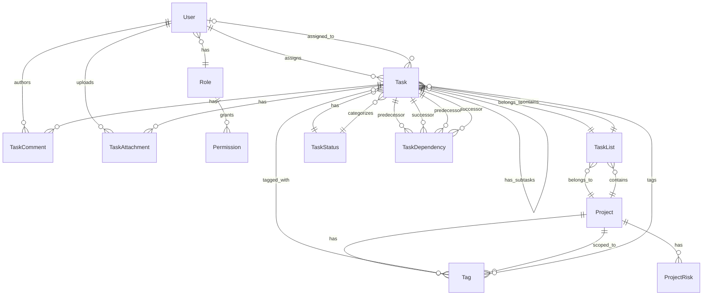

# Data Model - Dreamland Manager

## Overview

Dreamland Manager uses **Prisma ORM** with **PostgreSQL** as the database. The schema is organized into four main domains:

1. **Project Management**: Projects, tasks, lists, and tags
2. **Team Sentiment**: Mood tracking and risk analysis
3. **Authentication & RBAC**: Users, roles, and permissions
4. **AI Usage Tracking**: Logs for voice command usage

---

## Entity Relationship Diagram



---

## Domain 1: Project Management

### Project

Central entity representing a strategic initiative.

**Fields**:
| Field | Type | Description |
|-------|------|-------------|
| `id` | String (CUID) | Unique identifier |
| `title` | String | Project name |
| `department` | String | Owning department (e.g., "Engineering", "Marketing") |
| `type` | String | "Problem" \| "Idea" \| "Initiative" |
| `priority` | String | "High" \| "Medium" \| "Low" |
| `status` | String | "Active" \| "Pending" \| "Done" (default: "Pending") |
| `description` | String | Detailed description |
| `sourceQuote` | String? | Optional reference or quote |
| `startDate` | DateTime? | Project start date |
| `dueDate` | DateTime? | Project deadline |
| `progress` | Int | Completion percentage (0-100) |
| `color` | String? | Hex color for visual identification |
| `createdAt` | DateTime | Auto-generated creation timestamp |
| `updatedAt` | DateTime | Auto-updated timestamp |

**Relations**:
- `lists`: TaskList[] (one-to-many)
- `tags`: Tag[] (one-to-many)
- `risks`: ProjectRisk[] (one-to-many)

**Use Cases**:
- Track strategic initiatives across departments
- Visualize project portfolio by type and priority
- Monitor overall progress and deadlines

---

### TaskList

Organizational container for tasks within a project (similar to columns in Kanban).

**Fields**:
| Field | Type | Description |
|-------|------|-------------|
| `id` | String (CUID) | Unique identifier |
| `name` | String | List name (e.g., "Backlog", "In Progress") |
| `description` | String? | Optional description |
| `position` | Int | Display order (default: 0) |
| `color` | String? | Hex color for visual identification |
| `projectId` | String (FK) | Parent project |
| `createdAt` | DateTime | Auto-generated |
| `updatedAt` | DateTime | Auto-updated |

**Relations**:
- `project`: Project (many-to-one)
- `tasks`: Task[] (one-to-many)

**Use Cases**:
- Organize tasks into phases (e.g., "Design", "Development", "Testing")
- Drag-and-drop reordering via `position` field
- Color-code different workflow stages

---

### Task

Core work item with rich metadata and hierarchy support.

**Fields**:
| Field | Type | Description |
|-------|------|-------------|
| `id` | String (CUID) | Unique identifier |
| `title` | String | Task title |
| `description` | String? | Detailed description |
| `technicalNotes` | String? | Acceptance criteria or technical details |
| `position` | Int | Order within list (default: 0) |
| `startDate` | DateTime? | Planned start date |
| `dueDate` | DateTime? | Deadline |
| `estimatedHours` | Float? | Time estimate |
| `actualHours` | Float? | Time spent |
| `storyPoints` | Int? | Agile story points |
| `progress` | Int | Completion percentage (0-100, default: 0) |
| `parentId` | String? (FK) | Parent task for subtask hierarchy |
| `listId` | String (FK) | Parent list |
| `statusId` | String (FK) | Current status |
| `assigneeId` | String? (FK) | Assigned user (nullable) |
| `createdAt` | DateTime | Auto-generated |
| `updatedAt` | DateTime | Auto-updated |

**Relations**:
- `list`: TaskList (many-to-one)
- `status`: TaskStatus (many-to-one)
- `assignee`: User? (many-to-one, nullable)
- `parent`: Task? (self-referential, nullable)
- `subtasks`: Task[] (self-referential, one-to-many)
- `predecessors`: TaskDependency[] (task dependencies)
- `successors`: TaskDependency[] (task dependencies)
- `comments`: TaskComment[] (one-to-many)
- `attachments`: TaskAttachment[] (one-to-many)
- `tags`: Tag[] (many-to-many)

**Use Cases**:
- Break down work into manageable pieces
- Track progress and time estimates
- Create task hierarchies with subtasks
- Define task dependencies (Finish-to-Start, etc.)

---

### TaskStatus

Global status definitions for task workflow.

**Fields**:
| Field | Type | Description |
|-------|------|-------------|
| `id` | String (CUID) | Unique identifier |
| `name` | String (unique) | Status name (e.g., "To Do", "In Progress", "Done") |
| `color` | String | Hex color (default: #6B7280) |
| `position` | Int | Display order in Kanban (default: 0) |
| `isDefault` | Boolean | Default status for new tasks (default: false) |
| `isClosed` | Boolean | Marks task as complete (default: false) |

**Relations**:
- `tasks`: Task[] (one-to-many)

**Use Cases**:
- Define custom workflow stages
- Kanban board columns
- Automated status transitions

---

### TaskDependency

Defines dependencies between tasks (e.g., Task B can't start until Task A finishes).

**Fields**:
| Field | Type | Description |
|-------|------|-------------|
| `id` | String (CUID) | Unique identifier |
| `predecessorId` | String (FK) | Task that must complete first |
| `successorId` | String (FK) | Task that depends on predecessor |
| `type` | String | Dependency type (default: "FS") |
| `lagDays` | Int | Delay in days (default: 0) |
| `createdAt` | DateTime | Auto-generated |

**Dependency Types**:
- **FS** (Finish-to-Start): Successor starts after predecessor finishes (most common)
- **SS** (Start-to-Start): Both tasks start together
- **FF** (Finish-to-Finish): Both tasks finish together
- **SF** (Start-to-Finish): Successor finishes when predecessor starts

**Constraints**:
- Unique constraint on `[predecessorId, successorId]` (prevents duplicates)

**Use Cases**:
- Critical path analysis
- Gantt chart visualization
- Automated scheduling

---

### TaskComment

Collaboration comments on tasks.

**Fields**:
| Field | Type | Description |
|-------|------|-------------|
| `id` | String (CUID) | Unique identifier |
| `content` | String | Comment text |
| `taskId` | String (FK) | Parent task |
| `authorId` | String (FK) | Comment author |
| `createdAt` | DateTime | Auto-generated |
| `updatedAt` | DateTime | Auto-updated |

**Relations**:
- `task`: Task (many-to-one, cascade delete)
- `author`: User (many-to-one, cascade delete)

**Use Cases**:
- Team discussions on tasks
- Status updates and clarifications
- Audit trail of decisions

---

### TaskAttachment

File attachments on tasks.

**Fields**:
| Field | Type | Description |
|-------|------|-------------|
| `id` | String (CUID) | Unique identifier |
| `filename` | String | Original filename |
| `filepath` | String | Path to stored file |
| `filesize` | Int | Size in bytes |
| `mimetype` | String | MIME type (e.g., "image/png") |
| `taskId` | String (FK) | Parent task |
| `uploaderId` | String (FK) | User who uploaded |
| `createdAt` | DateTime | Auto-generated |

**Relations**:
- `task`: Task (many-to-one, cascade delete)
- `uploader`: User (many-to-one, cascade delete)

**Use Cases**:
- Attach design mockups, documents, screenshots
- Reference files in task discussions

---

### Tag

Flexible categorization system scoped to projects.

**Fields**:
| Field | Type | Description |
|-------|------|-------------|
| `id` | String (CUID) | Unique identifier |
| `name` | String | Tag name (e.g., "Frontend", "Bug", "P1") |
| `color` | String | Hex color (default: #3B82F6) |
| `projectId` | String (FK) | Parent project |

**Relations**:
- `project`: Project (many-to-one, cascade delete)
- `tasks`: Task[] (many-to-many)

**Constraints**:
- Unique constraint on `[projectId, name]` (prevents duplicate tags per project)

**Use Cases**:
- Filter tasks by topic or technology
- Visual categorization with colors
- Cross-list task organization

---

## Domain 2: Team Sentiment

### TeamMood

Tracks emotional health of departments over time.

**Fields**:
| Field | Type | Description |
|-------|------|-------------|
| `id` | String (CUID) | Unique identifier |
| `departmentName` | String | Department name |
| `sentimentScore` | Int | Score from 0-100 (100 = very happy, 0 = stressed) |
| `dominantEmotion` | String | Primary emotion detected (e.g., "Resilient", "Frustrated") |
| `keyConcerns` | String? | Optional summary of issues |
| `detectedAt` | DateTime | Timestamp of measurement (default: now) |

**Use Cases**:
- Monitor team wellness trends
- Early warning system for burnout
- Data-driven people management

---

### ProjectRisk

AI-identified risks associated with projects.

**Fields**:
| Field | Type | Description |
|-------|------|-------------|
| `id` | String (CUID) | Unique identifier |
| `projectId` | String (FK) | Parent project |
| `riskLevel` | String | "High" \| "Medium" \| "Low" |
| `reason` | String | Description of risk |

**Relations**:
- `project`: Project (many-to-one, cascade delete)

**Use Cases**:
- Predictive risk analysis
- Strategic decision support
- Portfolio health monitoring

---

## Domain 3: Authentication & RBAC

### User

System users with role-based access.

**Fields**:
| Field | Type | Description |
|-------|------|-------------|
| `id` | String (CUID) | Unique identifier |
| `name` | String? | Display name |
| `username` | String (unique) | Login username |
| `email` | String? (unique) | Email address |
| `password` | String | Hashed password (bcryptjs) |
| `image` | String? | Avatar URL |
| `roleId` | String (FK) | Assigned role |
| `createdAt` | DateTime | Auto-generated |
| `updatedAt` | DateTime | Auto-updated |

**Relations**:
- `role`: Role (many-to-one)
- `assignedTasks`: Task[] (one-to-many)
- `comments`: TaskComment[] (one-to-many)
- `attachments`: TaskAttachment[] (one-to-many)

**Security Notes**:
- Passwords hashed with bcryptjs before storage
- Email and username must be unique

---

### Role

Role definitions with associated permissions.

**Fields**:
| Field | Type | Description |
|-------|------|-------------|
| `id` | String (CUID) | Unique identifier |
| `code` | String (unique) | System code (e.g., "SUPER_ADMIN") |
| `name` | String | Display name (e.g., "Super Admin") |
| `description` | String? | Role description |
| `isSystem` | Boolean | Protected system role (default: false) |
| `createdAt` | DateTime | Auto-generated |
| `updatedAt` | DateTime | Auto-updated |

**Relations**:
- `users`: User[] (one-to-many)
- `permissions`: Permission[] (many-to-many)

**Default Roles** (created by seed):
- **SUPER_ADMIN**: Full system access
- **STRATEGIC_PM**: Project and roadmap management
- **PEOPLE_CULTURE_LEAD**: Team sentiment and departments
- **STAKEHOLDER**: Read-only strategic insights

---

### Permission

Fine-grained permissions for resources and actions.

**Fields**:
| Field | Type | Description |
|-------|------|-------------|
| `id` | String (CUID) | Unique identifier |
| `action` | String | Action type (e.g., "view", "create", "edit", "delete") |
| `resource` | String | Resource type (e.g., "projects", "users", "tasks") |
| `description` | String? | Human-readable description |
| `createdAt` | DateTime | Auto-generated |
| `updatedAt` | DateTime | Auto-updated |

**Relations**:
- `roles`: Role[] (many-to-many)

**Constraints**:
- Unique constraint on `[action, resource]` (prevents duplicate permissions)

**Example Permissions**:
- `{action: "view", resource: "projects"}` → Can view projects
- `{action: "delete", resource: "users"}` → Can delete users
- `{action: "edit", resource: "sentiment"}` → Can edit team mood data

---

## Domain 4: AI Usage Tracking

### AiUsageLog

Tracks AI API usage for quota monitoring.

**Fields**:
| Field | Type | Description |
|-------|------|-------------|
| `id` | String (CUID) | Unique identifier |
| `modelName` | String | AI model used (e.g., "llama-3.3-70b-versatile") |
| `actionType` | String | Action performed (e.g., "VoiceCommand") |
| `promptTokens` | Int | Tokens in prompt (default: 0) |
| `completionTokens` | Int | Tokens in response (default: 0) |
| `totalTokens` | Int | Total tokens used (default: 0) |
| `projectId` | String? | Associated project (nullable) |
| `userId` | String? | User who triggered (nullable) |
| `remainingRequests` | Int? | Snapshot of remaining API requests |
| `remainingTokens` | Int? | Snapshot of remaining tokens |
| `createdAt` | DateTime | Auto-generated timestamp |

**Use Cases**:
- Monitor AI API quota in real-time
- Cost analysis per project or user
- Identify usage patterns and optimization opportunities

---

## Indexes and Performance

### Recommended Indexes
```sql
-- Frequently queried foreign keys
CREATE INDEX idx_task_listId ON Task(listId);
CREATE INDEX idx_task_assigneeId ON Task(assigneeId);
CREATE INDEX idx_task_statusId ON Task(statusId);
CREATE INDEX idx_tasklist_projectId ON TaskList(projectId);

-- User lookup
CREATE INDEX idx_user_username ON User(username);
CREATE INDEX idx_user_roleId ON User(roleId);

-- AI usage analysis
CREATE INDEX idx_aiusagelog_createdAt ON AiUsageLog(createdAt);
CREATE INDEX idx_aiusagelog_userId ON AiUsageLog(userId);
```

---

## Data Integrity Rules

### Cascade Deletes
The following relationships cascade on delete:
- **Project deleted** → All TaskLists, Tags, and ProjectRisks deleted
- **TaskList deleted** → All Tasks in that list deleted
- **Task deleted** → All Comments, Attachments, Dependencies deleted
- **User deleted** → All Comments and Attachments by that user deleted

### Nullable Foreign Keys with SetNull
- **User deleted** → Tasks assigned to that user have `assigneeId` set to NULL (tasks remain)

---

## Migration Strategy

### Development
```bash
# Create new migration
npx prisma migrate dev --name add_task_priority

# Reset database (warning: deletes all data)
npm run db:reset
```

### Production
```bash
# Apply migrations
npx prisma migrate deploy
```

---

## Further Reading

- [System Overview](../architecture/system-overview.md)
- [RBAC System](../modules/admin/rbac.md)
- [Seeding Guide](./seeding.md)
- [Maintenance Scripts](./maintenance-scripts.md)
