# Voice Assistant Architecture - Dreamland Manager

## Overview

The Voice Assistant is a powerful feature that enables users to manage projects, tasks, and workflows through **natural language commands**. It combines browser-native speech recognition with AI-powered natural language understanding (NLU).

## Architecture Diagram

```mermaid
graph TB
    subgraph "Client Layer"
        USER[👤 User Speech]
        MIC[🎤 Microphone Access]
        WSA[Web Speech API<br/>Browser Native]
        UI[Voice Button Component]
    end
    
    subgraph "Application Layer"
        SA[Server Action<br/>processVoiceCommand]
        FACTORY[AI Provider Factory]
    end
    
    subgraph "AI Providers"
        GROQ[Groq Provider<br/>Llama 3.3 70B Versatile]
        GEMINI[Gemini Provider<br/>Flash 1.5]
    end
    
    subgraph "Task Execution"
        ACTIONS[Server Actions]
        PRISMA[(Database ORM)]
        DB[(PostgreSQL)]
    end
    
    USER --> MIC
    MIC --> WSA
    WSA --> UI
    UI --> SA
    SA --> FACTORY
    FACTORY -->|Runtime Selection| GROQ
    FACTORY -->|Fallback| GEMINI
    GROQ --> ACTIONS
    GEMINI --> ACTIONS
    ACTIONS --> PRISMA
    PRISMA --> DB
    
    style GROQ fill:#f97316
    style GEMINI fill:#3b82f6
    style FACTORY fill:#8b5cf6
    style DB fill:#10b981
```



---

## Components Breakdown

### 1. Speech Recognition (Client-Side)

**Technology**: Browser Web Speech API  
**Implementation**: `src/components/voice-assistant-button.tsx`

The application uses the **Web Speech API** (specifically `SpeechRecognition` / `webkitSpeechRecognition`) for speech-to-text conversion.

**Key Features**:
- ✅ **Free**: No API costs for speech recognition
- ✅ **Real-time**: Immediate transcription
- ✅ **Multi-language**: Automatically uses user's locale (en-US, es-ES, etc.)
- ⚠️ **Browser support**: Works in Chrome, Edge, Safari (not Firefox)

**Flow**:
1. User clicks microphone button
2. Browser requests microphone permission (if not granted)
3. Speech recognition starts listening
4. Interim results displayed in real-time
5. Final transcript sent to server for processing

**Code Example**:
```typescript
const recognition = new (window.SpeechRecognition || window.webkitSpeechRecognition)();
recognition.lang = locale === 'es' ? 'es-ES' : 'en-US';
recognition.interimResults = true;

recognition.onresult = (event) => {
  const transcript = event.results[0][0].transcript;
  // Send to server
  processVoiceCommand(transcript, locale);
};
```

---

### 2. Provider Pattern (AI Abstraction)

**Location**: `src/lib/ai/`

The Voice Assistant uses a **Provider Pattern** to abstract AI model selection. This allows swapping between AI services without changing application code.

#### Interface Definition

**File**: `src/lib/ai/provider.interface.ts`

```typescript
export interface AIProvider {
  /**
   * Process a voice command transcript and execute the corresponding action
   * @param transcript - The speech-to-text result
   * @param locale - User's language (e.g., 'en', 'es')
   * @returns Response with execution result
   */
  processVoiceCommand(transcript: string, locale: string): Promise<CommandResponse>;

  /**
   * Generate direct text based on a prompt (lightweight path)
   * Used for reports and background processing to save tokens
   */
  generateText(projectId: string, prompt: string): Promise<AIResponse>;
  
  /**
   * Get current API usage information (quota, remaining requests, etc.)
   */
  getUsageInfo(): Promise<UsageInfo>;
}

export interface CommandResponse {
  success: boolean;
  message: string;
  action?: string;
  data?: any;
}

export interface AIResponse {
  success: boolean;
  message?: string;
  error?: string;
  transcript?: string;
  actions?: any[];
}

export interface UsageInfo {
  remainingRequests?: number;
  remainingTokens?: number;
  estimatedRPM?: number;
  estimatedRPD?: number;
}
```

#### Factory

**File**: `src/lib/ai/factory.ts`

The factory dynamically selects the provider based on environment variables:

```typescript
import { GroqProvider } from './groq-provider';
import { GeminiProvider } from './gemini-provider';
import type { AIProvider } from './provider.interface';

export function getAIProvider(): AIProvider {
  const provider = process.env.AI_PROVIDER || 'groq';
  
  switch (provider) {
    case 'groq':
      return new GroqProvider();
    case 'gemini':
      return new GeminiProvider();
    default:
      return new GroqProvider(); // Default fallback
  }
}
```

**Usage**:
```typescript
import { getAIProvider } from '@/lib/ai/factory';

const provider = getAIProvider();
const result = await provider.processVoiceCommand('Create task: Fix login bug', 'en');
```

---

### 3. AI Providers

#### Groq Provider (Recommended)

**File**: `src/lib/ai/groq-provider.ts`  
**Model**: `llama-3.3-70b-versatile`  
**API**: Groq Cloud API

**Advantages**:
- ⚡ **Ultra-fast inference**: ~1-2 second responses
- 💰 **Free tier**: 14,400 requests/day, 30 requests/minute
- 📊 **Real-time tracking**: Rate limits exposed via response headers
- 🎯 **High accuracy**: 70B parameter model

**Configuration**:
```bash
# .env
AI_PROVIDER="groq"
GROQ_API_KEY="gsk_..."
```

**Rate Limit Tracking**:
Groq exposes real-time quota in response headers:
- `x-ratelimit-remaining-requests`: Requests left today
- `x-ratelimit-remaining-tokens`: Tokens left today

These values are captured and displayed in the UI (project header component).

**Implementation Details**:
```typescript
export class GroqProvider implements AIProvider {
  async processVoiceCommand(transcript: string, locale: string) {
    // 1. Call Groq API with system prompt
    const response = await fetch('https://api.groq.com/openai/v1/chat/completions', {
      method: 'POST',
      headers: {
        'Authorization': `Bearer ${process.env.GROQ_API_KEY}`,
        'Content-Type': 'application/json'
      },
      body: JSON.stringify({
        model: 'llama-3.3-70b-versatile',
        messages: [
          { role: 'system', content: this.getSystemPrompt(locale) },
          { role: 'user', content: transcript }
        ]
      })
    });
    
    // 2. Extract rate limit info from headers
    const remaining = response.headers.get('x-ratelimit-remaining-requests');
    
    // 3. Parse AI response as JSON
    const data = await response.json();
    const command = JSON.parse(data.choices[0].message.content);
    
    // 4. Execute command via Server Actions
    return this.executeCommand(command);
  }
}
```

---

#### Google Gemini Provider (Fallback)

**File**: `src/lib/ai/gemini-provider.ts`  
**Model**: `gemini-1.5-flash`  
**API**: Google AI Studio API

**Advantages**:
- 🔄 **Reliable fallback**: When Groq is unavailable
- 🌐 **Google infrastructure**: Global availability
- 💰 **Free tier**: 1500 requests/day, 15 requests/minute

**Configuration**:
```bash
# .env
AI_PROVIDER="gemini"
GOOGLE_GENERATIVE_AI_API_KEY="AIza..."
```

**Rate Limit Tracking**:
Gemini does NOT expose rate limits in headers. Instead, the application **estimates usage** based on local database logs:

```typescript
async getUsageInfo() {
  // Query last 60 seconds of logs
  const logsLastMinute = await prisma.aiUsageLog.count({
    where: {
      modelName: 'gemini-1.5-flash',
      createdAt: { gte: new Date(Date.now() - 60000) }
    }
  });
  
  // Query last 24 hours
  const logsLastDay = await prisma.aiUsageLog.count({
    where: {
      modelName: 'gemini-1.5-flash',
      createdAt: { gte: new Date(Date.now() - 86400000) }
    }
  });
  
  return {
    estimatedRPM: logsLastMinute,
    estimatedRPD: logsLastDay
  };
}
```

**Implementation Details**:
```typescript
import { GoogleGenerativeAI } from '@google/generative-ai';

export class GeminiProvider implements AIProvider {
  private genAI = new GoogleGenerativeAI(process.env.GOOGLE_GENERATIVE_AI_API_KEY!);
  
  async processVoiceCommand(transcript: string, locale: string) {
    const model = this.genAI.getGenerativeModel({ model: 'gemini-1.5-flash' });
    
    const result = await model.generateContent({
      contents: [
        { role: 'user', parts: [{ text: this.getSystemPrompt(locale) }] },
        { role: 'user', parts: [{ text: transcript }] }
      ]
    });
    
    const command = JSON.parse(result.response.text());
    return this.executeCommand(command);
  }
}
```

---

### 4. Command Processing

Both providers use a **structured JSON response format** to ensure consistent command parsing.

#### System Prompt

The AI receives a system prompt that defines available commands and expected JSON format:

```typescript
getSystemPrompt(locale: string): string {
  return `
You are a voice assistant for a project management system.
Return a JSON object with the following structure:
{
  "action": "createTask" | "createList" | "deleteTask" | "updateTask",
  "data": { ... }
}

Available actions:
- createTask: { title: string, listId?: string }
- createList: { name: string, projectId: string }
- deleteTask: { taskId: string }
- updateTask: { taskId: string, updates: {...} }

User locale: ${locale}
Respond in ${locale === 'es' ? 'Spanish' : 'English'}.
`;
}
```

#### Supported Commands

| **Command (English)** | **Command (Spanish)** | **Action** | **Data** |
|-----------------------|-----------------------|------------|----------|
| "Create task: Fix login bug" | "Crear tarea: Arreglar login" | `createTask` | `{title: "Fix login bug"}` |
| "Create list: Testing" | "Crear lista: Pruebas" | `createList` | `{name: "Testing"}` |
| "Delete task 123" | "Eliminar tarea 123" | `deleteTask` | `{taskId: "123"}` |
| "Mark task 456 as done" | "Completar tarea 456" | `updateTask` | `{taskId: "456", status: "done"}` |

---

### 5. Command Execution

After parsing the AI response, the provider calls the corresponding **Server Action**:

```typescript
async executeCommand(command: AICommand): Promise<CommandResponse> {
  switch (command.action) {
    case 'createTask':
      await createTask(command.data);
      return { success: true, message: 'Task created', action: 'createTask' };
      
    case 'createList':
      await createTaskList(command.data);
      return { success: true, message: 'List created', action: 'createList' };
      
    case 'deleteTask':
      await deleteTask(command.data.taskId);
      return { success: true, message: 'Task deleted', action: 'deleteTask' };
      
    default:
      return { success: false, message: 'Unknown command' };
  }
}
```

---

## Usage Tracking

### AiUsageLog Model

Every voice command is logged to the database for quota tracking:

```prisma
model AiUsageLog {
  id                String   @id @default(cuid())
  modelName         String   // "llama-3.3-70b-versatile" or "gemini-1.5-flash"
  actionType        String   // "VoiceCommand"
  promptTokens      Int
  completionTokens  Int
  totalTokens       Int
  remainingRequests Int?     // Groq only
  remainingTokens   Int?     // Groq only
  createdAt         DateTime @default(now())
}
```

### UI Display

The project header shows real-time usage:

**Groq Mode**:
```
🟢 Groq: 13,847 / 14,400 requests remaining
```

**Gemini Mode**:
```
🔵 Gemini: 12 RPM / 450 RPD
```

---

## Error Handling

### Network Errors
```typescript
try {
  const result = await provider.processVoiceCommand(transcript, locale);
} catch (error) {
  return { success: false, message: 'Network error. Please try again.' };
}
```

### Rate Limit Exceeded
```typescript
if (response.status === 429) {
  return {
    success: false,
    message: 'Rate limit exceeded. Please wait a moment.'
  };
}
```

### Invalid Command
```typescript
if (!command.action) {
  return {
    success: false,
    message: 'Sorry, I didn\'t understand that command.'
  };
}
```

---

## Performance Considerations

### Response Times
- **Groq**: ~1-2 seconds (with fast network)
- **Gemini**: ~2-4 seconds (with fast network)
- **Web Speech API**: Real-time (no added latency)

### Optimization Tips
1. **Use Groq for production**: Faster and more quota
2. **Cache system prompts**: Reduce prompt size
3. **Batch commands**: Allow multi-command voice input
4. **Fallback gracefully**: Switch to Gemini if Groq fails

---

## Security Considerations

### API Key Protection
- ✅ API keys stored in `.env` (never committed to Git)
- ✅ Server-side only (never exposed to client)
- ✅ Rate limiting enforced by providers

### Input Validation
- ✅ Transcript sanitized before AI processing
- ✅ Command execution validated by Server Actions
- ✅ RBAC permissions checked before execution

---

## Configuration Guide

### Environment Variables

```bash
# Choose provider: "groq" or "gemini"
AI_PROVIDER="groq"

# Groq API Key (get from https://console.groq.com)
GROQ_API_KEY="gsk_..."

# Google Gemini API Key (get from https://aistudio.google.com)
GOOGLE_GENERATIVE_AI_API_KEY="AIza..."
```

### Switching Providers

To switch from Groq to Gemini:

1. Update `.env`:
   ```bash
   AI_PROVIDER="gemini"
   ```

2. Restart server:
   ```bash
   npm run dev
   ```

No code changes required!

---

## Future Enhancements

### Planned Features
- [ ] Multi-turn conversations (contextual commands)
- [ ] Voice response (Text-to-Speech)
- [ ] Custom wake words ("Hey Dreamland...")
- [ ] Offline mode with local models
- [ ] Command history and suggestions

### Additional Providers
- [ ] OpenAI GPT-4
- [ ] Anthropic Claude
- [ ] Local LLaMA models (via Ollama)

---

## Further Reading

- [Groq Integration](./groq-integration.md)
- [Gemini Integration](./gemini-integration.md)
- [Voice Commands Reference](../../guides/voice-commands.md)
- [Usage Tracking](./usage-tracking.md)
- [System Architecture](../../architecture/system-overview.md)
