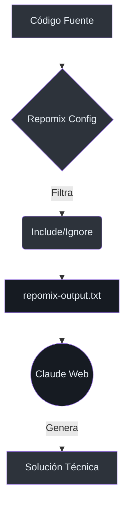

# 🤖 Contexto para IA con Repomix

Para que las IAs (como Claude Web) puedan ayudarnos de forma efectiva en tareas complejas, necesitan entender la estructura y la lógica del proyecto. Usamos **Repomix** para empaquetar de forma segura y estructurada las partes más relevantes del código.

## 🏗️ Flujo de Trabajo

El objetivo es generar un archivo único que contenga solo lo necesario para la tarea actual, evitando "ruido" como archivos de imagen, dependencias pesadas (`node_modules`) o builds generados (`.next`).



## ⚙️ Configuración Actual

El proyecto cuenta con un archivo `repomix.config.json` en la raíz (file:///c:/Webs/dreamland-projects/dreamland-app/repomix.config.json) con los siguientes ajustes predeterminados:

| Configuración | Valor | Razón |
| :--- | :--- | :--- |
| **Output Style** | `markdown` | Mejor legibilidad para la IA |
| **Include** | `src/**/*`, `prisma/schema.prisma` | Lógica de negocio y modelos |
| **Security** | `Secretlint` activado | Evitar fugas de tokens o passwords |
| **Line Numbers** | `true` | Permite citar líneas exactas |

## 🚀 Comandos Útiles

### Generar contexto global
Si necesitas que la IA analice todo el núcleo del proyecto:
```bash
npx repomix
```

### Contexto de Administración y Roles
Útil para tareas relacionadas con usuarios, permisos y RBAC (file:///c:/Webs/dreamland-projects/dreamland-app/src/modules/admin):
```bash
npx repomix --include "src/modules/admin/**/*,src/lib/permissions.ts,prisma/schema.prisma"
```

### Contexto del Módulo Sherlock
Para tareas de recetas e ingredientes (file:///c:/Webs/dreamland-projects/dreamland-app/src/modules/sherlock):
```bash
npx repomix --include "src/modules/sherlock/**/*,prisma/schema.prisma"
```

## 🛡️ Seguridad y Exclusiones

Repomix respeta automáticamente el archivo `.gitignore`. Además, de forma predeterminada ignoramos:
- `package-lock.json`
- `.next/`
- `public/assets/`
- Archivos binarios (`.png`, `.jpg`, `.ico`)

> [!IMPORTANT]
> Nunca subas el archivo generado a repositorios públicos. Está diseñado solo para su uso en chats de IA locales o bajo demanda.

## 🔗 Referencias
- [Repomix GitHub](https://github.com/yamadashy/repomix)
- [Prisma Schema](file:///c:/Webs/dreamland-projects/dreamland-app/prisma/schema.prisma)
