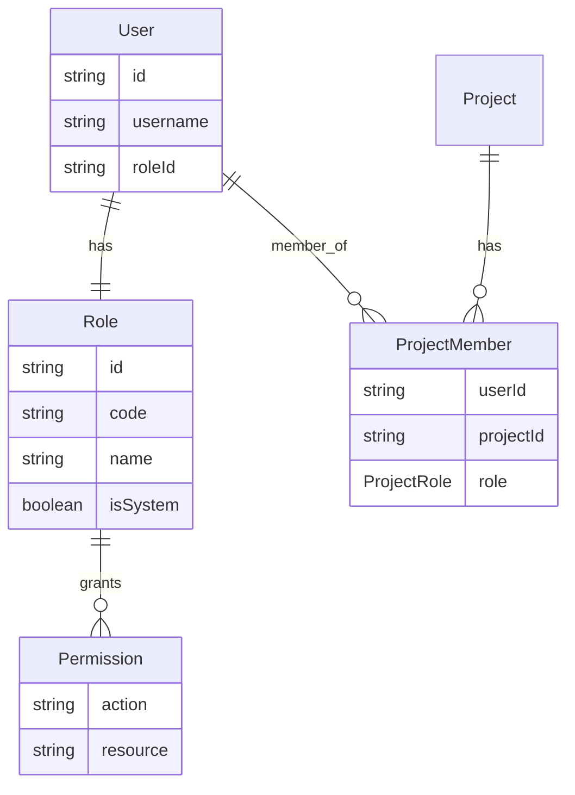
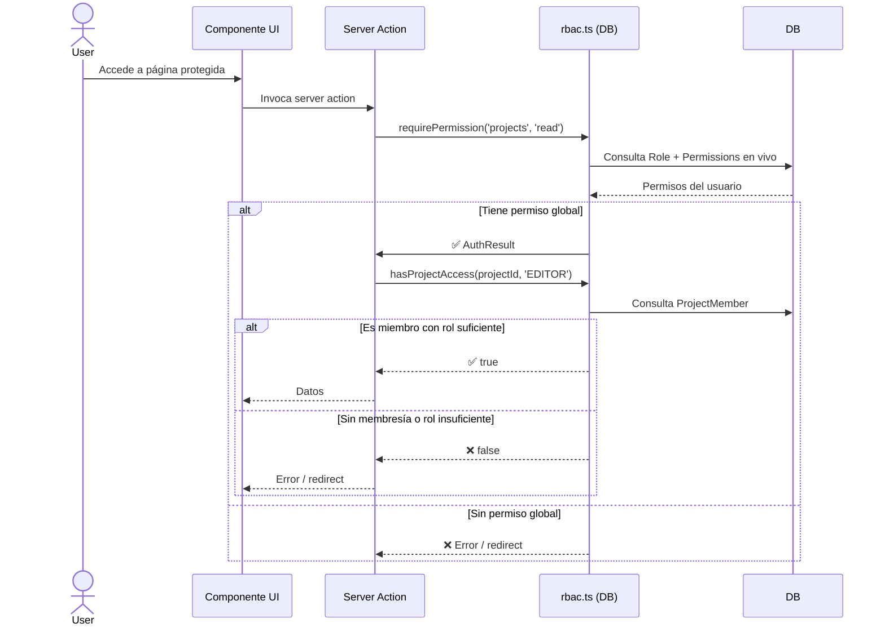

# Sistema RBAC - Dreamland Manager

## Introducción

Dreamland Manager implementa un sistema **RBAC híbrido de dos capas**:

1. **Roles Globales** — definen qué recursos del sistema puede acceder un usuario
2. **Roles de Proyecto** — definen el nivel de acceso dentro de cada proyecto concreto

---

## Arquitectura



---

## Conceptos Core

### 1. Usuarios
Usuarios individuales con credenciales:
- Username/email + contraseña
- Asignados a exactamente **UN rol global**
- Heredan todos los permisos de ese rol
- Pueden tener **múltiples membresías de proyecto** con roles diferentes

### 2. Roles Globales
Colecciones de permisos sobre recursos del sistema:
- **code**: Identificador de sistema (ej. `SUPER_ADMIN`)
- **name**: Nombre para mostrar (ej. "Super Admin")
- **isSystem**: Roles protegidos que no pueden eliminarse

### 3. Permisos
Reglas de acceso granulares:
- **resource**: Qué (ej. `projects`, `users`, `sherlock`)
- **action**: Cómo (`read`, `create`, `update`, `delete`, `manage`)

> **Nota:** La acción `manage` es un comodín — implica todos los permisos sobre ese recurso.
> La nomenclatura correcta es `read`/`update` (no `view`/`edit`).

### 4. Roles de Proyecto (`ProjectRole`)
Controlan el acceso dentro de un proyecto específico:

| Rol | Jerarquía | Capacidades |
|-----|-----------|-------------|
| `OWNER` | 4 (máximo) | Control total: editar, eliminar, gestionar miembros |
| `MANAGER` | 3 | Gestión completa excepto eliminar proyecto |
| `EDITOR` | 2 | Creación y edición de contenido (tareas, listas) |
| `VIEWER` | 1 (mínimo) | Solo lectura |

---

## Flujo de Autorización



### Regla clave: SUPER_ADMIN bypassa todo

`SUPER_ADMIN` tiene acceso completo a todos los recursos Y a todos los proyectos, sin necesidad de membresía.

---

## Roles Globales por Defecto

El seed crea 4 roles de sistema (`isSystem: true`):

### 1. Super Admin
**Code**: `SUPER_ADMIN`
**Permisos**: Acceso completo a todo el sistema

| Recurso | Acciones |
|---------|----------|
| projects | read, create, update, delete |
| users | read, create, update, delete |
| roles | read, create, update, delete |
| departments | read, create, update, delete |
| sentiment | read, create, update, delete |
| sherlock | read, create, update, delete |
| reports | read, create, update, delete |
| admin | manage |

**Caso de uso**: Administradores del sistema, fundadores

---

### 2. Strategic PM
**Code**: `STRATEGIC_PM`
**Permisos**: Gestión de proyectos y hoja de ruta

| Recurso | Acciones |
|---------|----------|
| projects | read, create, update, delete |
| departments | read |
| users | read |
| sherlock | read |
| reports | read |

**Caso de uso**: Product Managers, Technical Leads

---

### 3. People & Culture Lead
**Code**: `PEOPLE_CULTURE_LEAD`
**Permisos**: Bienestar del equipo y RRHH

| Recurso | Acciones |
|---------|----------|
| sentiment | read, create, update, delete |
| departments | read, create, update |
| users | read, update |
| projects | read |

**Caso de uso**: Responsables de RRHH, coaches de equipo

---

### 4. Stakeholder
**Code**: `STAKEHOLDER`
**Permisos**: Visión de solo lectura

| Recurso | Acciones |
|---------|----------|
| projects | read |
| departments | read |
| sentiment | read |
| reports | read |

**Caso de uso**: Ejecutivos, stakeholders externos

---

## Matriz de Permisos Global

| Recurso | read | create | update | delete |
|---------|------|--------|--------|--------|
| **projects** | Todos | Super Admin, Strategic PM | Super Admin, Strategic PM | Super Admin, Strategic PM |
| **users** | Todos | Super Admin | Super Admin, People Lead | Super Admin |
| **roles** | Super Admin | Super Admin | Super Admin | Super Admin |
| **departments** | Todos | Super Admin, People Lead | Super Admin, People Lead | Super Admin |
| **sentiment** | Todos | Super Admin, People Lead | Super Admin, People Lead | Super Admin |
| **sherlock** | Super Admin, Strategic PM | Super Admin | Super Admin | Super Admin |
| **reports** | Super Admin, Strategic PM, Stakeholder | Super Admin | Super Admin | Super Admin |
| **admin** | Super Admin | Super Admin | Super Admin | Super Admin |

> **Importante:** Los permisos a nivel de tarea (`tasks`, `lists`, `comments`, etc.) son gestionados exclusivamente por los roles de proyecto (`ProjectRole`), no por los roles globales.

---

## Roles de Proyecto — Detalle

### Jerarquía

```
OWNER (4) > MANAGER (3) > EDITOR (2) > VIEWER (1)
```

### Restricciones de seguridad
- Un usuario solo puede asignar roles **iguales o inferiores** al suyo
- `MANAGER` puede eliminar miembros con rol `EDITOR` o `VIEWER`
- **No se puede eliminar al último `OWNER`** de un proyecto
- El **creador del proyecto** es asignado automáticamente como `OWNER` en la misma transacción

### Capacidades por rol

| Acción | OWNER | MANAGER | EDITOR | VIEWER |
|--------|-------|---------|--------|--------|
| Ver proyecto y tareas | ✅ | ✅ | ✅ | ✅ |
| Crear/editar tareas | ✅ | ✅ | ✅ | ❌ |
| Crear/editar listas | ✅ | ✅ | ✅ | ❌ |
| Gestionar miembros | ✅ | ✅ | ❌ | ❌ |
| Editar configuración del proyecto | ✅ | ✅ | ❌ | ❌ |
| Eliminar proyecto | ✅ | ❌ | ❌ | ❌ |

---

## Implementación

### Archivos Clave

| Archivo | Propósito |
|---------|-----------|
| `src/lib/actions/rbac.ts` | Autorización real en servidor (consulta DB en vivo) |
| `src/lib/permissions.ts` | Checks rápidos en cliente (UI condicional, no para seguridad) |
| `src/modules/shared/lib/project-filters.ts` | Filtro Prisma automático por membresía |
| `src/modules/projects/actions/members.ts` | CRUD de membresías de proyecto |
| `src/modules/admin/actions/project-members.ts` | Gestión de membresías desde Admin |

---

### Funciones del Servidor (`src/lib/actions/rbac.ts`)

#### Tipos

```typescript
type Resource = 'projects' | 'tasks' | 'users' | 'roles' | 'sentiment' |
                'departments' | 'ai' | 'admin' | 'sherlock' | 'reports' |
                'settings' | 'lists' | 'comments' | 'attachments' | 'tags'

type Action = 'create' | 'read' | 'update' | 'delete' | 'manage'
```

#### `requireAuth()`
Verifica que el usuario esté autenticado consultando la DB en vivo.
```typescript
const auth = await requireAuth()
if (!auth.authenticated) throw new Error(auth.error)
// auth.userId, auth.roleCode disponibles
```

#### `hasPermission(resource, action)`
Devuelve `boolean`. Consulta DB en vivo. SUPER_ADMIN siempre devuelve `true`.
```typescript
const canRead = await hasPermission('projects', 'read')
```

#### `requirePermission(resource, action)`
Como `hasPermission` pero lanza error si no está autorizado.
```typescript
await requirePermission('projects', 'create') // lanza si no tiene permiso
```

#### `requireProjectAccess(projectId, minRole?)`
Verifica acceso a proyecto específico. Redirige a `/unauthorized` si no tiene acceso.
```typescript
await requireProjectAccess(projectId, 'EDITOR')
```

#### `hasProjectAccess(projectId, minRole?)`
Versión no-redirect: devuelve `boolean`.
```typescript
const canEdit = await hasProjectAccess(projectId, 'EDITOR')
```

#### `getAccessibleProjectIds()`
Devuelve `string[]` con IDs de proyectos accesibles, o `null` para SUPER_ADMIN (= todos).
```typescript
const projectIds = await getAccessibleProjectIds()
// null = SUPER_ADMIN (acceso total)
// [] = sin proyectos asignados
```

#### `getCurrentUserId()`
Obtiene el ID del usuario actual sin consulta DB extra.
```typescript
const userId = await getCurrentUserId()
```

---

### Checks Rápidos en Cliente (`src/lib/permissions.ts`)

> ⚠️ **Solo para UI condicional.** Nunca como única barrera de seguridad. Las permissions se codifican en el JWT como `"action:resource"`.

```typescript
import { hasPermission } from '@/lib/permissions'

// En Server Component
export default async function Page() {
  const session = await getSession()
  const canCreate = hasPermission(session?.user, 'create', 'projects')

  return (
    <div>
      {canCreate && <button>Nuevo Proyecto</button>}
    </div>
  )
}
```

```typescript
import { hasAnyPermission } from '@/lib/permissions'

const canManageTeam = hasAnyPermission(user, [
  { action: 'update', resource: 'users' },
  { action: 'manage', resource: 'departments' },
])
```

---

### Filtrado Automático de Proyectos (`src/modules/shared/lib/project-filters.ts`)

```typescript
import { getProjectWhereFilter } from '@/modules/shared/lib/project-filters'

export async function getProjects() {
  const filter = await getProjectWhereFilter()
  // SUPER_ADMIN: filter = {} (sin restricción)
  // Otros: filter = { id: { in: [...projectIds] } }
  return prisma.project.findMany({ where: filter })
}
```

---

### Ejemplo Completo en Server Action

```typescript
'use server'

import { requirePermission, hasProjectAccess } from '@/lib/actions/rbac'

export async function createTask(projectId: string, data: TaskData) {
  // 1. Verificar permiso global (tiene acceso al módulo de proyectos)
  await requirePermission('projects', 'read')

  // 2. Verificar acceso al proyecto específico como EDITOR o superior
  const canEdit = await hasProjectAccess(projectId, 'EDITOR')
  if (!canEdit) {
    throw new Error('No tienes permisos para crear tareas en este proyecto')
  }

  // 3. Proceder con la lógica de negocio
  return prisma.task.create({ data: { ...data, projectId } })
}
```

---

## Gestión de Miembros de Proyecto

### Desde el Proyecto (UI)

El componente `ProjectMembersPanel` (sheet lateral en el header del proyecto) permite a `OWNER` y `MANAGER` gestionar miembros directamente.

**Funciones disponibles** (`src/modules/projects/actions/members.ts`):

```typescript
getProjectMembers(projectId)                        // Lista de miembros
addProjectMember(projectId, userId, role)           // Añadir miembro
updateProjectMember(projectId, userId, role)        // Cambiar rol
removeProjectMember(projectId, userId)              // Eliminar miembro
getUsersWithProjectAccess(projectId)                // Usuarios con acceso
```

### Desde Admin (Gestión Global)

El panel `ProjectAccessPanel` en `/admin/users/[id]` permite a SUPER_ADMIN gestionar todas las membresías de un usuario.

**Funciones disponibles** (`src/modules/admin/actions/project-members.ts`):

```typescript
getUserProjectMemberships(userId)                   // Membresías de un usuario
getProjectMembers(projectId)                        // Miembros de un proyecto
assignUserToProject(userId, projectId, role)        // Asignar proyecto
removeUserFromProject(userId, projectId)            // Eliminar acceso
bulkAssignProjects(userId, assignments[])           // Asignación masiva
```

---

## Creación de Roles Personalizados

### Desde el Dashboard de Admin

1. Ir a **Admin** → **Roles**
2. Hacer clic en **Crear Nuevo Rol**
3. Introducir nombre y descripción
4. Seleccionar permisos en la matriz interactiva
5. Guardar

**Recursos disponibles en la UI**: `projects`, `sherlock`, `reports`, `users`, `roles`, `departments`, `sentiment`, `admin`
**Acciones disponibles**: `read`, `create`, `update`, `delete`, `manage`

### Desde Código (Seed Script)

```typescript
// prisma/seed.ts

const developerRole = await prisma.role.create({
  data: {
    code: 'DEVELOPER',
    name: 'Developer',
    description: 'Ingenieros de software con acceso técnico',
    permissions: {
      connect: [
        { action_resource: { action: 'read', resource: 'projects' } },
        { action_resource: { action: 'read', resource: 'sherlock' } },
      ]
    }
  }
})
```

---

## Buenas Prácticas de Seguridad

### 1. Principio de Mínimo Privilegio
❌ **Mal**: Dar `SUPER_ADMIN` a todos los usuarios
✅ **Bien**: Crear roles específicos por función y asignar roles de proyecto granulares

### 2. Proteger Roles de Sistema
Los roles con `isSystem: true` no pueden eliminarse:

```typescript
async function deleteRole(roleId: string) {
  const role = await prisma.role.findUnique({ where: { id: roleId } })
  if (role?.isSystem) throw new Error('Cannot delete system role')
  await prisma.role.delete({ where: { id: roleId } })
}
```

### 3. Siempre Validar en el Servidor
La UI condicionada por `hasPermission()` (cliente) es cosmética. La autorización real está en el servidor:

```typescript
// ❌ Solo cliente (inseguro como única barrera)
'use client'
const canDelete = hasPermission(user, 'delete', 'projects')
return canDelete && <button onClick={() => deleteProject(id)}>Eliminar</button>

// ✅ Servidor (enforcement real)
'use server'
async function deleteProject(projectId: string) {
  await requirePermission('projects', 'delete')
  await requireProjectAccess(projectId, 'OWNER')
  // ...
}
```

### 4. Doble Capa para Recursos de Proyecto
Para cualquier acción sobre datos de un proyecto, verificar **ambas** capas:

```typescript
// Capa 1: permiso global sobre el módulo
await requirePermission('projects', 'read')

// Capa 2: membresía en el proyecto concreto
await requireProjectAccess(projectId, 'EDITOR')
```

---

## Migraciones de Base de Datos

El refactor introdujo las siguientes migraciones:

```
prisma/migrations/
├── 20260217105017_add_project_members/   → Tabla project_members + enum ProjectRole
└── 20260217120000_cleanup_project_scoped_permissions/  → Limpia permisos de nivel
                                                          de proyecto de roles globales
```

---

## Lectura Adicional

- [Modelo de Datos](../../database/data-model.md)
- [Guía de Autenticación](../capabilities/authentication.md)
