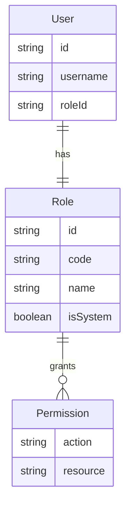
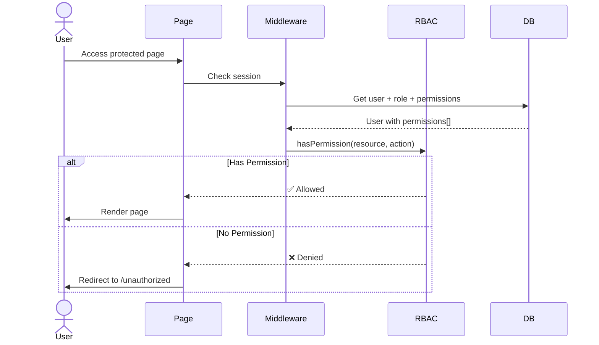

# RBAC System Overview - Dreamland Manager

## Introduction

Dreamland Manager implements a robust **Role-Based Access Control (RBAC)** system that provides granular permissions for enterprise-level security.

## Architecture



## Core Concepts

### 1. Users
Individual system users with credentials:
- Username/email + password
- Assigned exactly ONE role
- Inherit all permissions from their role

### 2. Roles
Named collections of permissions:
- **code**: System identifier (e.g., `SUPER_ADMIN`)
- **name**: Display name (e.g., "Super Admin")
- **isSystem**: Protected roles that can't be deleted

### 3. Permissions
Fine-grained access rules:
- **resource**: What (e.g., "projects", "users")
- **action**: How (e.g., "view", "create", "edit", "delete")

## Authorization Flow



## Default Roles

The system creates 4 default roles via seed script:

### 1. Super Admin
**Code**: `SUPER_ADMIN`  
**Permissions**: ALL (full system access)

| Resource | Actions |
|----------|---------|
| projects | view, create, edit, delete |
| users | view, create, edit, delete |
| roles | view, create, edit, delete |
| departments | view, create, edit, delete |
| tasks | view, create, edit, delete |
| sentiment | view, create, edit, delete |

**Use Case**: System administrators, founders

---

### 2. Strategic PM
**Code**: `STRATEGIC_PM`  
**Permissions**: Project and roadmap management

| Resource | Actions |
|----------|---------|
| projects | view, create, edit, delete |
| tasks | view, create, edit, delete |
| departments | view |
| users | view |

**Use Case**: Product/Project Managers, technical leads

---

### 3. People & Culture Lead
**Code**: `PEOPLE_CULTURE_LEAD`  
**Permissions**: Team wellness and HR

| Resource | Actions |
|----------|---------|
| sentiment | view, create, edit, delete |
| departments | view, create, edit |
| users | view, edit |
| projects | view |

**Use Case**: HR managers, team coaches

---

### 4. Stakeholder
**Code**: `STAKEHOLDER`  
**Permissions**: Read-only strategic insights

| Resource | Actions |
|----------|---------|
| projects | view |
| tasks | view |
| sentiment | view |
| departments | view |

**Use Case**: Executives, external stakeholders

---

## Permission Matrix

Full permission matrix for all resources:

| Resource | View | Create | Edit | Delete |
|----------|------|--------|------|--------|
| **projects** | All roles | Super Admin, Strategic PM | Super Admin, Strategic PM | Super Admin |
| **users** | All roles | Super Admin | Super Admin, People Lead | Super Admin |
| **roles** | Super Admin | Super Admin | Super Admin | Super Admin |
| **departments** | All roles | Super Admin, People Lead | Super Admin, People Lead | Super Admin |
| **tasks** | All roles | Super Admin, Strategic PM | Super Admin, Strategic PM | Super Admin |
| **sentiment** | All roles | Super Admin, People Lead | Super Admin, People Lead | Super Admin |

---

## Implementation

### Permission Check Function

**File**: `src/lib/permissions.ts`

```typescript
import { getSession } from '@/lib/session';
import prisma from '@/lib/prisma';

export async function hasPermission(resource: string, action: string): Promise<boolean> {
  const session = await getSession();
  if (!session) return false;
  
  const user = await prisma.user.findUnique({
    where: { id: session.userId },
    include: {
      role: {
        include: {
          permissions: true
        }
      }
    }
  });
  
  if (!user) return false;
  
  return user.role.permissions.some(
    p => p.resource === resource && p.action === action
  );
}
```

### Usage in Server Actions

```typescript
'use server';

import { hasPermission } from '@/lib/permissions';

export async function deleteProject(projectId: string) {
  // Check permission
  if (!(await hasPermission('projects', 'delete'))) {
    throw new Error('Unauthorized');
  }
  
  // Proceed with deletion
  await prisma.project.delete({ where: { id: projectId } });
}
```

### Usage in Components

```tsx
import { hasPermission } from '@/lib/permissions';

export async function ProjectActions({ projectId }: { projectId: string }) {
  const canEdit = await hasPermission('projects', 'edit');
  const canDelete = await hasPermission('projects', 'delete');
  
  return (
    <div>
      {canEdit && <button>Edit</button>}
      {canDelete && <button>Delete</button>}
    </div>
  );
}
```

---

## Creating Custom Roles

### Via Admin Dashboard

1. Navigate to **Admin** → **Roles**
2. Click **Create New Role**
3. Enter role name and description
4. Use permission matrix to select permissions
5. Click **Save**

### Via Code (Seed Script)

```typescript
// prisma/seed.ts

const customRole = await prisma.role.create({
  data: {
    code: 'DEVELOPER',
    name: 'Developer',
    description: 'Software engineers with technical access',
    permissions: {
      connect: [
        { action_resource: { action: 'view', resource: 'projects' } },
        { action_resource: { action: 'view', resource: 'tasks' } },
        { action_resource: { action: 'create', resource: 'tasks' } },
        { action_resource: { action: 'edit', resource: 'tasks' } }
      ]
    }
  }
});
```

---

## Security Best Practices

### 1. Principle of Least Privilege
Grant minimum permissions needed:

❌ **Bad**: Give all users `SUPER_ADMIN`  
✅ **Good**: Create specific roles per job function

### 2. Protect System Roles
System roles (`isSystem: true`) cannot be deleted:

```typescript
async function deleteRole(roleId: string) {
  const role = await prisma.role.findUnique({ where: { id: roleId } });
  
  if (role?.isSystem) {
    throw new Error('Cannot delete system role');
  }
  
  await prisma.role.delete({ where: { id: roleId } });
}
```

### 3. Server-Side Checks Always
Never rely on client-side permission checks alone:

```typescript
// ❌ Client-only check (insecure)
'use client';
function DeleteButton({ projectId }: { projectId: string }) {
  const canDelete = usePermission('projects', 'delete');
  return canDelete && <button onClick={() => deleteProject(projectId)}>Delete</button>;
}

// ✅ Server-side enforcement (secure)
'use server';
async function deleteProject(projectId: string) {
  if (!(await hasPermission('projects', 'delete'))) {
    throw new Error('Unauthorized');
  }
  // ...
}
```

---

## Further Reading

- [Data Model](../../database/data-model.md)
- [Default Roles](./default-roles.md)
- [Permission Matrix](./permission-matrix.md)
- [Custom Roles Guide](../../guides/custom-roles.md)
