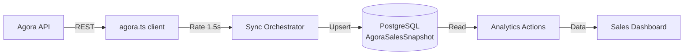

# 💳 Integración Agora TPV

## Resumen

La integración con **Agora TPV** permite sincronizar datos de ventas de los restaurantes hacia GastroLab para análisis de rendimiento, familias de producto y métodos de pago.

---

## 🏗️ Arquitectura



---

## 📁 Archivos Clave

| Archivo | Propósito |
|---------|-----------|
| `src/lib/agora.ts` | Cliente API con rate limiting y retry |
| `src/modules/gastrolab/domain/agora-sync/sync-orchestrator.ts` | Orquestador de sincronización |
| `src/modules/gastrolab/actions/agora-analytics.ts` | Queries analíticas sobre snapshots |
| `src/app/[locale]/(dashboard)/gastrolab/sales/` | Dashboard de ventas |
| `scripts/sync-agora-sales.ts` | Script CLI para sincronización |

---

## 🔌 Cliente API (`src/lib/agora.ts`)

### Características
- **Rate limiting**: 1.5 segundos entre llamadas (configurable via `AGORA_RATE_DELAY_MS`)
- **Retry**: Backoff exponencial 2s → 4s → 8s (configurable via `AGORA_MAX_RETRIES`)
- **Timeout**: 30s para endpoints de ventas (configurable via `AGORA_SALES_TIMEOUT_MS`)

### Normalización de Datos
La API de Agora devuelve estructuras anidadas complejas:

```typescript
// Respuesta Agora (anidada)
{
  Pos: { Id: 1, Name: "TPV1" },
  Workplace: { Id: 42, Name: "Voltereta Casa" },
  InvoiceItems: [{ Lines: [...] }],
  Totals: { GrossAmount: 125.50 }
}

// Normalizada (plana)
{
  posId: 1, posName: "TPV1",
  workplaceId: 42, workplaceName: "Voltereta Casa",
  items: [...],
  grossAmount: 125.50
}
```

### Mapeo de Locales
`Workplace.Id` de Agora = `RestaurantLocation.agoraPosId` — mapeo directo, sin pasar por `PosId`.

---

## 🔄 Sync Orchestrator

**Archivo**: `src/modules/gastrolab/domain/agora-sync/sync-orchestrator.ts`

### Fases de Sincronización

```
1. Conexión    → Verificar API disponible
2. Maestros    → Sincronizar familias y productos
3. Matching    → Mapear workplaces → RestaurantLocation
4. Ventas      → Descargar y guardar snapshots por día/local
```

### Guard de Concurrencia
- Registro de última sync con timestamp
- Sync considerada **stale** si tiene > 30 minutos
- Evita ejecución simultánea de múltiples syncs

---

## 🖥️ Script CLI

```bash
# Sincronizar últimos 7 días
npx tsx scripts/sync-agora-sales.ts --days=7 --write

# Rango específico
npx tsx scripts/sync-agora-sales.ts --from=2026-01-01 --to=2026-03-01 --write

# Solo maestros (familias, productos)
npx tsx scripts/sync-agora-sales.ts --master --write

# Sync completo (maestros + ventas)
npx tsx scripts/sync-agora-sales.ts --full --write

# Dry run (sin escribir en DB)
npx tsx scripts/sync-agora-sales.ts --days=30 --dry-run --verbose
```

### Flags

| Flag | Descripción |
|------|-------------|
| `--from=YYYY-MM-DD` | Fecha inicio |
| `--to=YYYY-MM-DD` | Fecha fin |
| `--days=N` | Últimos N días (alternativa a from/to) |
| `--master` | Solo sincronizar maestros |
| `--full` | Maestros + ventas completas |
| `--write` | Escribir en base de datos |
| `--dry-run` | Simular sin escribir |
| `--verbose` | Output detallado |

---

## 📊 Dashboard de Ventas

**Ruta**: `/gastrolab/sales`

### KPIs
- Ventas totales (€)
- Ticket medio
- Número de operaciones
- Comparativa vs período anterior

### Visualizaciones
- Tendencia de ventas (línea temporal)
- Distribución por familias de producto (barras)
- Top productos (ranking)
- Métodos de pago (dona/barras)

### Empty States
- **Sin datos**: Mensaje cuando no hay snapshots para el rango seleccionado
- **Sin locales**: Mensaje cuando no hay `RestaurantLocation` con `agoraPosId` configurado

---

## 📦 Datos Cargados

| Métrica | Valor |
|---------|-------|
| Período | Julio 2025 → Marzo 2026 |
| Restaurantes | 8 locales |
| Snapshots | ~1.766 registros |

---

## ⚙️ Variables de Entorno

| Variable | Obligatorio | Descripción |
|----------|-------------|-------------|
| `AGORA_API_URL` | Sí | URL base de la API de Agora |
| `AGORA_API_TOKEN` | Sí | Token de autenticación |
| `AGORA_RATE_DELAY_MS` | No | Delay entre llamadas (default: 1500ms) |
| `AGORA_SALES_TIMEOUT_MS` | No | Timeout para ventas (default: 30000ms) |
| `AGORA_MAX_RETRIES` | No | Reintentos máximos (default: 3) |

---

**Última actualización**: 2026-03-11
