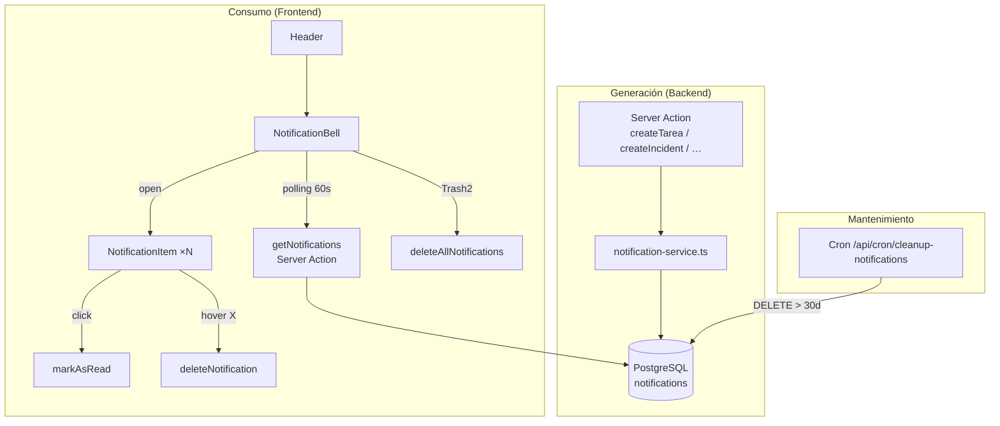

# 🔔 Sistema de Notificaciones In-App

## Resumen Ejecutivo

El sistema de notificaciones in-app proporciona a todos los usuarios autenticados un canal de comunicación pasivo para enterarse de eventos importantes sin necesidad de revisar manualmente cada sección de la aplicación.

Las notificaciones se generan automáticamente cuando ocurren acciones relevantes (incidencias críticas, asignación de tareas, alertas meteorológicas, menciones en comentarios…) y se muestran en un panel flotante accesible desde la campana del header. Persisten en base de datos hasta que el usuario las elimina o el cron de limpieza las purga pasados 30 días.

---

## 🎯 Problemas que Resuelve

| Sin notificaciones | Con notificaciones |
|---|---|
| El usuario no sabe que le han asignado una tarea | Recibe notificación inmediata al asignarse |
| Incidencias críticas pasan desapercibidas | Todos con permiso `read:atc` reciben alerta |
| Hay que navegar a ATC para ver alertas meteorológicas | La campana muestra el badge con contador |
| Las menciones `@usuario` en comentarios se pierden | El mencionado recibe notificación directa |
| No hay forma de saber si alguien te añadió a un proyecto | Llega notificación al momento |

---

## 🏗️ Arquitectura de Alto Nivel



---

## 📦 Modelo de Datos

```prisma
enum NotificationType {
  INCIDENT_CREATED
  INCIDENT_SEVERITY_HIGH
  WEATHER_ALERT
  EMAIL_ASSIGNED
  QUERY_ESCALATED
  TASK_ASSIGNED
  TASK_COMMENTED
  PROJECT_MEMBER_ADDED
}

model Notification {
  id        String           @id @default(cuid())
  userId    String
  type      NotificationType
  title     String           // Texto ya interpolado — no requiere i18n en runtime
  body      String
  isRead    Boolean          @default(false)
  href      String?          // Ruta a la que navega al hacer click (opcional)
  metadata  Json?            // Datos adicionales libres
  createdAt DateTime         @default(now())
  user      User             @relation(fields: [userId], references: [id], onDelete: Cascade)

  @@index([userId, isRead])   // Query principal: notificaciones no leídas del usuario
  @@index([userId, createdAt]) // Para ordenar por fecha
  @@index([createdAt])         // Para el cron de limpieza
  @@map("notifications")
}
```

**Decisión de diseño:** `title` y `body` se almacenan ya interpolados en el idioma del sistema. La UI del panel (cabecera, botones) sí usa i18n vía `next-intl`, pero el contenido de cada notificación no necesita traducción en runtime.

---

## 🔔 Tipos de Notificación

| Tipo | Icono | Color | Origen |
|------|-------|-------|--------|
| `INCIDENT_CREATED` | `AlertTriangle` | Naranja | Nueva incidencia ATC |
| `INCIDENT_SEVERITY_HIGH` | `AlertTriangle` | Rojo | Incidencia HIGH o CRITICAL |
| `WEATHER_ALERT` | `Cloud` | Azul | Alerta meteorológica (manual o cron) |
| `EMAIL_ASSIGNED` | `Mail` | Púrpura | Email de cliente asignado al usuario |
| `QUERY_ESCALATED` | `ArrowUpCircle` | Amarillo | Consulta escalada a supervisión |
| `TASK_ASSIGNED` | `CheckSquare` | Verde | Tarea asignada al usuario |
| `TASK_COMMENTED` | `MessageSquare` | Cian | Comentario en tarea asignada o @mención |
| `PROJECT_MEMBER_ADDED` | `UserPlus` | Índigo | El usuario fue añadido a un proyecto |

---

## 🖥️ Componentes UI

### NotificationBell

**Ruta:** `src/modules/notifications/ui/notification-bell.tsx`

Componente cliente montado en el header junto al ThemeToggle y LanguageSwitcher. Gestiona todo el estado del panel.

| Característica | Detalle |
|---|---|
| **Contenedor** | `Popover` de `@radix-ui/react-popover` (w-80, alineado a la derecha) |
| **Badge** | Contador de no-leídas sobre el icono Bell; muestra `9+` si supera 9 |
| **Polling** | `setInterval` cada 60 segundos vía `useEffect` + `useCallback` |
| **Refetch al abrir** | Siempre que el popover se abre se llama `fetchNotifications()` |
| **Marcar todas leídas** | Botón de texto en el header del popover; visible solo si `unreadCount > 0` |
| **Limpiar todas** | Icono `Trash2` con `Tooltip`; visible si hay notificaciones; abre `AlertDialog` de confirmación |
| **Optimistic UI** | Las acciones (marcar leída, eliminar) actualizan el estado local antes de esperar al servidor; rollback si falla |
| **Estado vacío** | Icono Bell difuminado + texto `"No tienes notificaciones"` |

### NotificationItem

**Ruta:** `src/modules/notifications/ui/notification-item.tsx`

Componente de presentación para cada notificación en la lista.

| Característica | Detalle |
|---|---|
| **Icono por tipo** | `TYPE_ICONS` — mapping `NotificationType → React.ElementType` |
| **Color por tipo** | `TYPE_COLORS` — mapping `NotificationType → clase Tailwind` |
| **No leída** | Fondo `bg-muted/30`, título `font-semibold`, punto azul `h-2 w-2 bg-primary` |
| **Tiempo relativo** | `formatDistanceToNow` de `date-fns` con locale `es` |
| **Navegación** | Si tiene `href`, envuelve el contenido en `<Link>` de next-intl |
| **Marcar leída** | Click en el item llama `onMarkRead(id)` si `!isRead` |
| **Botón eliminar** | Icono `X` con `opacity-0 group-hover:opacity-100`; `e.stopPropagation()` para no disparar la navegación del Link |

---

## ⚡ Server Actions

**Ruta:** `src/modules/notifications/actions/notifications.ts`

Todas las acciones requieren `requireAuth()` y filtran por `userId` para garantizar que cada usuario solo accede a sus propias notificaciones.

| Función | Descripción | Prisma op |
|---------|-------------|-----------|
| `getNotifications()` | Últimas 50 notificaciones del usuario, ordenadas por `createdAt` desc | `findMany` |
| `getUnreadCount()` | Solo el conteo de no-leídas (query mínima para polling del badge) | `count` |
| `markAsRead(id)` | Marca una notificación como leída — guard `WHERE id AND userId` | `updateMany` |
| `markAllAsRead()` | Marca todas las no-leídas del usuario como leídas | `updateMany` |
| `deleteNotification(id)` | Elimina una notificación — guard `WHERE id AND userId` | `deleteMany` |
| `deleteAllNotifications()` | Elimina todas las notificaciones del usuario | `deleteMany` |

> Se usa `updateMany` / `deleteMany` en lugar de `update` / `delete` para que el `WHERE userId` actúe como guard de seguridad incluso si el `id` no coincide con el usuario.

---

## 🔐 Seguridad

El sistema no utiliza RBAC específico (`PermissionResource`). La seguridad se implementa mediante:

1. **`requireAuth()`** — Toda action verifica que el usuario está autenticado
2. **Filtrado por `userId`** — Todas las queries incluyen `WHERE userId = auth.userId`
3. **Cascade delete** — Si se elimina el `User`, sus notificaciones se eliminan automáticamente (`onDelete: Cascade`)

No es necesario añadir `notifications` como recurso en `permissions.ts` ni en `rbac.ts`.

---

## 🌐 Internacionalización

Namespace `"notifications"` disponible en los 6 idiomas del proyecto:

| Clave | es | en |
|-------|----|----|
| `title` | Notificaciones | Notifications |
| `markAllRead` | Marcar todas como leídas | Mark all as read |
| `noNotifications` | No tienes notificaciones | You have no notifications |
| `clearAll` | Limpiar todas | Clear all |
| `clearAllTitle` | ¿Limpiar notificaciones? | Clear notifications? |
| `clearAllDescription` | Se eliminarán todas las notificaciones… | All notifications will be deleted… |
| `clearAllConfirm` | Eliminar todas | Delete all |

---

## 📁 Estructura de Archivos

```
src/
├── lib/
│   └── notification-service.ts      ← Servicio puro: createNotification, createNotificationsForPermission
│
├── modules/notifications/
│   ├── actions/
│   │   └── notifications.ts         ← Server actions CRUD (6 funciones)
│   └── ui/
│       ├── notification-bell.tsx    ← Popover + Badge + polling + AlertDialog limpiar
│       └── notification-item.tsx   ← Item individual con icono, tiempo, botón X
│
├── components/layout/
│   └── header.tsx                   ← Monta <NotificationBell userId={sessionUser?.id} />
│
└── app/api/cron/
    └── cleanup-notifications/
        └── route.ts                 ← GET — purga notificaciones > 30 días
```

---

## 🚦 Estado Actual

### ✅ Implementado
- [x] Modelo Prisma `Notification` con 3 índices optimizados
- [x] Servicio backend: `createNotification` y `createNotificationsForPermission`
- [x] 6 server actions CRUD con seguridad por `userId`
- [x] `NotificationBell` con Popover, badge, polling 60s, marcar leídas, limpiar todas
- [x] `NotificationItem` con icono/color por tipo, tiempo relativo, botón X hover
- [x] Integración en 7 puntos de generación (ATC + Projects)
- [x] Cron de limpieza con retención de 30 días
- [x] i18n en 6 idiomas (es, en, de, fr, it, ru)
- [x] Optimistic UI con rollback en eliminación individual

### 📋 Planificado
- [ ] Página dedicada `/notifications` con lista completa y filtros
- [ ] Animación de salida al eliminar items individuales
- [ ] Soporte de `@mentions` en interfaces de texto con autocompletado
- [ ] Notificaciones push (Web Push API)

---

## 📚 Documentación del Módulo

- **[Integración y Extensión](./integration)** — Dónde se generan las notificaciones, cómo añadir nuevos tipos y cómo programar el cron de limpieza

---

**Última actualización**: 2026-02-22
