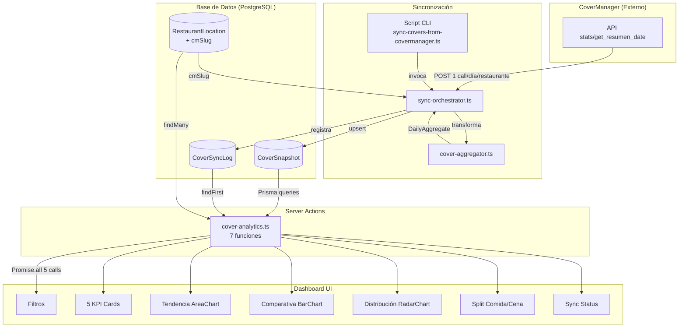

# 📊 Analytics de Comensales

## Resumen Ejecutivo

**Analytics de Comensales** es una sección dentro del módulo Sherlock que permite a perfiles ejecutivos analizar la evolución de comensales por restaurante durante los últimos 3 años, con gráficos interactivos, KPIs comparativos y filtros dinámicos.

### Problemas que resuelve

1. **Datos dispersos**: La información de comensales vive exclusivamente en CoverManager (SaaS externo), sin posibilidad de consultas históricas rápidas ni cruces avanzados.
2. **Latencia de API**: Cada consulta a CoverManager requiere una petición HTTP por día/restaurante. Para analizar 3 años de 8 locales serían ~8.760 peticiones en tiempo real — inaceptable para un dashboard interactivo.
3. **Falta de vista ejecutiva**: CoverManager no ofrece dashboards de tendencias multi-local, comparativas entre restaurantes ni distribuciones semanales.

### Decisión arquitectónica clave

**Snapshots diarios agregados en BD local** en lugar de consultas directas a la API:
- Un registro (`CoverSnapshot`) por restaurante/día con totales pre-calculados
- Sincronización periódica desde CoverManager (script CLI)
- Consultas al dashboard en milisegundos vía Prisma
- Upsert idempotente por `(restaurantLocationId, date)` para re-sincronizaciones seguras

### Datos disponibles

| Dato | Valor actual |
|------|-------------|
| Snapshots totales | ~6.012 |
| Rango temporal | 2023-03-06 → 2026-03-04 |
| Restaurantes | 8 (Voltereta) |
| Fuente | CoverManager `stats/get_resumen_date` |

---

## 🏗️ Arquitectura

### Flujo de datos completo



### Capas del sistema

| Capa | Archivos | Responsabilidad |
|------|----------|----------------|
| **API externa** | `src/lib/covermanager.ts` | Cliente HTTP para CoverManager |
| **Dominio** | `src/modules/sherlock/domain/cover-sync/` | Tipos, agregación, orquestación de sync |
| **Persistencia** | `prisma/schema.prisma` | Modelos CoverSnapshot, CoverSyncLog |
| **Acciones** | `src/modules/sherlock/actions/cover-analytics.ts` | Server actions con queries Prisma |
| **UI** | `src/app/[locale]/(dashboard)/sherlock/analytics/` | Page + 8 componentes cliente |
| **CLI** | `scripts/sync-covers-from-covermanager.ts` | Script de sincronización manual |

---

## 🔌 Datos en Origen: CoverManager API

### Endpoint utilizado

```
POST https://www.covermanager.com/api/stats/get_resumen_date
```

**Parámetros**:
| Parámetro | Tipo | Ejemplo | Descripción |
|-----------|------|---------|-------------|
| `restaurant` | string | `"restaurante-voltereta"` | Slug del restaurante en CoverManager |
| `date` | string | `"2026-03-04"` | Fecha a consultar (formato YYYY-MM-DD) |

**Autenticación**: API key enviada como header `Authorization` en las peticiones POST.

### Estructura de la respuesta

La respuesta devuelve un JSON con dos objetos principales: `lunch` (servicio de comida) y `dinner` (servicio de cena). Cada servicio tiene la misma estructura:

```json
{
  "resp": 1,
  "lunch": {
    "reservs_seated": 25,     "people_seated": 78,
    "reservs_walkin": 5,      "people_walkin": 12,
    "reservs_cancel": 3,      "people_cancel": 8,
    "reservs_noshow": 1,      "people_noshow": 4,
    "reservs_pending": 0,     "people_pending": 0,
    "reservs_confirm": 2,     "people_confirm": 6,
    "reservs_reconfirm": 0,   "people_reconfirm": 0,
    "reservs_arrival": 0,     "people_arrived": 0,
    "reservs_released": 0,    "people_released": 0,
    "reservs_billrequest": 0, "people_billrequest": 0,
    "reservs_desert": 0,      "people_desert": 0,
    "reservs_arrivalbar": 0,  "people_arrivalbar": 0,
    "reservs_toclean": 0,     "people_toclean": 0,
    "reservs_waitinglist": 0, "people_waitinglist": 0,
    "reservs_no_complete": 0, "people_no_complete": 0,
    "reservs_toreview": 0,    "people_toreview": 0,
    "reservs_custom": 0,      "people_custom": 0
  },
  "dinner": { ... }
}
```

### Significado de cada estado

| Estado | `reservs_*` | `people_*` | Descripción |
|--------|-------------|------------|-------------|
| `seated` | Reservas sentadas | Comensales sentados | **Reservas completadas** — el cliente se sentó y fue atendido |
| `walkin` | Walk-ins recibidos | Comensales walk-in | **Sin reserva previa** — llegaron directamente al restaurante |
| `cancel` | Reservas canceladas | Comensales de cancelaciones | Canceladas antes del servicio |
| `noshow` | No-shows | Comensales de no-shows | El cliente no se presentó |
| `pending` | Reservas pendientes | Comensales pendientes | Aún sin confirmar |
| `confirm` | Confirmadas | Comensales confirmados | Confirmadas por el cliente |
| `reconfirm` | Reconfirmadas | Comensales reconfirmados | Doble confirmación solicitada y recibida |
| `arrival` | Llegadas | Comensales llegados | Marcados como llegados al local |
| `released` | Liberadas | Comensales liberados | Mesa liberada tras el servicio |
| `billrequest` | Cuenta solicitada | Comensales con cuenta | Han pedido la cuenta |
| `desert` | Postres | Comensales en postres | En fase de postre (workflow interno CM) |
| `arrivalbar` | Llegada bar | Comensales en bar | Esperando en barra |
| `toclean` | Por limpiar | Comensales por limpiar | Mesa pendiente de limpieza |
| `waitinglist` | Lista de espera | Comensales en espera | En lista de espera |
| `no_complete` | Incompletas | Comensales incompletos | Reserva con datos incompletos |
| `toreview` | Por revisar | Comensales por revisar | Pendiente de revisión manual |
| `custom` | Personalizados | Comensales custom | Estados personalizados del restaurante |

> **Nota importante**: El campo `resp` indica el estado de la respuesta. `1` = éxito. Cualquier otro valor indica error y se descarta.

### Datos que **no** proporciona este endpoint

- **Desglose por hora**: No hay información de a qué hora llegó cada reserva, solo el split comida/cena
- **Detalles individuales**: No se obtienen nombres, teléfonos ni datos de la reserva individual
- **Ingresos económicos**: Solo comensales, no facturación

---

## 💾 Modelos de Datos

### CoverSnapshot

Almacena el agregado diario de comensales de un restaurante. Un registro por combinación `(restaurantLocationId, date)`.

```prisma
model CoverSnapshot {
  id                   String   @id @default(cuid())
  restaurantLocationId String
  date                 DateTime @db.Date
  totalCovers          Int      @default(0)
  totalReservations    Int      @default(0)
  avgPartySize         Float    @default(0)
  maxPartySize         Int      @default(0)
  coversByStatus       Json?
  coversByHour         Json?
  lunchCovers          Int?
  dinnerCovers         Int?
  walkInCovers         Int?
  syncedAt             DateTime @default(now())
  createdAt            DateTime @default(now())
  updatedAt            DateTime @updatedAt

  restaurantLocation   RestaurantLocation @relation(...)

  @@unique([restaurantLocationId, date])
  @@index([date])
  @@index([restaurantLocationId, date])
  @@map("cover_snapshots")
}
```

**Mapeo campo por campo — de CoverManager a CoverSnapshot:**

| Campo CoverSnapshot | Origen en CoverManager | Fórmula / Transformación |
|---------------------|----------------------|--------------------------|
| `totalCovers` | `lunch.people_seated + lunch.people_walkin + dinner.people_seated + dinner.people_walkin` | Solo comensales efectivos (sentados + walk-in) |
| `totalReservations` | `lunch.reservs_seated + lunch.reservs_walkin + dinner.reservs_seated + dinner.reservs_walkin` | Solo reservas efectivas |
| `avgPartySize` | Calculado | `totalCovers / totalReservations` (0 si no hay reservas) |
| `maxPartySize` | No disponible | Siempre 0 — el endpoint stats no da esta información |
| `coversByStatus` | Merge de lunch + dinner | `{ "seated": 78, "walkin": 12, "cancelled": 8, ... }` — suma ambos servicios |
| `coversByHour` | No disponible | Siempre `null` — el endpoint stats no da desglose horario |
| `lunchCovers` | `lunch.people_seated + lunch.people_walkin` | Comensales efectivos del servicio de comida |
| `dinnerCovers` | `dinner.people_seated + dinner.people_walkin` | Comensales efectivos del servicio de cena |
| `walkInCovers` | `lunch.people_walkin + dinner.people_walkin` | Walk-ins de ambos servicios |
| `syncedAt` | — | Timestamp de la última sincronización |

> **Concepto clave: "Comensales efectivos"**: Solo se cuentan `people_seated` + `people_walkin`. Los cancelados, no-shows, pendientes, etc. se almacenan en `coversByStatus` pero **no** se suman al total. Esto refleja la ocupación real del restaurante.

### CoverSyncLog

Registro de auditoría de cada ejecución de sincronización.

```prisma
model CoverSyncLog {
  id                   String    @id @default(cuid())
  restaurantLocationId String?   -- null = todos los restaurantes
  status               String    @default("RUNNING") -- RUNNING | SUCCESS | FAILED
  dateRangeStart       DateTime  -- Inicio del rango sincronizado
  dateRangeEnd         DateTime  -- Fin del rango sincronizado
  snapshotsCreated     Int       @default(0)
  snapshotsUpdated     Int       @default(0)
  errors               Json?     -- Array de errores encontrados
  durationMs           Int?      -- Duración total en milisegundos
  startedAt            DateTime  @default(now())
  finishedAt           DateTime?

  @@index([status])
  @@index([startedAt(sort: Desc)])
  @@map("cover_sync_logs")
}
```

### RestaurantLocation (campo añadido)

```prisma
model RestaurantLocation {
  // ... campos existentes ...
  cmSlug            String?  @unique    // Slug de CoverManager
  coverSnapshots    CoverSnapshot[]
}
```

**Mapping de slugs actual:**

| cmSlug | Restaurante | Ciudad |
|--------|-------------|--------|
| `restaurante-voltereta` | Voltereta Casa | Valencia |
| `restaurante-voltereta-bali` | Voltereta Bali | Valencia |
| `restaurante-voltereta-nuevo` | Voltereta Manhattan | Valencia |
| `restaurante-voltereta-alameda` | Voltereta Kioto | Valencia |
| `restaurante-volteretaalc` | Voltereta Tanzania | Alicante |
| `resturante-voltereta-sevilla` | Voltereta París | Sevilla |
| `restaurante-voltereta-zaragoza` | Voltereta Nueva Zelanda | Zaragoza |
| `voltereta-cordoba` | Voltereta Toscana | Córdoba |

> **Nota**: El slug de Sevilla tiene un typo en CoverManager (`resturante` en vez de `restaurante`). Es así en la API y no podemos cambiarlo.

---

## 🔄 Transformación de Datos

### cover-aggregator.ts

**Archivo**: `src/modules/sherlock/domain/cover-sync/cover-aggregator.ts`

Función pura que convierte la respuesta de CoverManager en un `DailyAggregate`:

```typescript
export function aggregateFromStats(
  date: string,
  stats: CoverManagerStatsResponse
): DailyAggregate
```

**Paso a paso:**

1. **Comensales efectivos por servicio**:
   ```
   effectiveCovers(service) = service.people_seated + service.people_walkin
   ```

2. **Reservas efectivas por servicio**:
   ```
   effectiveReservations(service) = service.reservs_seated + service.reservs_walkin
   ```

3. **Totales**:
   ```
   lunchCovers   = effectiveCovers(lunch)
   dinnerCovers  = effectiveCovers(dinner)
   totalCovers   = lunchCovers + dinnerCovers
   totalReservs  = effectiveReservations(lunch) + effectiveReservations(dinner)
   ```

4. **Media por reserva**:
   ```
   avgPartySize = totalReservations > 0 ? totalCovers / totalReservations : 0
   ```

5. **Desglose por estado** — merge de lunch + dinner:
   ```json
   {
     "seated": lunch.people_seated + dinner.people_seated,
     "walkin": lunch.people_walkin + dinner.people_walkin,
     "cancelled": lunch.people_cancel + dinner.people_cancel,
     "noshow": lunch.people_noshow + dinner.people_noshow,
     "pending": lunch.people_pending + dinner.people_pending,
     "confirmed": lunch.people_confirm + dinner.people_confirm
   }
   ```
   Solo se incluyen estados con valor > 0.

6. **Walk-ins**:
   ```
   walkInCovers = lunch.people_walkin + dinner.people_walkin
   ```

---

## 🔃 Sincronización

### Orquestador (sync-orchestrator.ts)

**Archivo**: `src/modules/sherlock/domain/cover-sync/sync-orchestrator.ts`

```typescript
export async function syncCoversFromCoverManager(
  options: CoverSyncOptions
): Promise<CoverSyncReport[]>
```

**Flujo**:

1. Obtiene todos los `RestaurantLocation` con `cmSlug` no nulo (filtro opcional por `restaurantLocationId`)
2. Para cada restaurante, ejecuta `syncSingleRestaurant()`:
   - Genera array de fechas del rango `[dateStart...dateEnd]`
   - Procesa en lotes de 10 días (para dar feedback de progreso)
   - Para cada fecha:
     a. `POST stats/get_resumen_date` con `{ restaurant: slug, date }`
     b. Si `resp !== 1` → error, siguiente fecha
     c. `aggregateFromStats(date, stats)` → `DailyAggregate`
     d. Si `totalCovers === 0 && totalReservations === 0` → salta (día vacío)
     e. Busca snapshot existente por `@@unique([restaurantLocationId, date])`
     f. Si existe → `UPDATE`, si no → `CREATE`
     g. **Rate limiting**: 100ms de delay entre cada petición a CoverManager
3. Retorna array de `CoverSyncReport` con estadísticas por restaurante

**Características**:
- **Idempotente**: El upsert por fecha+restaurante permite re-ejecutar sin duplicados
- **Tolerante a fallos**: Los errores por fecha se registran pero no detienen la sincronización
- **Rate limiting**: 100ms entre cada request para no sobrecargar la API de CoverManager
- **Progresivo**: Callback `onProgress` para feedback en UI o CLI

### Script CLI

**Archivo**: `scripts/sync-covers-from-covermanager.ts`

```bash
# Preview sin escribir (dry-run) — últimos 90 días
npx tsx scripts/sync-covers-from-covermanager.ts

# Escribir últimos 90 días
npx tsx scripts/sync-covers-from-covermanager.ts --write

# Sincronización completa (3 años = 1095 días)
npx tsx scripts/sync-covers-from-covermanager.ts --write --full

# Últimos N días
npx tsx scripts/sync-covers-from-covermanager.ts --write --days=30

# Poblar cmSlug en RestaurantLocation (primera vez)
npx tsx scripts/sync-covers-from-covermanager.ts --seed-slugs --write
```

**Funcionalidades del script**:
- **`--seed-slugs`**: Mapea slugs de CoverManager a registros de `RestaurantLocation` existentes usando un diccionario `SLUG_MAP` hardcoded
- **Prisma standalone**: Crea su propia conexión con `PrismaPg` adapter (no usa el singleton de Next.js)
- **CoverSyncLog**: Registra cada ejecución en BD con status, duración y conteo de snapshots
- **Colores ANSI**: Output con colores para mejor legibilidad en terminal
- **Progreso**: Reporta cada 50 días procesados por restaurante

**Estimación de tiempos**:
| Modo | Peticiones | Duración aproximada |
|------|-----------|---------------------|
| `--write` (90 días) | ~720 | ~4 min |
| `--write --full` (3 años) | ~8.760 | ~44 min |
| `--write --days=30` | ~240 | ~1.5 min |

---

## ⚡ Server Actions

**Archivo**: `src/modules/sherlock/actions/cover-analytics.ts`

Todas las actions:
- Son `"use server"`
- Ejecutan `await requirePermission("sherlock", "read")` como primera línea
- Reciben filtros de localización y rango de fechas
- Consultan directamente Prisma (sin llamadas a CoverManager)

### 1. getAnalyticsKpis

```typescript
getAnalyticsKpis(locationIds: string[], dateStart: string, dateEnd: string): Promise<KpiData>
```

**Query Prisma**: `findMany` con filtro por `restaurantLocationId IN locationIds` y `date BETWEEN dateStart AND dateEnd`. Selecciona solo `date`, `totalCovers`, `totalReservations`.

**Cálculos**:
- `totalCovers` = suma de todos los snapshots
- `totalReservations` = suma de todos los snapshots
- `periodDays` = conteo de fechas únicas (un restaurante puede tener varias entradas/día en teoría)
- `avgDailyCovers` = totalCovers / periodDays
- `avgPartySize` = totalCovers / totalReservations
- `maxDayCovers` = snapshot con mayor `totalCovers` (ordenado DESC, toma el primero)
- `maxDayDate` = fecha de ese snapshot

**Delta vs periodo anterior**:
- Calcula un rango previo de la misma duración: si el rango es 2025-01-01 a 2025-12-31, el previo es 2024-01-01 a 2024-12-31
- `coversDelta` = ((totalCovers - prevTotal) / prevTotal) × 100
- `avgDailyDelta` = ((avgDailyCovers - prevAvgDaily) / prevAvgDaily) × 100

**Componente destino**: `KpiCards`

### 2. getCoversTrend

```typescript
getCoversTrend(locationIds: string[], dateStart: string, dateEnd: string, granularity: Granularity): Promise<TrendDataPoint[]>
```

**Query Prisma**: `findMany` con filtro de rango + locaciones. Selecciona `date`, `totalCovers`, `totalReservations`. Ordenado por `date ASC`.

**Agrupación en código** (no en SQL): Itera snapshots y agrupa por `periodKey(date, granularity)`:
- `"day"` → `"2025-03-15"` (ISO)
- `"week"` → `"2025-W11"` (ISO week, lunes como primer día)
- `"month"` → `"2025-03"`

Cada grupo suma `covers` y `reservations`, calcula `avgPartySize`.

**Componente destino**: `CoversTrendChart` (AreaChart)

### 3. getLocationComparison

```typescript
getLocationComparison(locationIds: string[], dateStart: string, dateEnd: string, granularity: Granularity): Promise<LocationComparisonPoint[]>
```

**Query Prisma**: `findMany` con `include` del `restaurantLocation.name`. Agrupa por periodo + nombre de restaurante.

**Formato de salida**:
```json
[
  { "period": "2025-01", "Voltereta Casa": 4500, "Voltereta Bali": 3200, ... },
  { "period": "2025-02", "Voltereta Casa": 4800, "Voltereta Bali": 3100, ... }
]
```

Las claves dinámicas (nombres de restaurante) se convierten a slugs en el componente UI para generar CSS variables válidas.

**Componente destino**: `LocationComparisonChart` (BarChart)

### 4. getWeekdayDistribution

```typescript
getWeekdayDistribution(locationIds: string[], dateStart: string, dateEnd: string): Promise<WeekdayDistribution[]>
```

**Query Prisma**: `findMany` seleccionando `date`, `totalCovers`, `totalReservations`.

**Agrupación en código**: Por `date.getUTCDay()` (0=Domingo...6=Sábado).
- Suma covers, reservations y cuenta de snapshots por día de la semana
- `avgCovers` = covers / count — **media** por ese día (no total)
- Reordena: Lunes(1), Martes(2), ..., Sábado(6), Domingo(0)

**Formato de salida**:
```json
[
  { "day": "Lunes", "dayIndex": 1, "covers": 45000, "reservations": 12000, "avgCovers": 350 },
  { "day": "Martes", "dayIndex": 2, ... },
  ...
  { "day": "Domingo", "dayIndex": 0, ... }
]
```

**Componente destino**: `WeekdayDistributionChart` (RadarChart)

### 5. getServiceSplit

```typescript
getServiceSplit(locationIds: string[], dateStart: string, dateEnd: string): Promise<{ lunch: number; dinner: number; walkin: number }>
```

**Query Prisma**: `aggregate` con `_sum` sobre `lunchCovers`, `dinnerCovers`, `walkInCovers`. Es la query más eficiente — una sola operación de agregación.

**Componente destino**: `HourlyHeatmap` (desglose comida/cena)

### 6. getRestaurantLocations

```typescript
getRestaurantLocations(): Promise<{ id: string; name: string; city: string; cmSlug: string | null }[]>
```

**Query Prisma**: `findMany` donde `isActive: true` y `cmSlug: { not: null }`. Ordenado por nombre.

**Componente destino**: `AnalyticsFilters` (selector de locales) y `page.tsx` (carga inicial)

### 7. getLastSyncInfo

```typescript
getLastSyncInfo(): Promise<CoverSyncLog | null>
```

**Query Prisma**: `findFirst` ordenado por `startedAt DESC`. Selecciona `status`, `startedAt`, `finishedAt`, `snapshotsCreated`, `snapshotsUpdated`, `errors`.

**Componente destino**: `SyncStatusCard`

---

## 🖥️ Dashboard UI

### Estructura de la página

```
page.tsx (Server Component)
├── requirePermission("sherlock", "read")
├── getRestaurantLocations() → locations
├── Header (título, link back a /sherlock)
└── AnalyticsDashboard (Client Component)
    ├── Estado: filters, kpis, trend, comparison, weekday, serviceSplit
    ├── useTransition + Promise.all → 5 server actions en paralelo
    ├── useEffect → auto-fetch cuando cambian filtros
    │
    ├── AnalyticsFilters + SyncStatusCard
    ├── KpiCards (5 cards)
    ├── Grid 2 columnas:
    │   ├── CoversTrendChart (full width, col-span-2)
    │   ├── LocationComparisonChart
    │   └── WeekdayDistributionChart
    └── HourlyHeatmap (desglose servicio)
```

### Componente: Filtros (`analytics-filters.tsx`)

Controles interactivos que determinan qué datos se consultan:

| Control | Tipo | Valores | Efecto |
|---------|------|---------|--------|
| **Rango de fechas** | 2 inputs `date` | Fechas ISO | Filtra snapshots por `date BETWEEN` |
| **Presets** | 4 botones | 1 mes, 3 meses, 1 año, 3 años | Recalcula `dateStart` restando al día actual |
| **Locales** | Popover con checkboxes | Lista de restaurantes | Filtra por `restaurantLocationId IN` |
| **Granularidad** | Select | Día / Semana / Mes | Cambia agrupación en tendencia y comparativa |

**Comportamiento**: Cada cambio de filtro actualiza el estado en `AnalyticsDashboard`, que dispara `fetchData()` vía `useEffect`. La carga usa `useTransition` para no bloquear la UI (muestra spinner mientras carga).

**Valores por defecto**: Último año, todos los locales, granularidad mensual.

### Componente: KPI Cards (`kpi-cards.tsx`)

5 tarjetas con métricas clave y comparativa:

| # | KPI | Campo de `KpiData` | Icono | Color | Formato | Delta |
|---|-----|--------------------|-------|-------|---------|-------|
| 1 | **Total Comensales** | `totalCovers` | Users | Azul | `123.456` (locale ES) | ✅ `coversDelta` |
| 2 | **Media Diaria** | `avgDailyCovers` | TrendingUp | Esmeralda | `342` (redondeado) | ✅ `avgDailyDelta` |
| 3 | **Media / Reserva** | `avgPartySize` | Utensils | Púrpura | `3.8` (1 decimal) | ❌ |
| 4 | **Pico (1 día)** | `maxDayCovers` | Crown | Ámbar | `580` (locale ES) | ❌ |
| 5 | **Días Analizados** | `periodDays` | CalendarDays | Slate | `365` | ❌ |

**Deltas**: Badge con `▲` verde si positivo, `▼` rojo si negativo, porcentaje con 1 decimal. Se calcula comparando con el periodo anterior de igual duración.

**Estado de carga**: Skeleton rectangulares mientras `isPending` o `data === null`.

### Componente: Tendencia (`covers-trend-chart.tsx`)

- **Tipo de gráfico**: Recharts `AreaChart` con gradiente
- **Datos**: `TrendDataPoint[]` del action `getCoversTrend()`
- **Serie**: `covers` (comensales) como área con relleno degradado
- **Eje X**: Periodo formateado según granularidad:
  - Mes: `"25-01"` (slice del año)
  - Día/Semana: `"01-15"` (mes-día)
- **Eje Y**: Numérico con formato `k` para miles (`1.0k`, `2.5k`)
- **Tooltip**: Muestra valor exacto al hacer hover
- **Ancho**: Full width (`lg:col-span-2` en la grid)

### Componente: Comparativa por Local (`location-comparison-chart.tsx`)

- **Tipo de gráfico**: Recharts `BarChart` con barras agrupadas
- **Datos**: `LocationComparisonPoint[]` del action `getLocationComparison()`
- **Series**: Una barra por restaurante, colores de una paleta de 8 valores
- **Slugify**: Los nombres de restaurante se convierten a slugs CSS-safe (`Voltereta Casa` → `voltereta_casa`) para que las CSS variables `--color-{slug}` funcionen correctamente
- **Leyenda**: ChartLegend con etiquetas cortas (se elimina el prefijo "Voltereta ")
- **Eje X**: Periodo (igual formato que tendencia)
- **Eje Y**: Numérico con formato `k`

### Componente: Distribución Semanal (`weekday-distribution-chart.tsx`)

- **Tipo de gráfico**: Recharts `RadarChart`
- **Datos**: `WeekdayDistribution[]` (7 puntos) del action `getWeekdayDistribution()`
- **Métrica**: `avgCovers` — media de comensales por día de la semana
- **Ejes**: 7 ejes angulares (Lunes...Domingo)
- **Relleno**: Área con opacidad 0.3
- **Utilidad**: Identifica patrones — viernes/sábado normalmente más altos, lunes más bajo

### Componente: Desglose por Servicio (`hourly-heatmap.tsx`)

> **Nota de nombre**: Se llama `hourly-heatmap.tsx` por nomenclatura histórica, pero el endpoint `stats/get_resumen_date` no proporciona desglose horario. Realmente muestra el split comida/cena.

- **Datos**: `{ lunch, dinner, walkin }` del action `getServiceSplit()`
- **Visualización**:
  - Barra proporcional horizontal: ámbar (comida) + índigo (cena)
  - Grid 3 columnas con iconos (Sol=comida, Luna=cena, Huellas=walk-in)
  - Cada segmento muestra valor absoluto y porcentaje
- **Walk-ins**: Se muestran como métrica separada (están incluidos en los totales de comida/cena)

### Componente: Estado de Sincronización (`sync-status-card.tsx`)

- **Datos**: Último `CoverSyncLog` del action `getLastSyncInfo()`
- **Muestra**:
  - Badge de estado: verde (SUCCESS), azul (RUNNING), rojo (FAILED)
  - Fecha de última sincronización formateada
  - Conteo de snapshots procesados
- **Carga**: Fetch automático al montar el componente

---

## 📁 Estructura de Archivos

```
src/
├── app/[locale]/(dashboard)/sherlock/analytics/
│   ├── page.tsx                              ← Server page
│   └── _components/
│       ├── analytics-dashboard.tsx            ← Orquestador client
│       ├── analytics-filters.tsx              ← Filtros + presets
│       ├── kpi-cards.tsx                      ← 5 KPI cards
│       ├── covers-trend-chart.tsx             ← AreaChart tendencia
│       ├── location-comparison-chart.tsx      ← BarChart por local
│       ├── weekday-distribution-chart.tsx     ← RadarChart semanal
│       ├── hourly-heatmap.tsx                 ← Split comida/cena
│       └── sync-status-card.tsx               ← Último sync
│
├── modules/sherlock/
│   ├── actions/
│   │   └── cover-analytics.ts                 ← 7 server actions
│   └── domain/cover-sync/
│       ├── types.ts                           ← Interfaces
│       ├── cover-aggregator.ts                ← Stats → DailyAggregate
│       └── sync-orchestrator.ts               ← Lógica de sync
│
├── lib/
│   └── covermanager.ts                        ← Cliente API CoverManager
│
scripts/
└── sync-covers-from-covermanager.ts           ← CLI de sincronización

prisma/
└── schema.prisma                              ← CoverSnapshot, CoverSyncLog
```

---

## 🛠️ Guía de Mantenimiento

### Añadir un nuevo restaurante

1. Obtener el slug del restaurante en CoverManager (preguntar a CM o buscar en el panel)
2. Añadir el mapping en `SLUG_MAP` dentro de `scripts/sync-covers-from-covermanager.ts`:
   ```typescript
   const SLUG_MAP: Record<string, string> = {
     // ... existentes ...
     "nuevo-slug-cm": "Nombre en RestaurantLocation",
   }
   ```
3. Ejecutar seed de slugs: `npx tsx scripts/sync-covers-from-covermanager.ts --seed-slugs --write`
4. Sincronizar datos: `npx tsx scripts/sync-covers-from-covermanager.ts --write --full`

### Re-sincronizar datos

Si sospechas que hay datos incorrectos o quieres actualizar:

```bash
# Re-sync últimos 30 días (sobrescribe snapshots existentes)
npx tsx scripts/sync-covers-from-covermanager.ts --write --days=30
```

El upsert es idempotente — no crea duplicados, solo actualiza si el snapshot ya existe.

### Añadir una nueva métrica al dashboard

1. **Si el dato existe en CoverSnapshot**: Crear un nuevo server action en `cover-analytics.ts` con la query Prisma necesaria
2. **Si requiere un campo nuevo**: Añadir el campo al modelo `CoverSnapshot` en `schema.prisma`, migrar, y actualizar `cover-aggregator.ts` para calcularlo desde la respuesta de CoverManager
3. **Componente UI**: Crear nuevo componente en `_components/` y añadirlo al render de `analytics-dashboard.tsx`
4. **Datos**: Añadir el fetch al `Promise.all` en `fetchData()` del dashboard

### Automatizar la sincronización

Actualmente la sincronización es manual (CLI). Para automatizarla:
- Opción A: Crear un cron job que ejecute el script (ej: cada noche a las 3:00 AM)
- Opción B: Crear una API route `/api/cron/cover-sync` siguiendo el patrón de `/api/cron/gstock-sync` y registrarla en Vercel Cron

---

## 📝 Notas Técnicas

### Tecnologías utilizadas

| Tecnología | Uso |
|-----------|-----|
| **Prisma 7.x** | ORM para queries a CoverSnapshot |
| **Recharts 2.15** | Librería de gráficos (AreaChart, BarChart, RadarChart) |
| **shadcn/ui ChartContainer** | Wrapper que genera CSS variables para colores de Recharts |
| **date-fns** | Manipulación de fechas (presets de filtros) |
| **next-intl** | i18n para labels de filtros |
| **useTransition** | Loading no-bloqueante para fetches en paralelo |

### Permisos

- **Lectura del dashboard**: `requirePermission("sherlock", "read")`
- **Sincronización manual**: Solo vía CLI (requiere acceso al servidor)

### Rendimiento

- Las queries de analytics son rápidas (~50-200ms) gracias a los índices compuestos `@@index([restaurantLocationId, date])`
- Los 5 server actions se ejecutan en paralelo (`Promise.all`), no secuencialmente
- Skeleton loading en cada componente para percepción de velocidad instantánea

### Limitaciones conocidas

1. **Sin desglose horario**: El endpoint `stats/get_resumen_date` no proporciona a qué hora llegaron los comensales, solo el split comida/cena
2. **maxPartySize siempre 0**: El endpoint stats no informa del tamaño máximo de grupo en una reserva
3. **Walk-ins incluidos en totales**: Los walk-ins se suman a lunchCovers/dinnerCovers además de tener su propio campo
4. **Datos históricos dependen de CoverManager**: Si CM purga datos antiguos, no podremos re-sincronizar esos periodos
