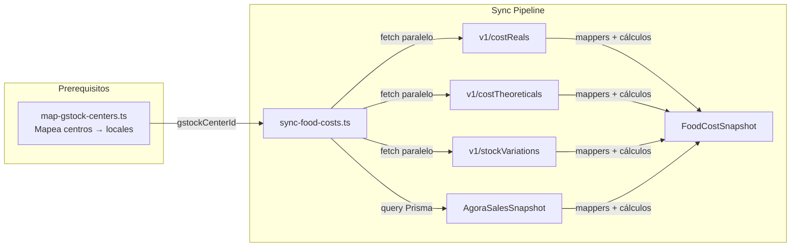

# 📊 Food Cost Sync Pipeline

## Visión General

La pipeline sincroniza datos de coste de la API de GStock y los almacena como snapshots mensuales en `FoodCostSnapshot`, cruzándolos con datos de revenue de `AgoraSalesSnapshot` para calcular el food cost %.



---

## Paso 1: Mapeo de Centros

Antes de sincronizar costes, cada `RestaurantLocation` necesita su `gstockCenterId`.

```bash
# Ver qué centros tiene GStock y cómo matchean
npx tsx scripts/map-gstock-centers.ts

# Aplicar el mapeo
npx tsx scripts/map-gstock-centers.ts --write
```

**Algoritmo de matching:**
1. Normaliza nombres (lowercase, sin acentos, solo alfanuméricos)
2. Calcula similitud: exacta (1.0), contiene (0.8), Jaccard de palabras (0.0-1.0)
3. Solo mapea si score >= 0.4

**Estado actual (marzo 2026):**
- `#2 VOLTERETA BALI` → Voltereta Bali (Valencia) — score 1.0
- `#3 VOLTERETA NUEVA ZELANDA` → Voltereta Nueva Zelanda (Zaragoza) — score 1.0
- `#4 VOLTERETA CASA` → Voltereta Casa (Valencia) — score 1.0
- `#5 VOLTERETA KIOTO` → Voltereta Kioto (Valencia) — score 1.0
- `#6 VOLTERETA TOSCANA` → Voltereta Toscana (Córdoba) — score 1.0
- `#7 VOLTERETA TANZANIA` → Voltereta Tanzania (Alicante) — score 1.0
- `#8 VOLTERETA MANHATTAN` → Voltereta Manhattan (Valencia) — score 1.0
- `#9 VOLTERETA PARÍS` → Voltereta París (Sevilla) — score 1.0
- `#1 PANEL ADMIN GRUPO VOLTERETA` — centro administrativo, no es un local
- `One Burger Laundry` — sin match en GStock (marca diferente)

---

## Paso 2: Sincronización de Costes

```bash
# Últimos 6 meses con detalle
npx tsx scripts/sync-food-costs.ts --write --months=6 --verbose

# Rango específico
npx tsx scripts/sync-food-costs.ts --write --from=2025-07-01 --to=2026-03-01

# Solo ver qué haría (dry-run)
npx tsx scripts/sync-food-costs.ts --months=3 --verbose
```

### Pipeline por centro/mes

```
Para cada local con gstockCenterId:
  Para cada mes en el rango:
    1. Fetch en paralelo:
       - GET v1/costReals?centerId=X&startDate=Y&endDate=Z
       - GET v1/costTheoreticals?centerId=X&startDate=Y&endDate=Z
       - GET v1/stockVariations?centerId=X&startDate=Y&endDate=Z

    2. Extraer datos:
       - extractRealCost(data) → { total, byCategory }
       - extractTheoreticalCost(data) → total (suma de registros semanales)
       - extractStockVariation(data) → total

    3. Calcular métricas:
       - variance = realCost - theoreticalCost
       - variancePercent = (variance / theoreticalCost) × 100

    4. Cruzar con Agora:
       - SUM(AgoraSalesSnapshot.totalGrossAmount) WHERE businessDay BETWEEN start AND end
       - foodCostPercent = (realCost / revenue) × 100

    5. Upsert FoodCostSnapshot:
       - Clave única: [restaurantLocationId, periodStart, periodEnd]
```

---

## Mappers (`domain/food-cost-sync/mappers.ts`)

### `extractRealCost(data)`

Lee `costTotal` del primer elemento. Actualmente devuelve 0 porque `costReals` viene vacío.

### `extractTheoreticalCost(data)`

**Importante**: `costTheoreticals` devuelve registros semanales. El mapper **suma todos los registros** del periodo para obtener el total mensual.

```typescript
// Cada item tiene: { costTotal, netSaleTotal, carte: {...}, packs: {...} }
let total = 0
for (const item of data) {
  total += item.costTotal ?? 0
}
```

### `extractStockVariation(data)`

Lee `totalVariation` del primer elemento. Actualmente devuelve null porque `stockVariations` viene vacío.

---

## Tipos de la API (`domain/food-cost-sync/types.ts`)

Los tipos reflejan el formato **real** de la API de GStock (verificado con llamadas directas):

- Usa **camelCase** (`costTotal`, `netSaleTotal`), no PascalCase
- `costTheoreticals` incluye `carte` y `packs` con breakdown
- Las categorías tienen `posCategoryId`, `name`, `quantity` (no `amount`)
- Los informes tienen `name` con formato interno (ej. "TEST.12")

---

## Troubleshooting

### "costReals devuelve data vacío"

**Causa**: GStock necesita que se registren albaranes de compra para calcular el coste real. Si no hay albaranes, no hay datos.

**Solución**: Configurar en GStock la carga de albaranes de compra, o usar el coste teórico como proxy.

### "Todos los centros devuelven el mismo costTotal"

**Causa**: Los informes de coste teórico están configurados a nivel global en GStock, no por centro.

**Solución**: En GStock, configurar informes de coste teórico individuales por centro.

### "Algunos meses tienen costTotal = 0"

**Causa**: GStock genera informes semanales bajo demanda. Si no se ha generado un informe para esa semana/centro, no hay datos.

**Patrón observado**: Solo los meses donde se generó un informe en GStock tienen datos (ej. nov 2025, ene-feb 2026). Los demás meses devuelven 0.

### "La migración falla por drift"

**Causa**: La tabla `rate_limit_entries` de Supabase no está en el schema Prisma. `prisma migrate dev` detecta drift.

**Solución**: Crear migraciones SQL manualmente (`--create-only` no funciona con drift) o usar `prisma migrate deploy` que ignora drift.

### Cómo verificar los datos sincronizados

```sql
-- Ver snapshots por local
SELECT rl.name, fcs.period_start, fcs.period_end,
       fcs.real_cost_total, fcs.theoretical_cost_total,
       fcs.period_revenue, fcs.food_cost_percent
FROM food_cost_snapshots fcs
JOIN restaurant_locations rl ON rl.id = fcs.restaurant_location_id
ORDER BY rl.name, fcs.period_start;
```

---

## Próximos Pasos

1. **Contactar a GStock** para configurar informes de coste real por centro
2. **Crear cron job** para sincronización automática (patrón: `/api/cron/sync-food-costs`)
3. **Usar costTotal teórico como proxy** del coste real en el dashboard hasta que haya datos de compras
4. **Añadir costReals/categories** al desglose por categoría cuando tenga datos

---

**Última actualización**: 2026-03-12
