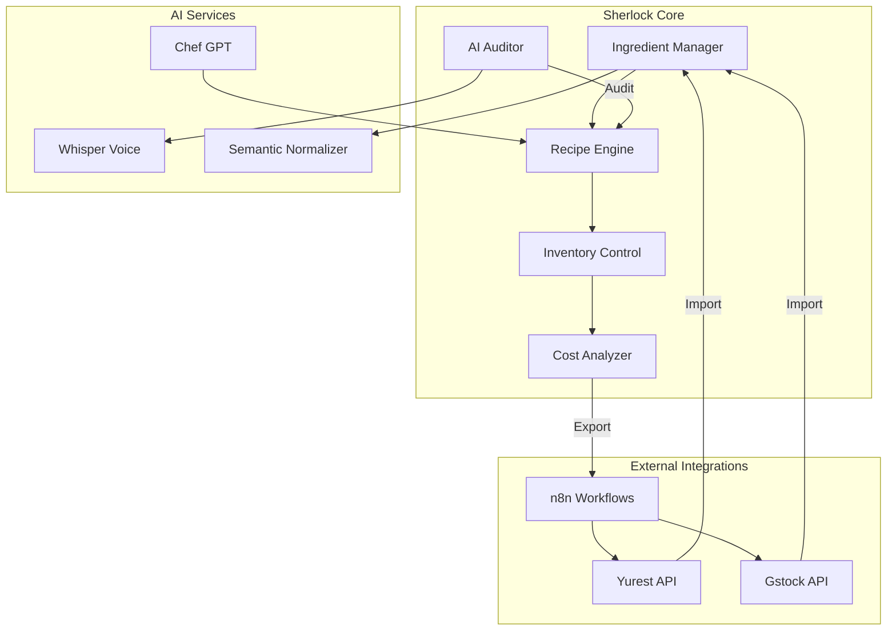

# 🕵️ Módulo Sherlock - Visión General

## Executive Summary

Sherlock es el **módulo de gestión integral de restaurantes** para Dreamland App, que combina:
- **Gestión de inventario** con trazabilidad completa
- **Recetario digital** con costeo automático y jerarquías
- **Auditoría por IA** mediante voz y análisis semántico
- **Integración bidireccional** con plataformas Yurest y Gstock

---

## 🎯 Objetivos del Módulo

### Problemas que Resuelve
1. **Duplicación de ingredientes**: "Tomate", "Tomate Frito", "Salsa de Tomate" como entidades separadas
2. **Falta de auditoría en cocina**: No hay forma de verificar adherencia a recetas sin interrumpir
3. **Información de sala incompleta**: Alergias, maridajes, y protocolos dispersos
4. **Desperdicios ocultos**: Detección manual insuficiente de mermas
5. **Integración fragmentada**: Datos dispersos entre Yurest, Gstock, y sistemas propios

### Valor Único de Sherlock

| Característica | Yurest | Gstock | **Sherlock** |
|----------------|--------|--------|--------------|
| Trazabilidad de lotes | ✅ | ❌ | ✅ |
| Unidades normalizadas | ❌ | ✅ | ✅ |
| Análisis teórico vs real | ❌ | ✅ | ✅ |
| **Normalización semántica IA** | ❌ | ❌ | ✅ |
| **Auditoría por voz** | ❌ | ❌ | ✅ |
| **Protocolo de Sala** | ❌ | ❌ | ✅ |
| **Chef GPT** (generación recetas) | ❌ | ❌ | ✅ |

---

## 📚 Documentación del Módulo

### 1. Análisis de Plataformas
- **[Yurest Analysis](./analysis/yurest.md)**: API, modelo de datos, trazabilidad, multimedia
- **[Gstock Analysis](./analysis/gstock.md)**: OAuth2, sistema de unidades, análisis de costes
- **[Comparative Analysis](./analysis/comparison.md)**: Tabla comparativa completa

### 2. Diseño de Esquema
- **[Prisma Schema](./schema/prisma-schema.md)**: Modelos completos (18 entities)
- **[Design Decisions](./schema/design-decisions.md)**: 13 decisiones arquitectónicas
- **[Entity Relationships](./schema/entity-relationships.md)**: Diagramas ER y flujos

### 3. Integraciones
- **[Yurest Integration](./integrations/yurest.md)**: Endpoints, autenticación, mapeo de campos
- **[Gstock Integration](./integrations/gstock.md)**: OAuth2, webhooks, sincronización
- **[n8n Workflows](./integrations/n8n-workflows.md)**: Automatizaciones de importación/exportación

### 4. Hoja de Ruta
- **[Roadmap](./roadmap/implementation-phases.md)**: Fases de implementación
- **[MVP Features](./roadmap/mvp.md)**: Funcionalidades del producto mínimo viable
- **[Future Enhancements](./roadmap/future.md)**: Mejoras planificadas

---

## 🏗️ Arquitectura de Alto Nivel



---

## 🔑 Características Principales

### 1. Normalización Semántica de Ingredientes
**Problema**: Ingredientes duplicados con nombres similares  
**Solución**: LLM analiza y agrupa automáticamente

```typescript
// Ejemplo de normalización
{
  "Tomate": { normalizedName: "Tomate", aiGroup: "tomate_products" },
  "Tomate Frito": { normalizedName: "Tomate", aiGroup: "tomate_products" },
  "Salsa Tomate": { normalizedName: "Tomate", aiGroup: "tomate_products" }
}
```

### 2. Auditoría por Voz
**Problema**: Verificar recetas sin interrumpir cocina  
**Solución**: Grabación de audio + Whisper + LLM

```typescript
// Flujo de auditoría
1. Cocinero graba: "Añado 50g de sal, 200ml aceite"
2. Whisper transcribe
3. LLM compara con receta
4. Score: 65/100 (desviación en sal: +30g)
5. Alerta automática
```

### 3. Protocolo de Sala
**Campo especial en cada receta**:
```markdown
### Emplatado
- Paellera 26cm a 65-70°C

### Alergias
- Mariscos, moluscos, sin gluten

### Maridaje
- Vino blanco albariño 8-10°C
```

### 4. Chef GPT
**Generación de recetas con IA**:
```typescript
// Prompt → Receta completa
const recipe = await chefGPT.generate({
  prompt: "Paella valenciana para 4 personas",
  dietaryRestrictions: ["sin gluten"],
  budget: 30
});
// → Genera receta con ingredientes, pasos, costes
```

---

## 📊 Modelos de Datos Principales

### Core Entities
1. **Ingredient**: Productos con normalización IA
2. **Recipe**: Recetas con subrecetas y protocolo de sala
3. **MeasureUnit**: Sistema de unidades con conversiones
4. **InventoryRecord**: Trazabilidad completa (lotes, fechas, temp)
5. **VoiceAudit**: Auditorías por voz
6. **WasteRecord**: Control de mermas (manual + IA)
7. **ProductionBatch**: Lotes de producción

Ver [Schema Documentation](./schema/prisma-schema.md) para detalles completos.

---

## 🚦 Estado Actual

### ✅ Completado (Fase 1-2)
- [x] Análisis completo de Yurest
- [x] Análisis completo de Gstock
- [x] Comparativa de plataformas
- [x] Diseño de esquema Prisma
- [x] Documentación de decisiones

### 🔄 En Progreso (Fase 3)
- [ ] Migraciones de base de datos
- [ ] Scripts de seed
- [ ] Workflows n8n de integración

### 📋 Planificado (Fase 4+)
- [ ] Implementación Chef GPT
- [ ] Integración Whisper
- [ ] UI de gestión de recetas
- [ ] UI de auditorías
- [ ] Dashboard de costes

---

## 🔗 Enlaces Rápidos

- [Prisma Schema](./schema/prisma-schema.md)
- [Yurest API Reference](./analysis/yurest.md#api-endpoints)
- [Gstock API Reference](./analysis/gstock.md#api-endpoints)
- [Design Decisions](./schema/design-decisions.md)
- [Implementation Roadmap](./roadmap/implementation-phases.md)

---

## 👥 Equipo y Contacto

**Módulo Owner**: Miguel  
**Status**: Fase 2 completada (Diseño)  
**Última actualización**: 2026-02-15

---

## 📝 Notas de Desarrollo

### Tecnologías Clave
- **ORM**: Prisma
- **Base de datos**: PostgreSQL
- **Workflows**: n8n
- **IA**: OpenAI GPT-4 + Whisper
- **Integraciones**: Yurest WebService API, Gstock REST API

### Convenciones
- IDs: `cuid()` para mejor ordenación y seguridad
- Timestamps: `createdAt`, `updatedAt` obligatorios
- Soft delete: No implementado (hard delete con cascade)
- Índices: En foreign keys y campos de búsqueda frecuente
