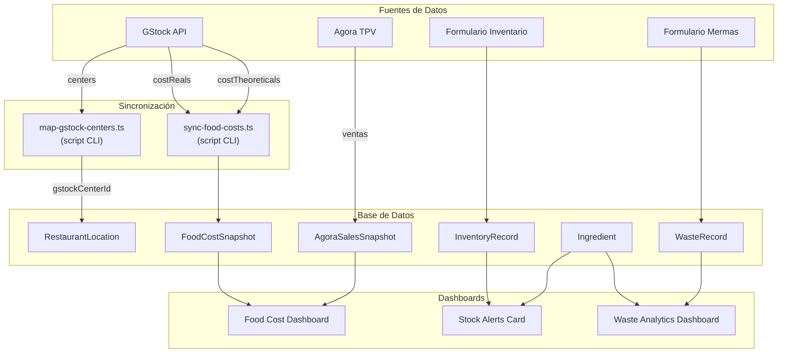

# 🕵️ Módulo Sherlock — Control de Costes

## Resumen Ejecutivo

Sherlock es el módulo de **control de costes operativos** para el grupo de restaurantes. Integra datos de **GStock** (costes de compra y teóricos), **Agora TPV** (ventas/revenue) y registros internos (inventario, mermas) para ofrecer una visión completa del food cost.

El módulo se compone de 4 áreas funcionales:

1. **Inventario & Stock** — CRUD de registros de inventario con trazabilidad completa (lote, partida, caducidad)
2. **Control de Mermas** — Registro de desperdicios con motivo y análisis de impacto
3. **Coste Teórico vs Real** — Dashboard comparativo usando datos de GStock + Agora
4. **Análisis de Mermas** — Dashboard con KPIs, tendencias y top ingredientes por impacto económico

---

## 🎯 Problemas que Resuelve

| Sin Sherlock | Con Sherlock |
|-------------|-------------|
| Food cost calculado manualmente en Excel | Dashboard automático con datos de GStock + Agora |
| Sin visibilidad de mermas por restaurante | Análisis por motivo, ingrediente y tendencia temporal |
| Alertas de stock inexistentes | Alertas automáticas: bajo mínimo, sin stock, caducidad próxima |
| Sin comparativa entre locales | Dashboard por local con varianza y food cost % |
| Inventario sin trazabilidad | Registros con lote, partida, fechas de producción/caducidad/congelación |

---

## 🏗️ Arquitectura de Alto Nivel


```mermaid
graph TB
    subgraph "Fuentes de Datos"
        GS[GStock API]
        AG[Agora TPV]
        UI_INV[Formulario Inventario]
        UI_WASTE[Formulario Mermas]
    end

    subgraph "Sincronización"
        SYNC_FC["sync-food-costs.ts<br/>(script CLI)"]
        SYNC_MAP["map-gstock-centers.ts<br/>(script CLI)"]
    end

    subgraph "Base de Datos"
        FCS[FoodCostSnapshot]
        ASS[AgoraSalesSnapshot]
        IR[InventoryRecord]
        WR[WasteRecord]
        ING[Ingredient]
        RL[RestaurantLocation]
    end

    subgraph "Dashboards"
        D_FC[Food Cost Dashboard]
        D_WA[Waste Analytics Dashboard]
        D_ALERTS[Stock Alerts Card]
    end

    GS -->|costTheoreticals| SYNC_FC
    GS -->|costReals| SYNC_FC
    GS -->|centers| SYNC_MAP
    AG -->|ventas| ASS
    SYNC_FC --> FCS
    SYNC_MAP -->|gstockCenterId| RL
    UI_INV --> IR
    UI_WASTE --> WR

    FCS --> D_FC
    ASS --> D_FC
    WR --> D_WA
    ING --> D_WA
    ING --> D_ALERTS
    IR --> D_ALERTS
```

---

## 📁 Estructura de Archivos

```
src/
├── app/[locale]/(modules)/sherlock/
│   ├── page.tsx                              # Landing: cards de navegación + alertas
│   ├── _components/
│   │   └── stock-alerts-card.tsx              # Card con alertas de stock (3 tipos)
│   ├── inventory/
│   │   ├── page.tsx                          # Lista de registros de inventario
│   │   ├── new/page.tsx                      # Formulario nuevo registro
│   │   ├── [id]/edit/page.tsx                # Formulario edición
│   │   └── _components/
│   │       └── inventory-form.tsx            # Formulario con trazabilidad + restaurante
│   ├── waste/
│   │   ├── page.tsx                          # Lista de mermas
│   │   ├── new/page.tsx                      # Formulario nueva merma
│   │   └── _components/
│   │       └── waste-form.tsx                # Formulario con motivo + restaurante
│   ├── food-cost/
│   │   ├── page.tsx                          # Server component (auth + locations)
│   │   └── _components/
│   │       ├── food-cost-dashboard.tsx        # Orquestador: filtros + fetch paralelo
│   │       ├── food-cost-kpi-cards.tsx        # 4 KPIs: real, teórico, FC%, varianza
│   │       ├── food-cost-trend-chart.tsx      # AreaChart real vs teórico
│   │       ├── category-cost-chart.tsx        # BarChart horizontal por categoría
│   │       └── location-cost-table.tsx        # Tabla comparativa por local
│   └── waste-analytics/
│       ├── page.tsx                          # Server component
│       └── _components/
│           └── waste-analytics-dashboard.tsx  # Dashboard completo: KPIs + charts
│
├── modules/sherlock/
│   ├── schemas.ts                            # Zod: inventoryRecordSchema, wasteRecordSchema
│   ├── actions/
│   │   ├── inventory.ts                      # CRUD inventario + updateIngredientStock()
│   │   ├── waste.ts                          # CRUD mermas
│   │   ├── stock-alerts.ts                   # getStockAlerts() — 3 queries paralelas
│   │   ├── food-cost-analytics.ts            # KPIs, tendencia, categoría, por local
│   │   ├── food-cost-sync.ts                 # Mapeo GStock centers + snapshots
│   │   └── waste-analytics.ts                # KPIs, tendencia, por motivo, top ingredientes
│   └── domain/
│       └── food-cost-sync/
│           ├── types.ts                      # Tipos GStock API (camelCase)
│           └── mappers.ts                    # Extractores + cálculos de varianza
│
scripts/
├── sync-food-costs.ts                        # CLI: sincroniza GStock → FoodCostSnapshot
└── map-gstock-centers.ts                     # CLI: mapea centros GStock → locales (auto-match)
```

---

## 🔗 Integraciones Externas

### GStock API

**Base URL**: `GSTOCK_API_URL` (OAuth2 con `GSTOCK_CLIENT_ID` / `GSTOCK_CLIENT_SECRET`)

**Endpoints consumidos:**

| Endpoint | Uso | Estado |
|----------|-----|--------|
| `v1/centers` | Obtener centros para mapeo automático | Funcional |
| `v1/costReals?centerId=X&startDate=Y&endDate=Z` | Coste real de compras | Devuelve `data: []` vacío |
| `v1/costTheoreticals?centerId=X&startDate=Y&endDate=Z` | Coste teórico (recetas × ventas) | Funcional |
| `v1/stockVariations?centerId=X&startDate=Y&endDate=Z` | Variación de stock | Devuelve `data: []` vacío |

**Cliente**: `src/lib/gstock.ts` — OAuth2, rate limiting (60 req/min), retry con backoff exponencial.

#### Problemas conocidos con GStock (marzo 2026)

1. **`costReals` siempre vacío**: El endpoint devuelve `{ data: [] }` para todos los centros y periodos. Probablemente requiere que se carguen albaranes de compra en GStock para que calcule el coste real. Actualmente solo `costTheoreticals` devuelve datos.

2. **Costes teóricos idénticos por centro**: Los datos de `costTheoreticals` devuelven el mismo `costTotal` independientemente del `centerId`. Parece que los informes de coste teórico están configurados a nivel global en GStock, no por centro. Esto requiere configuración en la plataforma GStock.

3. **Datos semanales, no mensuales**: `costTheoreticals` devuelve registros semanales (campo `name: "TEST.12"` sugiere que son informes con nomenclatura interna). El mapper suma todos los registros del periodo para obtener el total mensual.

4. **Formato camelCase**: La API devuelve campos en camelCase (`costTotal`, `netSaleTotal`), no PascalCase. Los tipos en `types.ts` reflejan el formato real verificado con llamadas a la API.

#### Formato de respuesta real de `costTheoreticals`

```json
{
  "meta": { "page": { "rows": 1, "pages": 1 } },
  "data": [{
    "id": "uuid",
    "centerId": 2,
    "startDate": "2026-02-18 00:00:00",
    "endDate": "2026-02-24 23:59:59",
    "name": "TEST.12",
    "shrinkageTotal": 357.807,
    "netSaleTotal": 78310.37,
    "costTotal": 14618.0945,
    "costPercentageTotal": 18.67,
    "marginTotal": 64050.08,
    "marginPercentageTotal": 81.33,
    "carte": {
      "netSaleTotal": 46038.23,
      "costTotal": 7156.399,
      "costPercentageTotal": 15.54,
      "categories": [
        { "posCategoryId": 2, "name": "COMIDA", "quantity": 5676 },
        { "posCategoryId": 1, "name": "BEBIDAS", "quantity": 4471 }
      ]
    },
    "packs": {
      "netSaleTotal": 32272.14,
      "costTotal": 7103.8885,
      "costPercentageTotal": 22.01,
      "categories": [...]
    }
  }]
}
```

### Agora TPV

Se consume indirectamente a través de `AgoraSalesSnapshot` — los datos de ventas se sincronizan con un pipeline independiente (ver `docs/modules/gastrolab/integrations/agora-tpv.md`). Sherlock cruza el `periodRevenue` con los costes de GStock para calcular el food cost %.

---

## 📦 Modelo de Datos

### Modelos nuevos

```prisma
model FoodCostSnapshot {
  id                   String   @id @default(cuid())
  restaurantLocationId String
  periodStart          DateTime @db.Date
  periodEnd            DateTime @db.Date
  realCostTotal        Float    @default(0)
  realCostByCategory   Json?    // [{ name, amount }]
  theoreticalCostTotal Float    @default(0)
  variance             Float    @default(0)
  variancePercent      Float    @default(0)
  periodRevenue        Float?   // de AgoraSalesSnapshot
  foodCostPercent      Float?   // (realCost / revenue) × 100
  stockVariationTotal  Float?
  syncedAt             DateTime @default(now())
  createdAt            DateTime @default(now())
  updatedAt            DateTime @updatedAt

  restaurantLocation   RestaurantLocation @relation(...)

  @@unique([restaurantLocationId, periodStart, periodEnd])
  @@index([restaurantLocationId, periodStart])
  @@map("food_cost_snapshots")
}
```

### Campos añadidos a modelos existentes

| Modelo | Campo | Tipo | Descripción |
|--------|-------|------|-------------|
| `RestaurantLocation` | `gstockCenterId` | `Int? @unique` | ID del centro en GStock |
| `InventoryRecord` | `restaurantLocationId` | `String?` | Local al que pertenece el registro |
| `WasteRecord` | `restaurantLocationId` | `String?` | Local donde ocurrió la merma |

### Migración

`prisma/migrations/20260312120000_add_sherlock_food_cost_models/migration.sql`

Migración manual (no generada con `prisma migrate dev`) debido al drift de la tabla `rate_limit_entries` de Supabase que no está en el schema Prisma.

---

## 🔐 Permisos (RBAC)

| Recurso | Acción | Descripción |
|---------|--------|-------------|
| `sherlock` | `read` | Ver dashboards, inventario y mermas |
| `sherlock` | `manage` | Crear/editar/eliminar registros, actualizar mapeo GStock |

Todas las server actions comienzan con `await requirePermission("sherlock", "read"|"manage")`.

---

## 📊 Dashboards

### Food Cost Dashboard (`/sherlock/food-cost`)

- **Filtros**: Reutiliza `AnalyticsFilters` de `analytics/covers` (dateStart, dateEnd, locationIds, granularity)
- **KPIs**: Coste Real, Coste Teórico, Food Cost %, Varianza (con delta vs periodo anterior)
- **Tendencia**: AreaChart con 2 áreas (real azul, teórico verde)
- **Por Categoría**: BarChart horizontal top 10
- **Por Local**: Tabla con real, teórico, varianza (badge color), FC%

**Fuente de datos**: `FoodCostSnapshot` (coste) + `AgoraSalesSnapshot` (revenue)

### Waste Analytics Dashboard (`/sherlock/waste-analytics`)

- **KPIs**: Coste Total (qty × ingredient.cost), Cantidad Total, Registros, Media por Registro
- **Tendencia**: BarChart mensual de impacto económico
- **Por Motivo**: PieChart donut con colores por `WasteReason` (EXPIRED=rojo, BURNED=naranja, etc.)
- **Top Ingredientes**: Tabla scrollable con nombre, cantidad, unidad, coste

**Fuente de datos**: `WasteRecord` + `Ingredient.cost` (cálculo en tiempo real, no snapshot)

**Filtro de locales**: `OR: [{ restaurantLocationId: { in: locationIds } }, { restaurantLocationId: null }]` — incluye registros legacy sin local asignado.

### Stock Alerts Card (landing `/sherlock`)

- **Sin Stock**: Ingredientes activos con `currentStock <= 0`
- **Bajo Mínimo**: Ingredientes con `currentStock < minStock` (ambos NOT NULL)
- **Próximo a Caducar**: `InventoryRecord` con `expiryDate` en próximos 7 días, status AVAILABLE

---

## 🛠️ Scripts CLI

### `scripts/map-gstock-centers.ts`

Mapeo automático de centros GStock a locales por coincidencia de nombre.

```bash
npx tsx scripts/map-gstock-centers.ts              # Dry-run (muestra propuesta)
npx tsx scripts/map-gstock-centers.ts --write       # Aplica el mapeo
```

- Llama a `v1/centers` de GStock
- Normaliza nombres (quita acentos, lowercase)
- Calcula similitud (exacta=1.0, contiene=0.8, Jaccard palabras)
- Solo mapea coincidencias con score >= 0.4
- Resultado actual: 8/9 locales mapeados (score 1.0), "One Burger Laundry" sin match

### `scripts/sync-food-costs.ts`

Sincroniza datos de coste de GStock a `FoodCostSnapshot`.

```bash
npx tsx scripts/sync-food-costs.ts                                      # Mes actual (dry-run)
npx tsx scripts/sync-food-costs.ts --write                              # Mes actual
npx tsx scripts/sync-food-costs.ts --write --months=6 --verbose         # Últimos 6 meses
npx tsx scripts/sync-food-costs.ts --write --from=2025-07-01 --to=2026-03-01  # Rango
```

**Pipeline por centro/mes:**
1. Fetch `v1/costReals`, `v1/costTheoreticals`, `v1/stockVariations` en paralelo
2. Extraer totales con mappers (`extractRealCost`, `extractTheoreticalCost`)
3. Calcular varianza y %
4. Cruzar con `AgoraSalesSnapshot.totalGrossAmount` para revenue del periodo
5. Calcular food cost %
6. Upsert `FoodCostSnapshot`

---

## 🌍 Internacionalización

Namespaces en `messages/{es,en,de,fr,it,ru}.json`:

| Namespace | Keys | Uso |
|-----------|------|-----|
| `sherlock` | title, description, costControl, theoreticalVsReal, stockAlerts, viewDashboard, comingSoon | Landing page |
| `sherlock.inventory` | title, description, new.title, new.description, edit.title, edit.description | Inventario CRUD |
| `sherlock.waste` | title, description | Mermas CRUD |
| `sherlock.alerts` | noAlerts, outOfStock, lowStock, expiringSoon | Card de alertas |
| `sherlock.foodCost` | title, description, realCost, theoreticalCost, foodCostPercent, variance, trendTitle, trendDesc, byCategory, byCategoryDesc, byLocation, byLocationDesc, location, noData | Dashboard food cost |
| `sherlock.wasteAnalytics` | title, description, totalCost, totalQuantity, totalRecords, avgPerRecord, trendTitle, trendDesc, byReason, byReasonDesc, topIngredients, topIngredientsDesc, ingredient, quantity, cost, noData | Dashboard mermas |
| `sherlock.settings` | centerMappingDesc, notMapped | Mapeo GStock |

---

## ⚙️ Variables de Entorno

| Variable | Requerida | Descripción |
|----------|-----------|-------------|
| `GSTOCK_API_URL` | Sí | Base URL de la API de GStock |
| `GSTOCK_CLIENT_ID` | Sí | Client ID para OAuth2 |
| `GSTOCK_CLIENT_SECRET` | Sí | Client Secret para OAuth2 |
| `GSTOCK_RATE_RPM` | No | Rate limit (default: 60 req/min) |
| `GSTOCK_TIMEOUT_MS` | No | Timeout por petición (default: 15000ms) |
| `DATABASE_URL` | Sí | Conexión Supabase (pooler) |
| `DIRECT_URL` | Sí | Conexión directa (scripts standalone) |

---

## 🚦 Estado Actual (marzo 2026)

### Implementado

- [x] CRUD de InventoryRecord con trazabilidad (lote, partida, caducidad)
- [x] CRUD de WasteRecord con 7 motivos (EXPIRED, BURNED, SPOILED, QUALITY_ISSUE, OVERPRODUCTION, YIELD_LOSS, OTHER)
- [x] `updateIngredientStock()` recalcula `Ingredient.currentStock` automáticamente
- [x] Alertas de stock: bajo mínimo, sin stock, caducidad próxima
- [x] Campo `restaurantLocationId` opcional en inventario y mermas
- [x] Modelo `FoodCostSnapshot` con migración
- [x] Campo `gstockCenterId` en `RestaurantLocation`
- [x] Script `map-gstock-centers.ts` — mapeo automático por nombre
- [x] Script `sync-food-costs.ts` — sincronización GStock → snapshots
- [x] Dashboard Food Cost: KPIs, tendencia, categoría, por local
- [x] Dashboard Waste Analytics: KPIs, tendencia, por motivo, top ingredientes
- [x] UI de mapeo GStock centers en GastroLab Settings
- [x] i18n en 6 locales (es, en, de, fr, it, ru)
- [x] 8/9 locales mapeados con GStock (One Burger Laundry sin match)
- [x] 48 snapshots sincronizados (8 locales × 6 meses)

### Limitaciones y trabajo pendiente

- [ ] **costReals vacío**: GStock no devuelve datos de coste real. Requiere configuración en la plataforma GStock (cargar albaranes de compra). Sin esto, el food cost real no se puede calcular.
- [ ] **Costes teóricos no diferenciados por centro**: GStock devuelve el mismo informe para todos los centros. Requiere configuración en GStock.
- [ ] **stockVariations vacío**: Mismo problema que costReals.
- [ ] **Automatización de sync**: Actualmente los scripts se ejecutan manualmente. Se podría crear un cron job (`/api/cron/sync-food-costs`) similar al patrón de `gstock-sync`.
- [ ] **Sidebar link a waste-analytics**: Falta añadir entrada en el sidebar para acceder directamente al dashboard de mermas (actualmente se accede desde código).
- [ ] **Food cost % con coste teórico**: Considerar usar `costTheoreticals.costTotal` como proxy del coste real hasta que GStock tenga datos de compras. Esto daría un food cost % "teórico" que es mejor que 0%.
- [ ] **Desglose por categoría con cantidades reales**: Las categorías de `costTheoreticals` devuelven `quantity` (unidades vendidas) pero no `amount` (coste). El desglose de coste por categoría requiere usar `carte.costTotal` + `packs.costTotal` en lugar de las categorías individuales.

---

## 📚 Documentación Relacionada

- **[GStock API](../gastrolab/integrations/gstock.md)** — Cliente, endpoints, OAuth2
- **[GStock Sync Pipeline](../gastrolab/integrations/gstock-sync-pipeline.md)** — Pipeline de sincronización de recetas/ingredientes
- **[Agora TPV](../gastrolab/integrations/agora-tpv.md)** — Integración de ventas
- **[Arquitectura de módulos](../../architecture/)** — Route groups, RBAC, patterns

---

**Última actualización**: 2026-03-12
