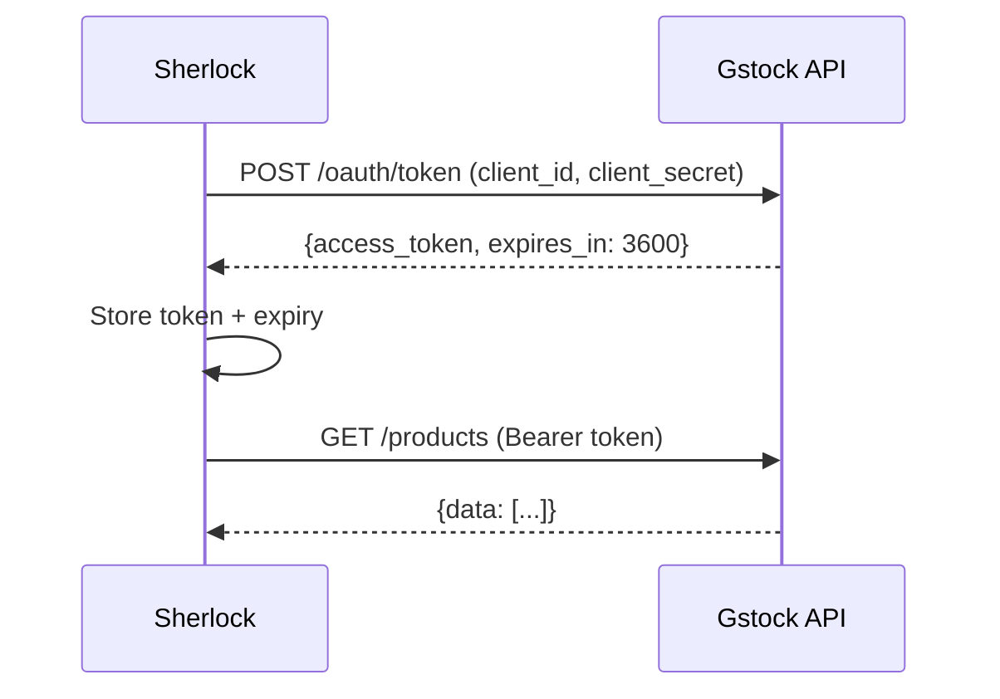

# 🔌 Guía de Integración: Gstock

## Resumen

Esta guía detalla la integración de Sherlock con la plataforma **Gstock API** utilizando OAuth2, webhooks y sincronización bidireccional.

---

## 🔑 Autenticación OAuth2

### Flujo de Autenticación



### Implementación

```typescript
// lib/integrations/gstock-auth.ts
interface GstockToken {
  access_token: string;
  token_type: 'Bearer';
  expires_in: number;
  obtained_at: number;
}

let cachedToken: GstockToken | null = null;

async function getGstockToken(): Promise<string> {
  // Check if cached token is still valid
  if (cachedToken) {
    const expiresAt = cachedToken.obtained_at + cachedToken.expires_in * 1000;
    if (Date.now() < expiresAt - 60000) { // Refresh 1min before expiry
      return cachedToken.access_token;
    }
  }

  // Request new token
  const response = await fetch(`${process.env.GSTOCK_API_URL}/oauth/token`, {
    method: 'POST',
    headers: { 'Content-Type': 'application/json' },
    body: JSON.stringify({
      client_id: process.env.GSTOCK_CLIENT_ID,
      client_secret: process.env.GSTOCK_CLIENT_SECRET
    })
  });

  const data = await response.json();
  cachedToken = {
    ...data,
    obtained_at: Date.now()
  };

  return cachedToken.access_token;
}

export async function fetchGstock(endpoint: string) {
  const token = await getGstockToken();
  
  const response = await fetch(`${process.env.GSTOCK_API_URL}${endpoint}`, {
    headers: {
      'Authorization': `Bearer ${token}`,
      'Content-Type': 'application/json'
    }
  });

  return response.json();
}
```

### Variables de Entorno

```env
GSTOCK_API_URL=https://api.gstock.es
GSTOCK_CLIENT_ID=your_client_id_here
GSTOCK_CLIENT_SECRET=your_client_secret_here
GSTOCK_WEBHOOK_SECRET=your_webhook_secret_for_hmac
```

---

## 📡 Endpoints Principales

### 1. Productos (con Paginación)

#### GET `/products?page=1&limit=250`

**Response**:
```json
{
  "data": [
    {
      "id": "prod_456",
      "reference": "SKU-123",
      "name": "Aceite de Oliva Virgen Extra",
      "categoryId": "cat_789",
      "subtypeId": "sub_101",
      "supplierId": "sup_202",
      "measureUnitId": "unit_303",
      "costPrice": 12.50,
      "sellPrice": 18.00,
      "taxRate": 0.10,
      "status": "active",
      "currentStock": 45.5,
      "minStock": 20,
      "maxStock": 100
    }
  ],
  "page": {
    "rows": 250,
    "pages": 5
  }
}
```

**Mapeo a Sherlock**:
```typescript
const mapGstockProduct = async (gstockData): Promise<IngredientCreateInput> => ({
  name: gstockData.name,
  reference: gstockData.reference,
  categoryId: await findOrCreateCategory(gstockData.categoryId),
  unitTypeId: await mapMeasureUnit(gstockData.measureUnitId),
  cost: gstockData.costPrice,
  taxRate: gstockData.taxRate,
  isBuyable: true,
  isSellable: gstockData.sellPrice > 0,
  currentStock: gstockData.currentStock,
  minStock: gstockData.minStock,
  maxStock: gstockData.maxStock,
  supplierId: await findOrCreateSupplier(gstockData.supplierId),
  status: gstockData.status === 'active' ? 'ACTIVE' : 'INACTIVE'
});

// Importación con paginación
async function importAllProducts() {
  let page = 1;
  let hasMore = true;

  while (hasMore) {
    const response = await fetchGstock(`/products?page=${page}&limit=250`);
    
    for (const product of response.data) {
      await prisma.ingredient.upsert({
        where: { reference: product.reference },
        update: { cost: product.costPrice, currentStock: product.currentStock },
        create: await mapGstockProduct(product)
      });
    }

    hasMore = page < response.page.pages;
    page++;
  }
}
```

---

### 2. Unidades de Medida

#### GET `/measure_units`

**Response**:
```json
{
  "data": [
    {
      "id": "unit_303",
      "name": "Litro",
      "abbreviation": "L",
      "type": "VOLUME",
      "conversionFactor": 1.0,
      "isBase": true
    },
    {
      "id": "unit_304",
      "name": "Mililitro",
      "abbreviation": "mL",
      "type": "VOLUME",
      "conversionFactor": 0.001,
      "isBase": false
    }
  ]
}
```

**Importación directa** (estructura idéntica a Sherlock):
```typescript
async function importMeasureUnits() {
  const units = await fetchGstock('/measure_units');
  
  for (const unit of units.data) {
    await prisma.measureUnit.upsert({
      where: { abbreviation: unit.abbreviation },
      update: { conversionFactor: unit.conversionFactor },
      create: {
        name: unit.name,
        abbreviation: unit.abbreviation,
        type: unit.type,
        conversionFactor: unit.conversionFactor,
        isBase: unit.isBase
      }
    });
  }
}
```

---

### 3. Recetas con Subrecetas

#### GET `/kitchen/recipes`

**Response**:
```json
{
  "data": [
    {
      "id": "rec_101",
      "name": "Paella Valenciana",
      "categoryId": "cat_principales",
      "familyId": "fam_arroces",
      "theoreticalCost": 24.50,
      "realCost": 27.00,
      "ingredients": [
        {
          "productId": "prod_456",
          "quantity": 0.5,
          "measureUnitId": "unit_303"
        }
      ],
      "subrecipes": [
        {
          "recipeId": "rec_102",
          "quantity": 0.2
        }
      ]
    }
  ]
}
```

**Mapeo con Subrecetas**:
```typescript
const mapGstockRecipe = async (gstockData): Promise<Recipe> => {
  // 1. Crear receta
  const recipe = await prisma.recipe.create({
    data: {
      name: gstockData.name,
      categoryId: await findOrCreateRecipeCategory(gstockData.categoryId),
      familyId: await findOrCreateRecipeFamily(gstockData.familyId),
      theoreticalCost: gstockData.theoreticalCost,
      realCost: gstockData.realCost,
      variance: gstockData.realCost - gstockData.theoreticalCost,
      variancePercent: ((gstockData.realCost - gstockData.theoreticalCost) / gstockData.theoreticalCost) * 100
    }
  });

  // 2. Crear ingredientes
  for (const ing of gstockData.ingredients) {
    await prisma.recipeIngredient.create({
      data: {
        recipeId: recipe.id,
        ingredientId: await mapProductId(ing.productId),
        quantity: ing.quantity,
        unitId: await mapMeasureUnit(ing.measureUnitId)
      }
    });
  }

  // 3. Crear subrecetas
  for (const sub of gstockData.subrecipes || []) {
    await prisma.recipeSubrecipe.create({
      data: {
        parentId: recipe.id,
        childId: await mapRecipeId(sub.recipeId),
        quantity: sub.quantity
      }
    });
  }

  return recipe;
};
```

---

### 4. Reportes de Costes

#### GET `/reports/costs?from=2026-01-01&to=2026-02-15`

**Response**:
```json
{
  "data": {
    "recipes": [
      {
        "recipeId": "rec_101",
        "name": "Paella Valenciana",
        "theoreticalCost": 24.50,
        "realCost": 27.00,
        "variance": 2.50,
        "variancePercent": 10.2,
        "timesProduced": 45
      }
    ]
  }
}
```

**Uso para Detección de Desperdicios**:
```typescript
async function analyzeWaste() {
  const costs = await fetchGstock('/reports/costs?from=2026-01-01&to=2026-02-15');
  
  for (const recipeReport of costs.data.recipes) {
    if (recipeReport.variancePercent > 10) {
      // Alerta: Desperdicio > 10%
      await prisma.wasteRecord.create({
        data: {
          ingredientId: '...', // Se necesita más análisis
          quantity: recipeReport.variance,
          reason: 'OTHER',
          notes: `Detectado automáticamente desde Gstock. Variación: ${recipeReport.variancePercent}%`,
          detectedByAI: true,
          confidenceScore: 0.75
        }
      });
    }
  }
}
```

---

## 🔔 Webhooks (Sincronización en Tiempo Real)

### Configuración del Webhook

En Gstock dashboard:
1. Ir a **Settings > Webhooks**
2. Añadir URL: `https://your-domain.com/api/webhooks/gstock`
3. Seleccionar eventos:
   - `product.price_updated`
   - `product.stock_updated`
   - `recipe.cost_changed`
4. Copiar `WEBHOOK_SECRET` para verificación HMAC

### Implementación del Endpoint

```typescript
// app/api/webhooks/gstock/route.ts
import { NextRequest } from 'next/server';
import crypto from 'crypto';

function verifyGstockSignature(payload: string, signature: string): boolean {
  const secret = process.env.GSTOCK_WEBHOOK_SECRET!;
  const hmac = crypto.createHmac('sha256', secret);
  hmac.update(payload);
  const computed = hmac.digest('hex');
  return crypto.timingSafeEqual(
    Buffer.from(signature),
    Buffer.from(computed)
  );
}

export async function POST(request: NextRequest) {
  const body = await request.text();
  const signature = request.headers.get('X-Gstock-Signature');

  if (!signature || !verifyGstockSignature(body, signature)) {
    return Response.json({ error: 'Invalid signature' }, { status: 401 });
  }

  const event = JSON.parse(body);

  switch (event.type) {
    case 'product.price_updated':
      await handlePriceUpdate(event.data);
      break;
    case 'product.stock_updated':
      await handleStockUpdate(event.data);
      break;
    case 'recipe.cost_changed':
      await handleCostChange(event.data);
      break;
  }

  return Response.json({ received: true });
}

async function handlePriceUpdate(data: any) {
  const ingredient = await prisma.ingredient.findUnique({
    where: { reference: data.productReference }
  });

  if (ingredient) {
    // Actualizar precio
    await prisma.ingredient.update({
      where: { id: ingredient.id },
      data: { cost: data.newPrice }
    });

    // Crear histórico
    await prisma.priceHistory.create({
      data: {
        ingredientId: ingredient.id,
        price: data.newPrice,
        reason: 'Actualización webhook Gstock'
      }
    });

    console.log(`✅ Price updated for ${ingredient.name}: ${data.newPrice}`);
  }
}

async function handleStockUpdate(data: any) {
  await prisma.ingredient.update({
    where: { reference: data.productReference },
    data: { currentStock: data.newStock }
  });
}

async function handleCostChange(data: any) {
  await prisma.recipe.update({
    where: { id: await mapRecipeId(data.recipeId) },
    data: {
      theoreticalCost: data.newTheoreticalCost,
      realCost: data.newRealCost
    }
  });
}
```

---

## 🔁 Exportación Bidireccional

### Sherlock → Gstock

**Caso de uso**: Exportar recetas generadas por Chef GPT a Gstock.

```typescript
async function exportRecipeToGstock(recipeId: string) {
  const recipe = await prisma.recipe.findUnique({
    where: { id: recipeId },
    include: {
      ingredients: {
        include: { ingredient: true, unit: true }
      },
      subrecipesUsed: {
        include: { child: true }
      }
    }
  });

  if (!recipe) return;

  const gstockPayload = {
    name: recipe.name,
    categoryId: recipe.categoryId,
    ingredients: recipe.ingredients.map(ri => ({
      productId: await reverseMapIngredientId(ri.ingredientId),
      quantity: ri.quantity,
      measureUnitId: await reverseMapMeasureUnit(ri.unitId)
    })),
    subrecipes: recipe.subrecipesUsed.map(sub => ({
      recipeId: await reverseMapRecipeId(sub.childId),
      quantity: sub.quantity
    }))
  };

  const token = await getGstockToken();
  await fetch(`${process.env.GSTOCK_API_URL}/kitchen/recipes`, {
    method: 'POST',
    headers: {
      'Authorization': `Bearer ${token}`,
      'Content-Type': 'application/json'
    },
    body: JSON.stringify(gstockPayload)
  });

  console.log(`✅ Exported recipe "${recipe.name}" to Gstock`);
}
```

---

## 📊 Manejo de Paginación

```typescript
async function fetchAllPages<T>(endpoint: string): Promise<T[]> {
  const results: T[] = [];
  let page = 1;
  let hasMore = true;

  while (hasMore) {
    const response = await fetchGstock(`${endpoint}?page=${page}&limit=250`);
    results.push(...response.data);
    
    hasMore = page < response.page.pages;
    page++;
    
    // Rate limiting
    await new Promise(resolve => setTimeout(resolve, 100));
  }

  return results;
}
```

---

## 🚨 Manejo de Errores

```typescript
class GstockAPIError extends Error {
  constructor(
    message: string,
    public statusCode: number,
    public endpoint: string
  ) {
    super(message);
  }
}

async function fetchGstockSafe(endpoint: string) {
  try {
    const token = await getGstockToken();
    const response = await fetch(`${process.env.GSTOCK_API_URL}${endpoint}`, {
      headers: {
        'Authorization': `Bearer ${token}`,
        'Content-Type': 'application/json'
      },
      signal: AbortSignal.timeout(15000)
    });

    if (!response.ok) {
      throw new GstockAPIError(
        `HTTP ${response.status}`,
        response.status,
        endpoint
      );
    }

    return response.json();
  } catch (error) {
    if (error instanceof GstockAPIError) {
      // Log to monitoring
      console.error(`Gstock API error on ${error.endpoint}: ${error.message}`);
      
      // Retry logic
      if (error.statusCode >= 500) {
        // Retry after 5s for server errors
        await new Promise(resolve => setTimeout(resolve, 5000));
        return fetchGstockSafe(endpoint);
      }
    }
    throw error;
  }
}
```

---

## 🔗 Referencias

- [Gstock Analysis](../analysis/gstock.md)
- [Comparative Analysis](../analysis/comparison.md)
- [Prisma Schema](../schema/prisma-schema.md)
- [Webhooks Security Best Practices](https://docs.gstock.es/webhooks)
