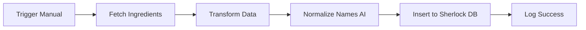

# 🗓️ Roadmap de Implementación Sherlock

## Visión General

Este documento detalla las fases de implementación del módulo Sherlock, desde la infraestructura base hasta las características avanzadas de IA.

---

## 📋 Fases de Desarrollo

### ✅ Fase 1: Investigación de Integraciones (COMPLETADA)
**Duración**: 1 semana  
**Estado**: ✅ Completado 2026-02-15

#### Objetivos
- Analizar APIs de Yurest y Gstock
- Identificar campos comunes y diferencias
- Definir estrategia de integración

#### Entregables
- [x] Análisis completo de Yurest API
- [x] Análisis completo de Gstock API
- [x] Tabla comparativa de plataformas
- [x] Documento de gaps y oportunidades

---

### ✅ Fase 2: Diseño de Esquema (COMPLETADA)
**Duración**: 1 semana  
**Estado**: ✅ Completado 2026-02-15

#### Objetivos
- Diseñar esquema de base de datos informado
- Documentar decisiones arquitectónicas
- Preparar migraciones

#### Entregables
- [x] Prisma schema completo (18 modelos)
- [x] Documento de 13 decisiones de diseño
- [x] Diagramas de entidad-relación
- [x] Definición de "Protocolo de Sala"

---

### 🔄 Fase 3: Infraestructura Base (EN PROGRESO)
**Duración estimada**: 2 semanas  
**Estado**: 🔄 En progreso

#### Objetivos
- Implementar esquema en base de datos
- Crear datos de prueba (seeds)
- Configurar integraciones básicas

#### Tareas

##### 3.1 Migraciones de Base de Datos
- [ ] Generar migración inicial de Prisma
  ```bash
  npx prisma migrate dev --name initial_sherlock_schema
  ```
- [ ] Validar schema en PostgreSQL
- [ ] Crear backup antes de aplicar

##### 3.2 Scripts de Seed
- [ ] **Unidades de medida estándar**
  ```typescript
  // Peso
  { name: "Kilogramo", abbr: "Kg", type: "WEIGHT", factor: 1.0, isBase: true }
  { name: "Gramo", abbr: "g", type: "WEIGHT", factor: 0.001, isBase: false }
  
  // Volumen
  { name: "Litro", abbr: "L", type: "VOLUME", factor: 1.0, isBase: true }
  { name: "Mililitro", abbr: "mL", type: "VOLUME", factor: 0.001, isBase: false }
  
  // Unidad
  { name: "Unidad", abbr: "Ud", type: "UNIT", factor: 1.0, isBase: true }
  { name: "Docena", abbr: "Doc", type: "UNIT", factor: 12.0, isBase: false }
  ```

- [ ] **Categorías básicas de ingredientes**
  ```typescript
  const categories = [
    "Carnes", "Pescados", "Verduras", "Frutas", "Lácteos",
    "Cereales", "Especias", "Bebidas", "Congelados", "Secos"
  ];
  ```

- [ ] **Categorías de recetas**
  ```typescript
  const recipeCategories = [
    "Entrantes", "Principales", "Postres", "Guarniciones",
    "Salsas", "Bebidas", "Aperitivos"
  ];
  ```

##### 3.3 Configuración de Integraciones
- [ ] Solicitar credenciales Yurest (token API)
- [ ] Solicitar credenciales Gstock (OAuth2 client_id/secret)
- [ ] Configurar variables de entorno
  ```env
  YUREST_API_URL=https://api.yurest.com
  YUREST_TOKEN=your_token_here
  
  GSTOCK_API_URL=https://api.gstock.es
  GSTOCK_CLIENT_ID=your_client_id
  GSTOCK_CLIENT_SECRET=your_secret
  ```

---

### 📋 Fase 4: Workflows de Integración
**Duración estimada**: 2 semanas  
**Inicio planeado**: 2026-03-01

#### Objetivos
- Automatizar importación de datos
- Sincronización bidireccional
- Manejo de errores y reintentos

#### Tareas

##### 4.1 n8n Workflows

**Workflow 1: Importación Inicial Yurest**


**Workflow 2: Sincronización Gstock**


##### 4.2 Scripts de Importación
- [ ] **Script: import-yurest-ingredients.ts**
  - Fetch all ingredients from Yurest
  - Map to Sherlock schema
  - Handle duplicates

- [ ] **Script: import-yurest-recipes.ts**
  - Fetch recipes with ingredient relationships
  - Create RecipeIngredient links
  - Import multimedia (photos/videos)

- [ ] **Script: import-gstock-products.ts**
  - OAuth2 authentication flow
  - Fetch products with pagination
  - Map measure units

---

### 📋 Fase 5: UI Básica (MVP)
**Duración estimada**: 3 semanas  
**Inicio planeado**: 2026-03-15

#### Objetivos
- Interfaz para gestión de ingredientes
- Interfaz para gestión de recetas
- Dashboard de costes básico

#### Componentes a Desarrollar

##### 5.1 Gestión de Ingredientes
```typescript
// Components
- IngredientList.tsx: Listado con búsqueda y filtros
- IngredientForm.tsx: Formulario crear/editar
- IngredientCard.tsx: Vista de tarjeta
- NormalizedGroupBadge.tsx: Visualizar grupos IA
```

**Features**:
- ✅ CRUD completo
- ✅ Búsqueda semántica (por `normalizedName`)
- ✅ Filtros por categoría, proveedor, stock
- ✅ Vista de grupos normalizados
- ✅ Alertas de bajo stock

##### 5.2 Gestión de Recetas
```typescript
// Components
- RecipeList.tsx: Grid de recetas con fotos
- RecipeEditor.tsx: Editor WYSIWYG de recetas
- IngredientPicker.tsx: Selector de ingredientes
- SubrecipePicker.tsx: Selector de subrecetas
- ProtocolSalaEditor.tsx: Editor de protocolo de sala
```

**Features**:
- ✅ CRUD completo
- ✅ Gestión de subrecetas (drag & drop)
- ✅ Cálculo automático de `theoreticalCost`
- ✅ Editor markdown para `protocoloDeSala`
- ✅ Upload de fotos/videos

##### 5.3 Dashboard de Costes
```typescript
// Components
- CostOverview.tsx: Métricas principales
- CostVarianceChart.tsx: Teórico vs Real
- TopCostlyRecipes.tsx: Recetas más caras
- WasteAnalytics.tsx: Análisis de desperdicios
```

---

### 📋 Fase 6: Características IA (Core Value)
**Duración estimada**: 4 semanas  
**Inicio planeado**: 2026-04-05

#### Objetivos
- Implementar Chef GPT
- Integrar Whisper para auditorías
- Normalización semántica automática

#### 6.1 Chef GPT
**Generación de recetas con IA**

```typescript
// API endpoint
POST /api/sherlock/chef-gpt/generate

{
  "prompt": "Paella valenciana para 4 personas",
  "dietaryRestrictions": ["sin gluten", "vegetariana"],
  "maxBudget": 30,
  "availableIngredients": ["arroz", "tomate", "pimiento"]
}

// Response
{
  "recipe": {
    "name": "Paella Vegetariana",
    "ingredients": [...],
    "steps": [...],
    "theoreticalCost": 24.50,
    "aiGenerated": true,
    "aiPrompt": "...",
    "protocoloDeSala": "..."
  }
}
```

**Componentes**:
- [ ] `ChefGPTGenerator.tsx`: UI de generación
- [ ] `action/generateRecipe.ts`: Server action
- [ ] `lib/ai/chefGPT.ts`: Lógica de prompts

#### 6.2 Auditoría por Voz
**Whisper + LLM para verificación**

```typescript
// Flujo
1. Upload audio: POST /api/sherlock/audit/transcribe
2. Whisper transcribe
3. LLM compara con receta
4. Genera VoiceAudit record con score y discrepancies
```

**Componentes**:
- [ ] `VoiceRecorder.tsx`: Grabador de audio
- [ ] `AuditDashboard.tsx`: Vista de auditorías
- [ ] `DiscrepancyViewer.tsx`: Visualizar diferencias
- [ ] `lib/ai/whisper.ts`: Integración Whisper
- [ ] `lib/ai/auditAnalyzer.ts`: Comparador LLM

#### 6.3 Normalización Semántica
**Agrupación automática de ingredientes**

```typescript
// Batch job (cron diario)
POST /api/sherlock/normalize/batch

// Proceso:
1. Fetch ingredientes sin normalizar
2. LLM analiza nombres en batch de 50
3. Genera `normalizedName` y `aiNormalizedGroup`
4. Sugiere fusiones con confidence score
5. Admin aprueba/rechaza sugerencias
```

**Componentes**:
- [ ] `NormalizationQueue.tsx`: Cola de sugerencias
- [ ] `MergeSuggestion.tsx`: Vista de fusión
- [ ] `lib/ai/semanticNormalizer.ts`: Lógica de normalización

---

### 📋 Fase 7: Características Avanzadas
**Duración estimada**: 4 semanas  
**Inicio planeado**: 2026-05-05

#### 7.1 Análisis Predictivo
- [ ] Predicción de stock (ML)
- [ ] Alertas de subida de precios
- [ ] Optimización de costes por receta
- [ ] Sugerencias de compra

#### 7.2 Gestión de Producción
- [ ] Planificación de lotes (`ProductionBatch`)
- [ ] Seguimiento en tiempo real
- [ ] Análisis de variaciones
- [ ] Integración con kitchen displays

#### 7.3 Reportes Avanzados
- [ ] Informe de rendimiento por ingrediente
- [ ] Análisis ABC de inventario
- [ ] Dashboard ejecutivo
- [ ] Exportación a Excel/PDF

---

## 📊 Métricas de Éxito

### KPIs por Fase

| Fase | KPI | Target |
|------|-----|--------|
| **Fase 3** | Schema deployed | 100% |
| **Fase 4** | Ingredientes importados | >1000 |
| **Fase 4** | Recetas importadas | >200 |
| **Fase 5** | Usuarios activos | >10 |
| **Fase 6** | Recetas generadas IA | >50 |
| **Fase 6** | Auditorías completadas | >100 |
| **Fase 7** | Reducción costes | >10% |

---

## 🚧 Riesgos y Mitigaciones

### Riesgo 1: Calidad de APIs Externas
**Probabilidad**: Media  
**Impacto**: Alto

**Mitigación**:
- Implementar circuit breakers
- Cache agresivo
- Fallback a datos locales

### Riesgo 2: Precisión de Normalización IA
**Probabilidad**: Media  
**Impacto**: Medio

**Mitigación**:
- Supervisión humana obligatoria
- Threshold de confidence (>0.85)
- Rollback de cambios

### Riesgo 3: Adopción de Usuario
**Probabilidad**: Media  
**Impacto**: Alto

**Mitigación**:
- Onboarding guiado
- Tutoriales en video
- Soporte directo

---

## 🎯 Milestones

- **M1** (2026-02-28): Base de datos migrada y seed completo
- **M2** (2026-03-14): Importación inicial de Yurest/Gstock completa
- **M3** (2026-04-04): UI MVP funcional
- **M4** (2026-05-02): Chef GPT + Whisper integrados
- **M5** (2026-06-01): v1.0 lanzamiento completo

---

## 📚 Referencias

- [Prisma Schema](../schema/prisma-schema.md)
- [Yurest Integration Guide](../integrations/yurest.md)
- [Gstock Integration Guide](../integrations/gstock.md)
- [Design Decisions](../schema/design-decisions.md)
