# 📊 Diagramas de Entidad-Relación

Este documento contiene los diagramas visuales del esquema de base de datos de Sherlock.

---

## Diagrama ER Completo


---

## Diagrama por Módulos

### Módulo: Gestión de Unidades


### Módulo: Ingredientes con Normalización IA


### Módulo: Recetas Jerárquicas

```mermaid
graph TD
    A[Recipe: Paella Valenciana] -->|RecipeIngredient| B[Arroz 400g]
    A -->|RecipeIngredient| C[Pollo 300g]
    A -->|RecipeSubrecipe| D[Recipe: Sofrito 150g]
    
    D -->|RecipeIngredient| E[Tomate 100g]
    D -->|RecipeIngredient| F[Cebolla 50g]
    D -->|RecipeIngredient| G[Ajo 20g]
    
    A -->|theoreticalCost| H[€24.50]
    A -->|realCost| I[€27.00]
    A -->|variance| J[€2.50 - 10.2%]
```


### Módulo: Control de Inventario

```mermaid
graph TB
    A[Ingredient: Pollo] -->|InventoryRecord #1| B[Location: Cámara<br/>Quantity: 5kg<br/>Expiry: 2026-02-20<br/>Lot: LOT-2345]
    A -->|InventoryRecord #2| C[Location: Congelador<br/>Quantity: 10kg<br/>Freeze: 2026-01-10<br/>Lot: LOT-2301]
    
    B -->|status| D[AVAILABLE]
    C -->|status| E[AVAILABLE]
    
    A -->|WasteRecord| F[Quantity: 0.5kg<br/>Reason: SPOILED<br/>Date: 2026-02-15]
```


### Módulo: Auditoría por Voz

```mermaid
sequenceDiagram
    participant C as Cocinero
    participant S as Sistema
    participant W as Whisper
    participant L as LLM
    participant D as Database
    
    C->>S: Graba audio cocinando
    S->>W: Transcribe audio
    W-->>S: "Añado 50g de sal, 200ml de aceite"
    S->>D: Fetch recipe specification
    D-->>S: Recipe: sal=20g, aceite=200ml
    S->>L: Compare transcription vs recipe
    L-->>S: Discrepancies: {salt: +30g}
    S->>D: Create VoiceAudit (score: 65/100)
    S-->>C: Alert: Desviación en sal detectada
```


---

## Flujos de Datos Principales

### Flujo 1: Importación desde Yurest


### Flujo 2: Cálculo de Coste de Receta


### Flujo 3: Detección de Desperdicios


---

## Índices y Optimización

### Índices Principales
```sql
-- Búsqueda de ingredientes
CREATE INDEX idx_ingredient_normalized_name ON ingredients(normalized_name);
CREATE INDEX idx_ingredient_ai_group ON ingredients(ai_normalized_group);

-- Filtrado de recetas
CREATE INDEX idx_recipe_status ON recipes(status);
CREATE INDEX idx_recipe_category ON recipes(category_id);

-- Alertas de stock
CREATE INDEX idx_inventory_expiry ON inventory_records(expiry_date);
CREATE INDEX idx_ingredient_stock ON ingredients(current_stock);

-- Auditorías
CREATE INDEX idx_voice_audit_score ON voice_audits(score);
CREATE INDEX idx_voice_audit_date ON voice_audits(created_at);

-- Histórico de precios
CREATE INDEX idx_price_history_date ON price_history(effective_at);
```

---

## Tamaños Estimados

| Tabla | Registros (Año 1) | Tamaño Estimado |
|-------|-------------------|-----------------|
| Ingredient | ~2,000 | 500 KB |
| Recipe | ~500 | 2 MB |
| RecipeIngredient | ~5,000 | 300 KB |
| InventoryRecord | ~10,000 | 1.5 MB |
| WasteRecord | ~3,000 | 400 KB |
| VoiceAudit | ~1,000 | 50 MB (audio refs) |
| PriceHistory | ~20,000 | 2 MB |
| **TOTAL** | | **~56.7 MB** |

---

## Estrategias de Escalado

### Particionamiento
```sql
-- Particionar PriceHistory por fecha
CREATE TABLE price_history_2026_q1 PARTITION OF price_history
    FOR VALUES FROM ('2026-01-01') TO ('2026-04-01');

CREATE TABLE price_history_2026_q2 PARTITION OF price_history
    FOR VALUES FROM ('2026-04-01') TO ('2026-07-01');
```

### Archivado
```sql
-- Mover VoiceAudits > 6 meses a tabla de archivo
INSERT INTO voice_audits_archive
SELECT * FROM voice_audits
WHERE created_at < NOW() - INTERVAL '6 months';

DELETE FROM voice_audits
WHERE created_at < NOW() - INTERVAL '6 months';
```

---

## Referencias Técnicas

- [Prisma Schema Full](./prisma-schema.md)
- [Design Decisions](./design-decisions.md)
- [Yurest Data Model](../analysis/yurest.md#data-model)
- [Gstock Data Model](../analysis/gstock.md#data-model)
