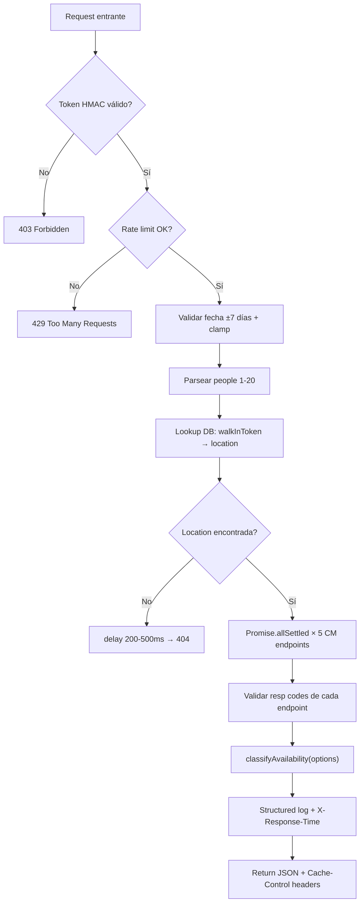

# 📡 API de Disponibilidad Walk-in

## Endpoint

```
GET /api/walk-in/availability/{slug}
```

### Parámetros

| Parámetro | Ubicación | Tipo | Obligatorio | Descripción |
|-----------|-----------|------|-------------|-------------|
| `slug` | Path | string | Sí | `walkInToken` (opaco) o `cmSlug` (legacy) |
| `date` | Query | string | No | Fecha ISO `YYYY-MM-DD` (default: hoy, max ±7 días) |
| `people` | Query | number | No | Tamaño de grupo (1-20). Filtra slots por capacidad mínima |
| `X-WalkIn-Token` | Header | string | Sí | Token HMAC generado por el Server Component |

### Ejemplo

```bash
curl -H "X-WalkIn-Token: 1710144000000.a1b2c3d4..." \
  "https://app.dreamland.es/api/walk-in/availability/a7Bk3mXp9Qr2?date=2026-03-11&people=6"
```

---

## Respuesta Exitosa (200)

### Headers
```
Cache-Control: public, s-maxage=120, stale-while-revalidate=300
X-Response-Time: 245ms
```

### Body

```typescript
interface WalkInAvailability {
  restaurant: {
    name: string;      // "Voltereta Casa"
    address: string;   // "C/ Colón 15, Valencia"
    city: string;      // "Valencia"
    slug: string;      // "voltereta-casa" (cmSlug)
  };
  date: string;        // "2026-03-11"
  services: ServiceAvailability[];
  lastUpdated: string;          // "2026-03-11T13:45:00.000Z"
  filteredPartySize?: number;   // Si se filtró por tamaño de grupo (query param `people`)
}
```

### ServiceAvailability

```typescript
interface ServiceAvailability {
  service: "lunch" | "dinner";
  label: string;                // "Comida" | "Cena"
  slots: TimeSlot[];
  occupancy: {
    covers: number;             // Comensales sentados
    totalCapacity: number;      // Capacidad total
    tables: number;             // Mesas ocupadas
    totalTables: number;        // Mesas totales
    percentage: number;         // 0-100
  };
  tableZones?: TableZoneSummary[];  // Zonas del restaurante
  stats?: ServiceStats;              // Stats de reservas (solo admin)
}
```

### TimeSlot

```typescript
type SlotStatus = "available" | "limited" | "full";

interface TimeSlot {
  time: string;              // "14:30"
  status: SlotStatus;
  maxPartySize: number;      // Mayor grupo que cabe

  // Solo visible para SUPER_ADMIN:
  availableMinutes?: number;
  consecutiveUntil?: string; // "16:00"
  partySizes?: number[];     // [2, 3, 4, 5, 6, 8]
  zones?: SlotZone[];
}
```

### SlotZone

```typescript
interface SlotZone {
  name: string;        // "Selva Ubud"
  id: number;
  tableCount: number;
  minCapacity: number;
  maxCapacity: number;
  availableForPartySizes?: number[];  // Qué tamaños de grupo caben en esta zona (ej: [2, 4, 6])
}
```

---

## Respuestas de Error

| Código | Motivo | Body |
|--------|--------|------|
| 403 | Token HMAC inválido o expirado | `{ "error": "Forbidden" }` |
| 404 | Restaurante no encontrado (con delay 200-500ms) | `{ "error": "Not found" }` |
| 429 | Rate limit excedido (+ header `Retry-After: 60`) | `{ "error": "Too many requests..." }` |
| 500 | Error interno al consultar CoverManager | `{ "error": "Failed to fetch availability" }` |

---

## Flujo Interno del Route Handler



---

## Clasificador de Disponibilidad

**Archivo**: `src/modules/walk-in/domain/availability-classifier.ts`

### Función Principal

```typescript
function classifyAvailability(
  cmAvailability: CMAvailabilityResponse,
  cmTableAvailability: CMTableAvailabilityResponse,
  cmMap?: CMMapResponse,
  cmExtended?: CMExtendedAvailabilityResponse,
  cmStats?: CMStatsResponse,
  options?: { partySize?: number; cutoff?: string }
): ServiceAvailability[]
```

### Algoritmo de Clasificación

1. **Extraer horas disponibles** de `availability.hours[hour][partySize]`

2. **Filtrar por party size** (si `options.partySize` está definido):
   - Para cada hora, eliminar entries donde `parseInt(partySize) < options.partySize`
   - Si una hora queda sin entries válidos, se elimina del resultado
   - Esto filtra implícitamente tanto `maxPartySize` como `partySizes` del slot

3. **Separar en servicios**: lunch (< cutoff) y dinner (≥ cutoff)
   - Cutoff configurable via `options.cutoff` (default: `"17:00"`)
   - Se almacena en `RestaurantLocation.lunchDinnerCutoff`

4. **Para cada slot**, calcular duración consecutiva:
   - Mirar cada hora posterior hasta encontrar una sin disponibilidad
   - Sumar minutos (intervalos de 15 o 30 min según CM)

5. **Clasificar por duración**:

   ```
   ≥ 90 min  → "available"  (reserva estándar completa)
   45-89 min → "limited"    (mesa corta, ~45 min de servicio)
   < 45 min  → "full"       (tiempo insuficiente para servicio)
   ```

6. **Enriquecer con zonas** (de `get_map` + `availability_extended`):
   - `buildZoneTableMap()` — Map zone_id → { tableCount, minCap, maxCap }
   - `buildHourZoneMap()` — Map hour → SlotZone[] (acumula `availableForPartySizes` por zona en vez de ignorar duplicados)

7. **Enriquecer con stats** (de `get_resumen_date`):
   - Sentados, walk-in, pendientes, lista espera, cancelados, no-show, liberados

### Helpers

| Función | Propósito |
|---------|-----------|
| `buildZoneTableMap()` | Agrupa mesas por zona desde `get_map` |
| `buildHourZoneMap()` | Extrae zonas disponibles por hora desde `availability_extended` |
| `summarizeTableZones()` | Agrupa mesas por `name_floor` para el resumen por zonas |
| `mapStats()` | Transforma `CMStatsResponse` en `ServiceStats` |

---

## Tipos de CoverManager (entrada)

### CMAvailabilityResponse

```typescript
interface CMAvailabilityResponse {
  resp: number;
  availability: {
    people: Record<string, Record<string, { discount: number }>>;
    hours: Record<string, Record<string, { discount: number }>>;
  };
}
```

### CMTableAvailabilityResponse

```typescript
interface CMTableAvailabilityResponse {
  availability: {
    lunch: {
      num_comensales: number;     // Sentados ahora
      all_num_comensales: number; // Capacidad total
      tables: number;             // Mesas ocupadas
      all_tables: number;         // Mesas totales
    };
    dinner: { /* idem */ };
  };
}
```

### CMMapResponse

```typescript
interface CMMapResponse {
  tables: Array<{
    id_table: number;
    name_table: string;
    min: number;
    max: number;
    shape: string;
    id_zone: number;
    name_floor: string;
  }>;
}
```

### CMExtendedAvailabilityResponse

```typescript
interface CMExtendedAvailabilityResponse {
  availability: {
    people: Record<string, Record<string, {
      discount: number;
      zones: Array<{ id: number; name: string }>;
    }>>;
  };
}
```

### CMStatsResponse

```typescript
interface CMStatsResponse {
  lunch: {
    reservs_seated: number;
    people_walkin: number;
    reservs_pending: number;
    reservs_waiting: number;
    reservs_cancel: number;
    people_noshow: number;
    reservs_released: number;
  };
  dinner: { /* idem */ };
}
```

---

## Cache y Observabilidad

### Estrategia CDN

No hay cache in-memory (se eliminó porque no se comparte entre instancias serverless de Vercel). El caching se delega completamente al **CDN de Vercel** mediante headers HTTP:

| Header | Valor | Significado |
|--------|-------|-------------|
| `Cache-Control` | `public, s-maxage=120, stale-while-revalidate=300` | CDN cachea 2 min, sirve stale hasta 5 min |
| `X-Response-Time` | `245ms` | Tiempo de procesamiento del request |

### Structured Logging

Cada request genera un log estructurado JSON:

```json
{
  "slug": "a7Bk3mXp9Qr2",
  "date": "2026-03-11",
  "people": 6,
  "cm": { "availability": "ok", "extended": "ok", "table": "ok", "map": "ok", "stats": "ok" },
  "slots": 14,
  "ms": 245
}
```

### Validación de `resp` codes

Cada endpoint de CoverManager devuelve un campo `resp`. Tras `Promise.allSettled`, se valida:
- Si `resp` ≠ 1 → se trata como `null` + `console.warn` con el body para debugging
- Si el fetch falla → se registra como `"fetch_error"` en el campo `cm` del log
- `Promise.allSettled` evita que el fallo de un endpoint tumbe toda la respuesta

---

## Endpoints de CoverManager Consultados

| # | Método | Endpoint | Datos obtenidos |
|---|--------|----------|-----------------|
| 1 | POST | `reserv/availability` | Slots por tamaño de grupo y hora |
| 2 | POST | `apiV2/availability_extended` | Slots con zonas disponibles |
| 3 | GET | `restaurant/table_availability` | Ocupación actual (comensales + mesas) |
| 4 | GET | `restaurant/get_map` | Inventario de mesas (zonas, capacidades) |
| 5 | POST | `stats/get_resumen_date` | Stats de reservas del día |

Todos se ejecutan en **paralelo** con `Promise.allSettled()` — si alguno falla, los demás siguen funcionando y se usa `null` como fallback.

---

**Última actualización**: 2026-03-11
