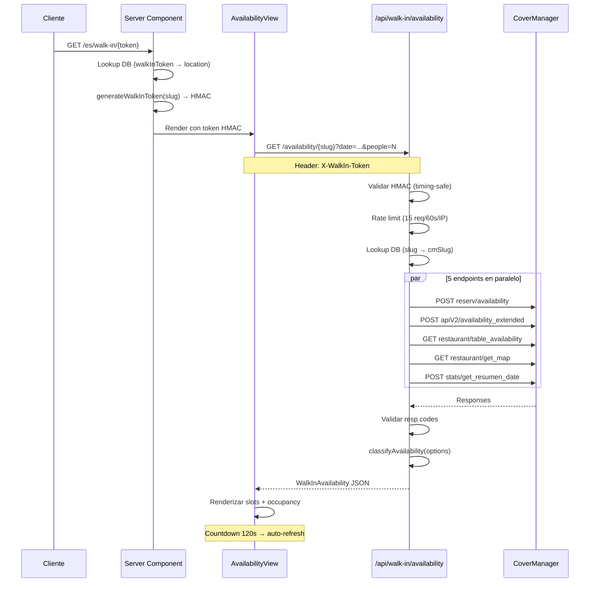

# 🚶 Módulo Walk-in — Disponibilidad en Tiempo Real

## Resumen Ejecutivo

El módulo Walk-in es una **interfaz pública** (sin autenticación) que permite a los clientes consultar la disponibilidad de un restaurante en tiempo real. Acceden escaneando un **código QR** o a través de un enlace directo.

El sistema integra **5 endpoints de CoverManager** en paralelo para construir una vista unificada de:
- **Slots horarios** clasificados por disponibilidad (disponible / mesa corta / completo)
- **Ocupación en tiempo real** (comensales sentados vs capacidad total)
- **Zonas y mesas** disponibles (información detallada para admins)

---

## 🎯 Problemas que Resuelve

| Sin Walk-in | Con Walk-in |
|-------------|-------------|
| El cliente llama por teléfono para preguntar disponibilidad | Escanea QR y ve la disponibilidad al instante |
| El equipo de sala pierde tiempo atendiendo consultas telefónicas | Sin intervención humana necesaria |
| Sin visibilidad de ocupación en tiempo real | Barra de ocupación actualizada cada 2 minutos |
| URLs predecibles permiten enumerar restaurantes | Tokens opacos anti-enumeración |

---

## 🏗️ Arquitectura de Alto Nivel



---

## 📁 Estructura de Archivos

```
src/
├── app/
│   ├── api/walk-in/
│   │   └── availability/[slug]/
│   │       └── route.ts              ← API endpoint (GET)
│   └── [locale]/walk-in/[slug]/
│       ├── page.tsx                  ← Server Component (genera HMAC)
│       └── loading.tsx               ← Skeleton loader
│
├── modules/walk-in/
│   ├── domain/
│   │   ├── types.ts                  ← Tipos CM + clasificados
│   │   ├── availability-classifier.ts← Lógica de clasificación
│   │   ├── walk-in-token.ts          ← HMAC generation/validation
│   │   └── __tests__/
│   │       └── availability-classifier.test.ts ← 14 tests unitarios
│   └── ui/
│       ├── availability-view.tsx     ← Orquestador principal (Client)
│       ├── service-section.tsx       ← Card de servicio (Comida/Cena)
│       ├── time-slot-card.tsx        ← Slot horario individual
│       ├── party-size-picker.tsx     ← Stepper tamaño de grupo
│       └── qr-generator-dialog.tsx   ← Generador de QR codes
│
├── lib/
│   └── rate-limit-supabase.ts        ← Rate limiting via Supabase RPC
│
scripts/
├── generate-walkin-tokens.ts         ← Genera tokens para locations
└── setup-rate-limit.sql              ← Setup tabla + RPC en Supabase
```

---

## 🔐 Seguridad

El módulo implementa **3 capas de seguridad** para proteger una API pública:

1. **Token HMAC** — Evita acceso directo a la API sin pasar por la página
2. **Rate Limiting** — 15 peticiones / 60 segundos por IP
3. **CSP Header** — Content-Security-Policy restrictivo en rutas walk-in

> Ver documentación detallada en **[Seguridad Walk-in](./security)**

---

## 📊 Clasificación de Disponibilidad

El clasificador (`availability-classifier.ts`) transforma datos crudos de CoverManager en una vista simplificada:

### Lógica de Slots

Para cada hora disponible, se calcula la **duración consecutiva** de disponibilidad:

| Duración consecutiva | Estado | Color | Significado |
|----------------------|--------|-------|-------------|
| ≥ 90 minutos | `available` | 🟢 Verde | Reserva estándar completa |
| 45 – 89 minutos | `limited` | 🟡 Ámbar | Mesa corta (~45 min) |
| < 45 minutos | `full` | 🔴 Rojo | Insuficiente para servicio |

### Filtro por Tamaño de Grupo

La respuesta de CoverManager en `reserv/availability` viene indexada por `hours[time][partySize]`. Cuando el usuario selecciona un tamaño de grupo (query param `people`), el clasificador **filtra** cada hora dejando solo entries donde `parseInt(partySize) >= people`. Si una hora queda sin party sizes válidos, desaparece del resultado (se considera "completo" implícitamente).

> **Importante**: No se consulta ningún endpoint adicional (ni Agora). Todo el filtrado es sobre datos de CoverManager.

### Separación de Servicios

- **Comida (lunch)**: slots con hora < cutoff (configurable por restaurante, default `17:00`)
- **Cena (dinner)**: slots con hora ≥ cutoff

El corte lunch/dinner se configura con el campo `lunchDinnerCutoff` de `RestaurantLocation` (ej: `"15:00"` para brunch).

### Ocupación

Para cada servicio se muestra:
- Comensales sentados vs capacidad total
- Mesas ocupadas vs mesas totales
- Porcentaje de ocupación con barra de progreso (emerald < 70%, amber 70-89%, red ≥ 90%)

> Ver documentación detallada en **[API de Disponibilidad](./availability-api)**

---

## 🖥️ Componentes UI

### AvailabilityView (orquestador)

Client Component que gestiona todo el flujo:
- Selector de fecha: **Hoy** / **Mañana**
- **Filtro por tamaño de grupo** (PartySizePicker): stepper +/- (1-12 personas)
- Auto-fetch al montar, al cambiar fecha o al cambiar tamaño de grupo
- **Countdown visual** de 120s → auto-refresh al llegar a 0 (reemplaza el auto-refresh silencioso anterior)
- Footer: "Actualizado HH:MM · Actualiza en Xm Xs"
- Manejo de errores con botón de reintentar
- Modo admin: panel debug para `SUPER_ADMIN`

### PartySizePicker (filtro de grupo)

Stepper numérico compacto mobile-first:
- Rango: 1-12 personas
- Sin filtro (default): botón "Todos los tamaños" → al pulsar, activa filtro en 2
- Con filtro activo: botones −/+/✕ con contador de personas
- Al limpiar (✕), vuelve al estado sin filtro
- Envía query param `people=N` a la API

### ServiceSection (card de servicio)

Muestra un servicio (Comida o Cena):
- Header con icono + ocupación en texto
- Barra de ocupación con colores dinámicos
- Grid de `TimeSlotCard` para cada slot
- **(Admin)** Stats de reservas: sentados, walk-in, pendientes, cancelados, no-show
- **(Admin)** Zonas colapsables con mesas y capacidades

### TimeSlotCard (slot individual)

Tarjeta para un slot horario:
- Punto de color + hora + estado + capacidad máxima
- **(Admin)** Panel expandible: minutos disponibles, ventana, grupos, zonas

### QrGeneratorDialog

Dialog para generar QR codes (accesible desde GastroLab settings):
- Selector de restaurante
- Preview del QR (280×280px)
- Descarga PNG (1024×1024px) / SVG
- Copiar URL al portapapeles
- Prefiere `walkInToken` (opaco) sobre `cmSlug` (legible)

---

## 🗃️ Modelo de Datos

### RestaurantLocation (campos walk-in)

```prisma
model RestaurantLocation {
  // ... campos existentes ...
  walkInToken        String?  @unique          // Token opaco para URL walk-in
  lunchDinnerCutoff  String   @default("17:00") // Hora corte lunch/dinner
  // ...
}
```

- **Migraciones**:
  - `20260310120000_add_walkin_token` — Campo `walkInToken`
  - `20260311120000_add_lunch_dinner_cutoff` — Campo `lunchDinnerCutoff`
- **Generación**: `scripts/generate-walkin-tokens.ts` — tokens base62 de 12 caracteres
- **Lookup**: primero por `walkInToken`, fallback por `cmSlug` (compatibilidad con QRs antiguos)

---

## 🌍 Internacionalización

Namespace `walkIn` en `messages/{locale}.json` con traducciones en 6 idiomas:

| Clave | Español | Inglés |
|-------|---------|--------|
| `title` | Disponibilidad | Availability |
| `today` | Hoy | Today |
| `tomorrow` | Mañana | Tomorrow |
| `available` | Disponible | Available |
| `limited` | Mesa corta | Short table |
| `full` | Completo | Full |
| `disclaimer` | Sin reserva previa, sujeto a disponibilidad... | No reservation, subject to... |
| `shortTableHint` | Las franjas amarillas permiten un servicio rápido... | Yellow slots allow a quick service... |
| `partySizeAll` | Todos los tamaños | All sizes |
| `partySizeFor` | {count} personas | {count} people |
| `partySizeDecrease` | Reducir personas | Decrease party size |
| `partySizeIncrease` | Aumentar personas | Increase party size |
| `partySizeClear` | Quitar filtro | Clear filter |
| `refreshIn` | Actualiza en {minutes}m {seconds}s | Refreshes in {minutes}m {seconds}s |

---

## ⚙️ Variables de Entorno

| Variable | Obligatorio | Descripción |
|----------|-------------|-------------|
| `WALKIN_HMAC_SECRET` | Sí (prod) | Secret para generar/validar tokens HMAC (32+ chars) |
| `NEXT_PUBLIC_SUPABASE_URL` | Sí | URL de Supabase (para rate limit RPC) |
| `SUPABASE_SERVICE_ROLE_KEY` | Sí | Service role key de Supabase |
| `COVER_MANAGER_API_URL` | Sí | URL de la API de CoverManager |
| `COVER_MANAGER_API_KEY` | Sí | API key de CoverManager |

---

## 🚦 Estado Actual

### ✅ Implementado
- [x] Página pública con disponibilidad en tiempo real
- [x] Clasificación de slots (available/limited/full) con duración consecutiva
- [x] 5 endpoints CoverManager en paralelo (`Promise.allSettled`)
- [x] Token HMAC con TTL 10 min (generado en Server Component)
- [x] Rate limiting via Supabase RPC (15 req/60s/IP)
- [x] CSP header restrictivo en rutas walk-in
- [x] Anti-enumeración: tokens opacos + delay en 404
- [x] Selector Hoy/Mañana
- [x] Barra de ocupación con colores dinámicos
- [x] Modo admin con debug info (zonas, stats, duración)
- [x] Generador de QR codes (PNG/SVG/copiar URL)
- [x] Skeleton loading state
- [x] i18n en 6 idiomas
- [x] Tokens walkInToken (base62, 12 chars) para URLs opacas
- [x] Filtro por tamaño de grupo (party size picker, query param `people`)
- [x] Countdown visual de actualización (120s → auto-refresh)
- [x] Cutoff lunch/dinner configurable por restaurante (`lunchDinnerCutoff`)
- [x] Validación de `resp` code en cada endpoint CoverManager
- [x] Structured logging + header `X-Response-Time`
- [x] Tests unitarios del clasificador (14 tests con Vitest)
- [x] Zonas enriquecidas con `availableForPartySizes` asociados
- [x] Cache CDN (`s-maxage=120, stale-while-revalidate=300`) — sin cache in-memory

### 📋 Planificado (Fase 3)
- [ ] Lista de espera pública (cuando todos los slots son "full")
- [ ] Registro walk-in (solo admin, vía `POST reserv/walk_in` de CM)
- [ ] Reservas reales del día (solo admin, vía `POST restaurant/get_reservs_basic`)

---

## 📚 Documentación Relacionada

- **[Seguridad Walk-in](./security)** — HMAC, rate limiting, CSP, anti-enumeración
- **[API de Disponibilidad](./availability-api)** — Endpoint, request/response, clasificador
- **[Analytics de Comensales](../gastrolab/analytics-de-comensales)** — Dashboard ejecutivo con datos CoverManager

---

**Última actualización**: 2026-03-11
