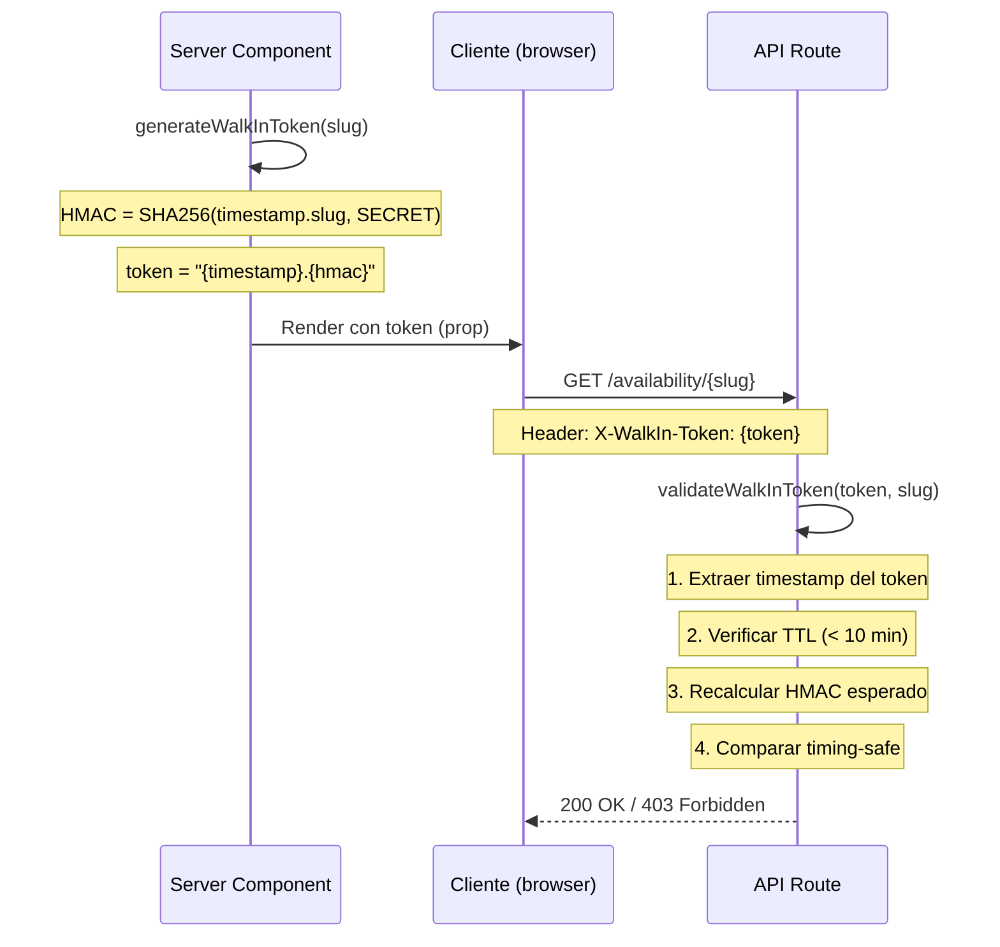

# 🔐 Seguridad del Módulo Walk-in

El módulo Walk-in es una **API pública** (sin autenticación de usuario). Para protegerla de abusos, implementa **3 capas de seguridad** complementarias más medidas anti-enumeración.

---

## 1. Token HMAC — Protección de API

### Problema
Sin protección, cualquiera podría llamar directamente a `/api/walk-in/availability/{slug}` sin pasar por la página, eludiendo rate limits y métricas.

### Solución
El **Server Component** genera un token HMAC que el cliente debe enviar como header en cada petición a la API.



### Implementación

**Archivo**: `src/modules/walk-in/domain/walk-in-token.ts`

```typescript
// Generación (Server Component — secret nunca llega al cliente)
export function generateWalkInToken(slug: string): string {
  const timestamp = Date.now().toString();
  const hmac = createHmac("sha256", WALKIN_HMAC_SECRET)
    .update(`${timestamp}.${slug}`)
    .digest("hex");
  return `${timestamp}.${hmac}`;
}

// Validación (API Route)
export function validateWalkInToken(token: string, slug: string): boolean {
  const [timestamp, receivedHmac] = token.split(".");
  // 1. TTL check: 10 minutos
  if (Date.now() - Number(timestamp) > 10 * 60 * 1000) return false;
  // 2. Recalcular HMAC esperado
  const expectedHmac = createHmac("sha256", WALKIN_HMAC_SECRET)
    .update(`${timestamp}.${slug}`)
    .digest("hex");
  // 3. Comparación timing-safe (evita timing attacks)
  return timingSafeEqual(
    Buffer.from(receivedHmac, "hex"),
    Buffer.from(expectedHmac, "hex")
  );
}
```

### Características
- **TTL**: 10 minutos (suficiente para cargar la página, no para reutilizar)
- **Timing-safe**: Usa `crypto.timingSafeEqual` para evitar timing attacks
- **Secret**: Variable de entorno `WALKIN_HMAC_SECRET` (32+ caracteres en producción)
- **Dev mode**: Si `WALKIN_HMAC_SECRET` está vacío, se salta la validación (solo desarrollo)

---

## 2. Rate Limiting — Protección contra Abuso

### Problema
Un atacante podría hacer miles de peticiones para sobrecargar CoverManager o enumerar restaurantes.

### Solución
Rate limiting **por IP** usando una **función RPC en Supabase** (funciona across serverless instances).

### Implementación

**Archivo**: `src/lib/rate-limit-supabase.ts`

```typescript
export async function checkRateLimitSupabase({
  key,                    // "walkin:{ip}"
  maxRequests = 15,       // Máximo por ventana
  windowSeconds = 60,     // Ventana de 60 segundos
}): Promise<boolean> {
  const { data } = await supabase.rpc("check_rate_limit", {
    p_key: key,
    p_max_requests: maxRequests,
    p_window_seconds: windowSeconds,
  });
  return data ?? true; // Fail-open si Supabase no responde
}
```

### Función SQL (Supabase)

**Setup**: `scripts/setup-rate-limit.sql`

```sql
CREATE TABLE rate_limit_entries (
  key           TEXT        NOT NULL,
  count         INT         NOT NULL DEFAULT 1,
  window_start  TIMESTAMPTZ NOT NULL DEFAULT now(),
  PRIMARY KEY (key, window_start)
);

CREATE OR REPLACE FUNCTION check_rate_limit(
  p_key TEXT,
  p_max_requests INT DEFAULT 15,
  p_window_seconds INT DEFAULT 60
) RETURNS BOOLEAN AS $$
DECLARE
  v_window_start TIMESTAMPTZ;
  v_count INT;
BEGIN
  v_window_start := date_trunc('second',
    to_timestamp(
      floor(extract(epoch from now()) / p_window_seconds) * p_window_seconds
    )
  );
  -- Limpiar entradas viejas
  DELETE FROM rate_limit_entries
    WHERE key = p_key AND window_start < v_window_start;
  -- Upsert: incrementar o insertar
  INSERT INTO rate_limit_entries (key, count, window_start)
    VALUES (p_key, 1, v_window_start)
    ON CONFLICT (key, window_start)
    DO UPDATE SET count = rate_limit_entries.count + 1;
  -- Leer count actual
  SELECT count INTO v_count FROM rate_limit_entries
    WHERE key = p_key AND window_start = v_window_start;
  RETURN v_count <= p_max_requests;
END;
$$ LANGUAGE plpgsql;
```

### Características
- **Límite**: 15 peticiones por ventana de 60 segundos por IP
- **Agrupación**: Por IP (no por restaurante) — todos los restaurantes comparten cuota
- **Fail-open**: Si Supabase no responde, la petición se permite (prioriza UX)
- **Cleanup**: Función `cleanup_rate_limit_entries()` elimina entradas > 5 minutos
- **Extracción IP**: `x-real-ip` (Vercel, no spoofeable) → `x-forwarded-for` → `"unknown"`

### Respuesta 429

```json
// HTTP 429 Too Many Requests
// Header: Retry-After: 60
{
  "error": "Too many requests. Please try again later."
}
```

---

## 3. Content Security Policy (CSP)

### Problema
Las páginas walk-in son públicas y podrían ser objetivo de inyección de scripts.

### Solución
CSP restrictivo aplicado **solo a rutas walk-in** en `next.config.ts`:

```typescript
{
  source: '/:locale/walk-in/:slug*',
  headers: [{
    key: 'Content-Security-Policy',
    value: [
      "default-src 'self'",
      "script-src 'self' 'unsafe-inline' 'unsafe-eval'",
      "style-src 'self' 'unsafe-inline'",
      "img-src 'self' data: blob:",
      "connect-src 'self'",
    ].join('; ')
  }]
}
```

### Restricciones
- **Scripts**: Solo del mismo origen (+ inline para Next.js hydration)
- **Estilos**: Solo del mismo origen + inline (Tailwind)
- **Imágenes**: Same-origin + data URIs + blobs
- **Conexiones**: Solo al mismo origen (la API walk-in está en el mismo dominio)

---

## 4. Anti-Enumeración

### Tokens Opacos (`walkInToken`)

En lugar de exponer el `cmSlug` legible del restaurante (ej: `restaurante-voltereta`), las URLs usan un **token opaco** de 12 caracteres base62:

```
# Antes (predecible, enumerable)
/es/walk-in/restaurante-voltereta

# Ahora (opaco, no enumerable)
/es/walk-in/a7Bk3mXp9Qr2
```

**Generación** (`scripts/generate-walkin-tokens.ts`):
```typescript
function generateToken(): string {
  const bytes = randomBytes(9); // 72 bits de entropía
  const chars = "0123456789abcdefghijklmnopqrstuvwxyzABCDEFGHIJKLMNOPQRSTUVWXYZ";
  // Encode 9 bytes → 12 chars base62
  return token; // ej: "a7Bk3mXp9Qr2"
}
```

- **Entropía**: 72 bits → ~4.7 × 10²¹ combinaciones posibles
- **Compatibilidad**: QRs antiguos con `cmSlug` siguen funcionando (fallback en lookup)

### Delay Anti-Timing

Cuando una location **no existe**, la API introduce un **delay aleatorio de 200-500ms** antes de responder 404:

```typescript
if (!location) {
  // Anti-timing oracle: evita que un atacante distinga
  // "no existe" (respuesta rápida) de "existe" (respuesta lenta por CM)
  await new Promise(r => setTimeout(r, 200 + Math.random() * 300));
  return NextResponse.json({ error: "Not found" }, { status: 404 });
}
```

Esto evita que un atacante use el **tiempo de respuesta** para distinguir entre slugs válidos e inválidos.

---

## 📊 Resumen de Capas

```
Petición del cliente
    │
    ├── 1. HMAC Token ─── ¿Token válido y no expirado?
    │       ├── NO → 403 Forbidden
    │       └── SÍ ↓
    │
    ├── 2. Rate Limit ─── ¿Dentro del límite (15/60s)?
    │       ├── NO → 429 Too Many Requests
    │       └── SÍ ↓
    │
    ├── 3. DB Lookup ──── ¿Existe el restaurante?
    │       ├── NO → delay 200-500ms → 404 Not Found
    │       └── SÍ ↓
    │
    └── ✅ Fetch CoverManager → Clasificar → Responder
```

---

## ⚙️ Setup

### 1. Variables de entorno
```bash
# Generar un secret seguro
openssl rand -hex 32
# Añadir a .env
WALKIN_HMAC_SECRET=<output-del-comando-anterior>
```

### 2. Tabla de rate limit en Supabase
```bash
# Ejecutar el SQL en el dashboard de Supabase
# o via psql contra la base de datos
psql $DATABASE_URL < scripts/setup-rate-limit.sql
```

### 3. Generar tokens para restaurantes
```bash
npx tsx scripts/generate-walkin-tokens.ts
# Output: "Voltereta Casa (voltereta-casa) → a7Bk3mXp9Qr2"
```

---

**Última actualización**: 2026-03-11
